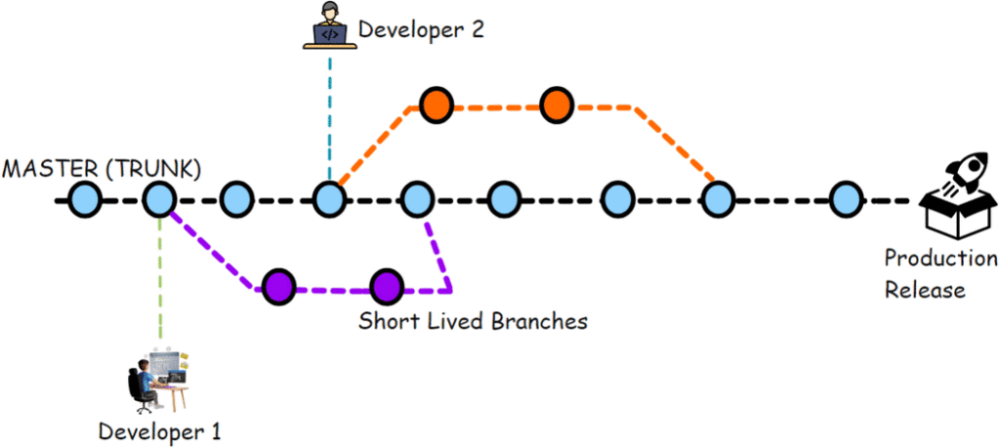

# 📘 DevOps Knowledge Summary: CI/CD, Git Workflow, and GitOps

## 📑 Table of Contents
1. [🚀 CI/CD (Continuous Integration / Continuous Delivery / Deployment)](#-cicd-continuous-integration--continuous-delivery--deployment)  
   - [What is CI/CD?](#what-is-cicd)
   - [Benefits](#benefits)  
   - [Typical CI/CD Pipeline](#typical-cicd-pipeline)  

2. [🐙 Git Basics](#-git-basics)
   - [How to Install Git](#how-to-install-git) 
   - [Common Commands](#common-commands)

3. [🌿 Git Workflows](#-git-workflows)  
   - [Gitflow Workflow](#gitflow-workflow)  
   - [Trunk-Based Development](#trunk-based-development)  

4. [🔄 GitOps](#-gitops)  
   - [What is GitOps?](#what-is-gitops)  
   - [Principles of GitOps](#principles-of-gitops)  
   - [GitOps Workflow](#gitops-workflow)  
   - [Tools](#tools)

5. [✅ Summary](#-summary)  

6. [📚 References](#-references)  

---

## 1. CI/CD (Continuous Integration / Continuous Delivery / Deployment)
### What is CI/CD?
#### CI/CD 
- **CI/CD stands for two main concepts: Continuous Integration and Continuous Delivery/Deployment. This is a method of automating the software development process, helping to get products from programmers to end users faster, safer and more reliably.
- **Let break down this'
#### Continuous Integration
- **CI (Continuous Integration)**: Developers frequently merge code into a shared repository. Each commit triggers automated builds and tests to detect issues early.
#### Continuous Delivery
- **CD (Continuous Delivery)**: Code is automatically built, tested, and packaged for release. Deployment to production requires manual approval. The main goal of Continuous Delivery is not “more deployments”, but “less risk per deployment”
- **Goal**: Always have a release-ready version.  
- **Process**: After successful CI, the new version is automatically deployed to a staging environment (similar to production). All final tests are performed here.  
- **Key Point**: Deploying to the real Production environment still requires a **manual decision** (a human approval click).
##### Anatomy of a Continuous Delivery Pipeline
A typical CD pipeline is a sequence of automated **“quality gates”**, where each gate must be passed before moving on to the next.

###### **Phase 1: Continuous Integration (CI Phase)**  
This is the foundation of CD. Every time a developer commits code, the pipeline automatically:  
- **Build & Compile**: Compiles the source code into a runnable software package (artifact).  
- **Unit & Integration Tests**: Runs unit and integration tests to ensure internal components behave as expected.  
  - ⚠️ If this phase fails, the pipeline stops immediately and notifies the developer.

###### **Phase 2: Acceptance Phase**  
Once the artifact has passed CI, it is deployed to a production-like environment (commonly called **Staging**). Here, higher-level tests are performed:  
- **Automated Acceptance / End-to-End (E2E) Tests**: Simulates real user behavior to validate key business workflows.  
- **Performance & Load Tests (Optional)**: Ensures the new release meets performance and scalability requirements.  
- **Security Scans (Optional)**: Detects security vulnerabilities.  
  - ✅ This phase confirms that the new release is not only technically correct but also meets business requirements.  

###### **Phase 3: The Manual Approval Gate ⚖️**
This is the heart of **Continuous Delivery**. After passing all automated tests, the pipeline **pauses and waits for approval**.
- **Who approves?** Product Manager, QA Lead, or business stakeholders.  
- **What do they do?** They may perform final **manual exploratory testing** in the staging environment or simply confirm whether it’s the right business time to release.  

###### **Phase 4: Release Phase (Deployment to Production)**
When the **“Approve”** button is clicked, the final deployment begins.
- The deployment itself must be **fully automated** (often called **“One-Click Deploy”**).
- Safe release strategies such as **Blue-Green** or **Canary Deployment** can be used to minimize risks.

###### When to Choose Continuous Delivery?
Continuous Delivery is a **strategic choice** when you want to balance **development speed** with **business control**.  
- ✅ **When business decisions are critical**: Releasing features must align with marketing campaigns, press releases, or major events.  
- ✅ **When regulatory & compliance requirements apply**: Industries like finance or healthcare often require clear approval and audit processes before deployment.  
- ✅ **When multiple teams must be ready**: A new feature may require Customer Support and Sales teams to be trained before release.  
- ✅ **When the organization isn’t ready for Continuous Deployment**: CD acts as a **stepping stone** toward full automation, building trust in the process before removing the manual gate.  
**In summary**:
Continuous Delivery empowers development teams to **always have a release-ready product**, while empowering business teams to **decide the best time to deliver it to the market**.  

#### Continuous Deployment
- **CD (Continuous Deployment)**: With Continuous Delivery, the code will be deployed to production with manual approval, while in concept of Continuous Deployment, every change that passes tests is automatically deployed to production without manual intervention.
- **Goal**: Fully automate the entire process from code commit to production.  
- **Process**: If the new version passes **ALL automated tests** (including staging tests), it is automatically deployed to Production without any human intervention.

##### Philosophy of Continuous Deployment
- **Lower risk**: Each deployment contains only a few small changes. If something goes wrong, you know exactly where the problem is, and fixing (or rolling back) is extremely fast. This is much safer than deploying a massive “bundle” of changes after months of development.
- **Faster feedback**: You receive feedback from end users almost immediately. This helps the product team know if a feature is liked or not and adjust quickly.
- **Higher productivity**: Developers can focus entirely on creating value without worrying about stressful “release days.”

##### Core Pillars for Successful CD
To confidently hand over the “keys” to production, you need an extremely solid foundation.
###### The Test Automation Pyramid
This is a prerequisite. Without a reliable automated testing system, CD is impossible.
- **Unit Tests (Base)**: Fast and cheap, check the smallest code units. Must have high coverage.  
- **Integration Tests (Middle layer)**: Verify interactions between modules or services.  
- **End-to-End (E2E) Tests (Top)**: Simulate user behavior across the entire application. Slow and costly, so only keep a limited number for the most critical business flows.
###### A Robust CD Pipeline
A typical CD pipeline includes these steps. If any step fails, the entire process stops.
1. **Trigger**: Developer commits code to the main/master branch.  
2. **Build & Unit Test**: CI system builds source code and runs all unit tests.  
3. **Deploy to Staging**: If successful, the new version is deployed to a staging environment (identical to production).  
4. **Run Acceptance Tests**: Run advanced tests (Integration, E2E) in staging.  
5. **The Gate**: If all steps succeed → automatically deploy to production.  
###### Monitoring & Observability
Deployment does not end when code reaches production.
You must be able to answer **“Is the system working properly?”** instantly.
- **Monitoring**: Track key metrics (CPU, memory, HTTP 5xx errors, latency).  
- **Alerting**: Automatically notify the team when anomalies occur.  
- **Logging**: Capture complete logs for tracing and debugging issues. 

##### Safe Deployment Techniques (Safety Nets)
Even with perfect testing, unexpected risks remain.  
These techniques minimize impact:

###### Blue-Green Deployment
- **Idea**: Two identical production environments: “Blue” (old) and “Green” (new).  
- **Process**: Pipeline deploys to “Green”. Once validated, traffic is switched from “Blue” to “Green”.  
**Pros**  
- Almost instant rollback.  
- No downtime, seamless traffic switch.  
- Full-scale validation in a production-like environment.  
**Cons**  
- High cost (duplicate infrastructure).  
- Database schema migrations can complicate rollback.  
- Long-running transactions may fail during traffic switch.  

###### Canary Deployment
- **Idea**: Release the new version to a small subset of users (e.g., 1-5%).  
- **Process**: Gradually increase traffic if no issues are found.  
**Pros**  
- Limited blast radius.  
- Real user feedback and performance data.  
- Lower cost than Blue-Green.  
**Cons**  
- Slower rollout process.  
- Requires advanced monitoring.  
- Database/cache compatibility challenges.  

###### Feature Flags (Feature Toggles)
- **Idea**: Separate *deployment* from *release*.  
- **Process**: Deploy code to production but keep features hidden behind flags. Enable them when ready.  
**Pros**  
- Deployment anytime, release when business is ready.  
- “Kill switch” for problematic features.  
- Targeted rollouts, A/B testing, beta programs.  
**Cons**  
- Technical debt grows if flags aren’t cleaned up.  
- More complex testing (many feature combinations).  
- Requires feature flag management system (e.g., LaunchDarkly).  

##### Conclusion
Continuous Deployment is not just a set of tools — it’s a **cultural and mindset shift**.  
It requires absolute trust in automation, strong discipline in writing tests, and close collaboration across teams (DevOps).  
While challenging, the rewards of CD — **speed, stability, and innovation** — make it a game-changer for modern software delivery.  

#### 📊 Comparison: Continuous Delivery vs Continuous Deployment

| Stage                | Continuous Delivery     | Continuous Deployment |
|-----------------------|-------------------------|------------------------|
| Commit Code           | Automated              | Automated              |
| Build & Unit Test     | Automated              | Automated              |
| Deploy to Staging     | Automated              | Automated              |
| Acceptance Tests      | Automated              | Automated              |
| Deploy to Production  | **MANUAL** Approval    | **AUTOMATED**          |

### Benefits
- Faster release cycles
- Higher code quality and reliability
- Reduced manual errors
- Quick feedback loop

### Typical CI/CD Pipeline
1. **Source** – Code pushed to Git repository (GitHub, GitLab, etc.)
2. **Build** – Compile source code, build artifacts, container images
3. **Test** – Unit tests, integration tests, security scans
4. **Release** – Package and store artifacts
5. **Deploy** – Deploy to environments (dev, staging, production)
6. **Monitor** – Observe system metrics and logs

---

## 2. Git Basics
### How to install Git
#### 📌 Linux (Debian/Ubuntu)
sudo apt update
sudo apt install git -y
git --version
#### 📌 Linux (RHEL/CentOS/Rocky)
sudo dnf install git -y   # or: sudo yum install git -y
git --version
#### 📌 macOS
brew install git
git --version
#### 📌 Windows
1. Download Git for Windows: https://git-scm.com/download/win
2. Run the installer with default settings.
3. Open Git Bash or Command Prompt and check:
   git --version
✅ Once installed, configure your identity:
git config --global user.name "Your Name"
git config --global user.email "youremail@example.com"

### Common Commands
- `git init` – Initialize repository
- `git clone <url>` – Clone repository
- `git add <file>` – Stage changes
- `git commit -m "message"` – Save snapshot
- `git status` – Check repository status
- `git log` – Show commit history
- `git diff` – Show changes
- `git push` – Upload local commits to remote
- `git pull` – Fetch + merge changes from remote
- `git fetch` – Download changes without merging

---

## 3. Git Workflows
Git workflows define how teams collaborate, manage branches, and deliver code in a consistent and reliable way. Below are three of the most common workflows, with details on their structure, advantages, disadvantages, and typical usage.

### **Gitflow Workflow**

- **Branches:**
  - `main` → production-ready code, only stable releases are merged into this branch.
  - `develop` → integration branch, new features are merged here before being pushed to main.
  - `feature/*` → new features, created from develop branch to develop a specific feature.
  - `release/*` → created from develop to prepare for a new release. This branch is used to fix bugs, update documentation, and prepare for release. Once completed, it will be merged into both main and develop.
  - `hotfix/*` → created from main to fix an emergency bug in the production environment. Once fixed, it will be merged into both main and develop
#### Advantages
- **Clear structure:** Suitable for projects with scheduled release cycles.
- **Environment separation:** Clearly separates code in development from code running in production.
- **Quality control:** Allows for more thorough testing on the release branch before deployment to production.
#### Disadvantages
- **Complexity:** Too many branches can lead to complex management and potential confusion.
- **Delays:** Feature branches with long lifecycles can easily cause merge conflicts, slowing down the integration process.
- **Less suitable for CI/CD:** This model does not encourage continuous integration and rapid deployment.

### **Trunk-Based Development**
Trunk-Based Development (TBD) is a simpler model that focuses on frequent and rapid code integration. All developers work on a single branch, typically called the trunk (or main).

#### Process
- All developers commit directly to the main branch or use very short-lived feature branches (lasting only a few hours).
- Small and frequent changes are merged into the main branch.
- To avoid breaking the code on main, incomplete features are often hidden behind **Feature Flags**, allowing features to be toggled on or off without requiring code redeployment.
#### Advantages
- **Continuous integration:** Minimizes code conflicts due to frequent merging of small changes.
- **Fast-paced:** Well-suited for CI/CD (Continuous Integration and Continuous Deployment) workflows and teams that need to release products quickly.
- **Simplicity:** Much easier to manage than Gitflow, especially for small to medium-sized teams.
#### Disadvantages
- **High demands:** Requires a highly disciplined team, strict code reviews, and a robust automated testing system.
- **Risk:** Without a strong testing system, a faulty commit can break the main branch and disrupt the entire development process.
- **Challenges in release control:** Continuous deployments can complicate projects with fixed release schedules.

#### Comparison of GitFlow and Trunk-Based Development

| Criteria                        | GitFlow                              | Trunk-based Development (TBD)       |
|---------------------------------|--------------------------------------|-------------------------------------|
| Main branch                    | Production branch (master/main for Production vs develop for Development) | Main branch always (Trunk/Main)     |
| Time to create branch (Feature Branches) | Long (days or weeks to complete a feature) | Short (a few hours to 1-2 days)     |
| Integration Frequency          | Rarely (integration only when developing new features or preparing for release) | Continuous (immediate integration)  |
| Release cycle                  | Quarterly release with many versions | Always with Continuous Delivery (CD) |
| State of branch                | Master/Main often behind. Develop often behind feature, rarely ready for deployment | Always ready, always deployable (Deployable) |
| Code structuring               | Heavy branching (branching) leads to complex code management | Use Feature Flags/Toggles to hide incomplete code |

---

## 4. GitOps

### What is GitOps?
- GitOps is **using Git as the single source of truth for infrastructure and application deployments**.
- Kubernetes manifests, Helm charts, or Terraform files are stored in Git.
- An operator (e.g., Argo CD, Flux) continuously reconciles cluster state with Git.

### Principles of GitOps
1. **Declarative** – Desired system state is defined in Git
2. **Versioned** – All changes are tracked and auditable
3. **Automated** – CI/CD pipelines and GitOps controllers apply changes automatically
4. **Continuous** – System state is constantly reconciled with Git

### GitOps Workflow
1. Developer commits code/config changes to Git
2. CI pipeline builds & tests artifacts
3. CD (GitOps tool) applies changes to Kubernetes
4. GitOps controller continuously ensures cluster matches Git state

### Tools
- **Argo CD**
- **Flux**
- **Jenkins X**
- **Tekton**

---

## ✅ Summary
- **CI/CD** automates integration, testing, and delivery.
- **Git** provides version control for source code and infrastructure.
- **Git Workflows** (Feature Branch, Gitflow, Forking) standardize collaboration.
- **GitOps** extends CI/CD to infrastructure and Kubernetes, making Git the single source of truth.

---

## 📚 References
- [Atlassian Git Tutorials](https://www.atlassian.com/git/tutorials)
- [Gitflow Workflow](https://nvie.com/posts/a-successful-git-branching-model/)
- [Argo CD Documentation](https://argo-cd.readthedocs.io/)
- [Flux CD Documentation](https://fluxcd.io/)
