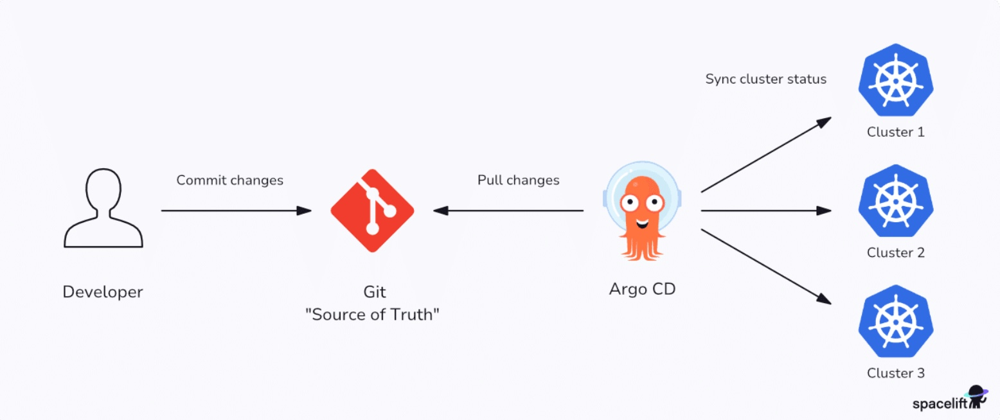

# 📘 DevOps Knowledge Summary: ArgoCD Overview and Concepts

This repository contains notes, exercises, and lab materials for learning **ArgoCD** — from installation and basic operation to advanced pipeline automation techniques.

---

## 📑 Table of Contents
1. [🚀 ArgoCD?](#-argocd)
  - [What is ArgoCD?](#what-is-ArgoCD)
  - [Push vs pull-based CI/CD](#push-vs-pull-based-ci/cd)
  - [ArgoCD vs Jenkins](#argocd-vs-jenkins)

2. [📚 References](#-references)  

---

## 1. ArgoCD?
### What is ArgoCD?

Argo CD is described as “a declarative, GitOps continuous delivery tool for Kubernetes.” It can monitor your source repositories and automatically deploy changes to your cluster.

Kubernetes orchestrates container deployment and management tasks. It starts your containers, replaces them when they fail, and scales your service across the compute nodes in your cluster.

Kubernetes is best used as part of a continuous delivery workflow. Running automated deployments when new code is merged ensures changes reach your cluster quickly after passing through a consistent pipeline.
Please refer to https://spacelift.io/blog/kubernetes-tutorial if you're new about kubernetes

Key features of Argo CD include:

*   **GitOps-based deployment** – Uses Git as the single source of truth, enabling declarative configuration and automated syncing with Kubernetes clusters
*   **Declarative application definitions** – Supports Helm, Kustomize, Jsonnet, and plain YAML to define and manage application manifests
*   **Automated synchronization** – Automatically syncs Kubernetes resources with Git repositories, ensuring cluster state matches the desired state
*   **Real-time application status monitoring** – Continuously monitors app health and sync status, with visual dashboards and diff views
*   **Role-based access control (RBAC)** – Fine-grained access controls for managing user permissions across projects and environments
*   **Multi-cluster support** – Manages deployments across multiple Kubernetes clusters from a single Argo CD instance
*   **Web UI and CLI**– Provides a user-friendly web interface and CLI for managing applications, viewing diffs, and troubleshooting

Argo CD is easy to learn once you understand its basic concepts. Here are the core elements of Argo CD architecture:

*   **Application controller** – Argo’s Application Controller is the component you install in your cluster. It implements the Kubernetes controller pattern to monitor your applications and compare their state against their repositories.
*   **Application** – An Argo application is a group of Kubernetes resources that collectively deploy your workload. Argo stores the details of applications in your cluster as instances of an included Custom Resource Definition (CRD).
*   **Live state** – The live state is your application’s current state inside the cluster, such as the number of Pods created and the image they’re running.
*   **Target state** – The target state is the version of the state declared by your Git repository. When the repository changes, Argo will apply actions that evolve the live state into the target state.
*   **Refresh** – A refresh occurs when Argo fetches the target state from your repository. It compares the changes against the live state but doesn’t necessarily apply them at this stage.
*   **Sync** – A Sync is the process of applying the changes discovered by a Refresh. Each Sync moves the cluster back toward the target state.
*   **API server** – The Argo API server provides the REST and gRPC API interface used by the CLI, Web UI, and external integrations.
*   **Git repository** – The Git repository acts as the single source of truth, storing declarative configurations for all applications and environments.

### Push vs pull-based CI/CD
Historically, most CI/CD implementations have relied on push-driven behavior. This requires connecting your cluster to your CI/CD platform and using tools like Kubectl and Helm within your pipeline to apply Kubernetes changes.

Argo CD is a pull-based CI/CD system. It runs inside your Kubernetes cluster and pulls source from your repositories. Argo then applies the changes for you without a manually configured pipeline.

This model is more secure than push-based workflows. You don’t have to expose your cluster’s API server or store Kubernetes credentials in your CI/CD platform. Compromising a source repository only gives an attacker access to your code instead of the code and a route to your live deployments.

Understanding Deployment Strategies

When managing Kubernetes workloads, deployment strategies play a pivotal role in determining your workflow's security, scalability, and flexibility. Two dominant approaches stand out: Push-Based Deployment and Pull-Based Deployment. Let's explore these strategies, their advantages, drawbacks, and ideal use cases.

* * *

Push-Based Deployment

In a push-based model, the deployment process begins with a CI/CD system that takes the lead in applying changes to the Kubernetes cluster.

*   Process

1.Build the container image.

2.Push the image to a container registry.

3.The CI/CD system uses kubectl apply or similar tools to deploy the changes directly to the Kubernetes cluster.

*   Access Control

CI/CD System: Read/Write (RW) access to the Kubernetes cluster.

Git Repository: Read-Only (RO) access to the CI/CD system.

*   Advantages

Simplified Helm Charts Deployment: Easily deploy and manage Helm charts.

Dynamic Updates: Container version updates are seamlessly injected during the build pipeline.

Centralized Secrets Management: Secrets can be managed directly in the CI/CD system.

*   Drawbacks

Tightly Coupled: The CI/CD system is closely tied to the cluster configuration.

Security Risks: RW access to the cluster by the CI/CD system increases vulnerability.

Limited Flexibility: The deployment process heavily depends on the CI/CD pipeline.

* * *

Pull-Based Deployment

In contrast, the pull-based model leverages a GitOps operator (e.g., Flux or ArgoCD) to synchronize Kubernetes manifests from a source repository to the cluster.

*   Process

1.Build the container image.

2.Push the image to a container registry.

3.Update the manifests in the Git repository.

4.A GitOps operator pulls these changes and applies them to the cluster.

*   Access Control

CI/CD System: Read-Only (RO) access to the cluster.

GitOps Operator: Read/Write (RW) access to the cluster for applying changes.

*   Advantages

Enhanced Security: Only the GitOps operator has RW access to the cluster, reducing external risks.

Automated Updates: Supports container registry scanning for new versions.

Integrated Secret Management: Secrets are managed in the Git repository using tools like HashiCorp Vault.

Decoupled Deployments: The CI/CD system and deployment process are independent.

Multi-Tenant Support: GitOps operators are well-suited for multi-tenant architectures.

*   Drawbacks

Complex Secret Management: Handling secrets in Helm chart deployments is more intricate.

Steeper Learning Curve: Requires additional setup and understanding of GitOps tools.

* * *

\_\_Key Takeaways

* * *

Choosing the Right Strategy

Use Push-Based Deployment for straightforward workflows where simplicity and speed are paramount.

Opt for Pull-Based Deployment to prioritize security, scalability, and modularity in a cloud-native environment.

### ArgoCD vs Jenkins

#### 🚀 Jenkins

**Role:** CI/CD (Continuous Integration & Delivery).
**Philosophy:** *Imperative* -- You "command" it: build, push, apply.
**Model:** *Push*. Jenkins (from outside) actively pushes configuration files into K8s.
**Scope:** Very broad. Can build and deploy anywhere (VMs, Docker, K8s, mobile...).
**Focus:** Extremely strong in CI (Build, Test, Scan).

------------------------------------------------------------------------

#### 🐙 Argo CD

**Role:** GitOps CD (Continuous Delivery & Synchronization).
**Philosophy:** *Declarative* -- You "declare" the desired state in Git, and Argo CD automatically "fixes" K8s to match it.
**Model:** *Pull*. Argo CD (inside K8s) pulls changes from Git.
**Scope:** Specialized (K8s-native). Works with any Kubernetes cluster, whether on-premise (like our lab) or cloud (Azure AKS, Google GKE, Amazon EKS).
**Focus:** Exceptionally strong in CD (Sync, Audit, Drift Detection).

------------------------------------------------------------------------

#### Why use Argo CD when Jenkins already exists?

In a traditional CI/CD model, Jenkins holds the kubeconfig and has admin rights to run `kubectl apply`. This setup works but is **not secure** and **not GitOps-compliant**. Argo CD solves three major issues:

##### 1. Git as the Single Source of Truth (SSoT)

This is the most important concept of GitOps. Think of SSoT as the *single blueprint* for your entire system.

**Real-world analogy:** Instead of 10 people editing 10 different copies of a Word file, the whole team collaborates on one Google Doc. Every change and comment happens there. That Google Doc is the *Single Source of Truth*.

In GitOps, the Git repository containing your YAML files **is** that SSoT. If you want to change something (e.g., scale replicas from 3 → 5), you don't run `kubectl edit` (a local copy). Instead, you create a **Pull Request** proposing the change in the "blueprint."

------------------------------------------------------------------------

##### 2. Drift Detection & Self-Healing

If someone manually edits a Deployment in Rancher, Argo CD will detect it (show "OutOfSync") and --- if enabled --- automatically correct K8s back to match the Git code.

------------------------------------------------------------------------

##### 3. Security (Role Separation)

Jenkins no longer needs to hold the Kubernetes kubeconfig. Its job now is simply: build the image and push code to a **second Git repository**. Only Argo CD has permission to modify K8s.

------------------------------------------------------------------------

#### Standard Workflow: Jenkins (CI) + Argo CD (CD)

This is the ideal upgraded model all learners should aim for:

    (1) Dev pushes code (React)
              ↓
    (2) GitHub Repo (App)
              ↓
    (3) Jenkins (CI Server)
         ├─ 1. Run tests
         ├─ 2. Build Docker image
         ├─ 3. Push image to Registry (e.g., GitLab Registry)
         ├─ 4. Checkout "GitOps Repo"
         ├─ 5. Edit file (deployment.yaml -> image: v1.1.0)
         └─ 6. Push updated YAML
              ↓
    (4) GitOps Repo (GitLab)
              ↓
    (5) Argo CD (inside K8s)
              ↓
    (6) Kubernetes Cluster
         ↳ Argo CD detects and syncs the new YAML

**Summary:**
- Developer pushes app code to GitHub.
- Jenkins automatically builds, tests, and pushes image (e.g., `maf-tool:v1.1.0`).
- Jenkins then edits the GitOps repo, changing `image: ...:latest` → `image: ...:v1.1.0`, and pushes.
- Argo CD watches the GitOps repo, detects a new commit, and syncs changes automatically to K8s.

------------------------------------------------------------------------

#### When is Argo CD not necessary?

-   When you're **not using Kubernetes**.
-   When your lab is very small (1--2 apps) and you're comfortable
    applying manifests manually or via Jenkins.

For any **production system** (or a complex lab) that is evolving, integrating Argo CD is the next logical step.

## 📚 References
- [Tony Tech Lab - Jenkins Course](https://tonytechlab.com/courses/mastering-ci-cd-from-docker-to-k8s/lessons/1-3-1-ly-thuyet-jenkins-la-gi-kien-truc-master-agent/)
- [Jenkins Official Documentation](https://www.jenkins.io/doc/)
- [ArgoCD Official](https://argo-cd.readthedocs.io/en/stable/understand_the_basics/)
- [ArgoCD](https://spacelift.io/blog/argocd)
- [Push-vs-pull-based](https://dev.to/mohamednasser018/push-vs-pull-based-deployments-4m78)
