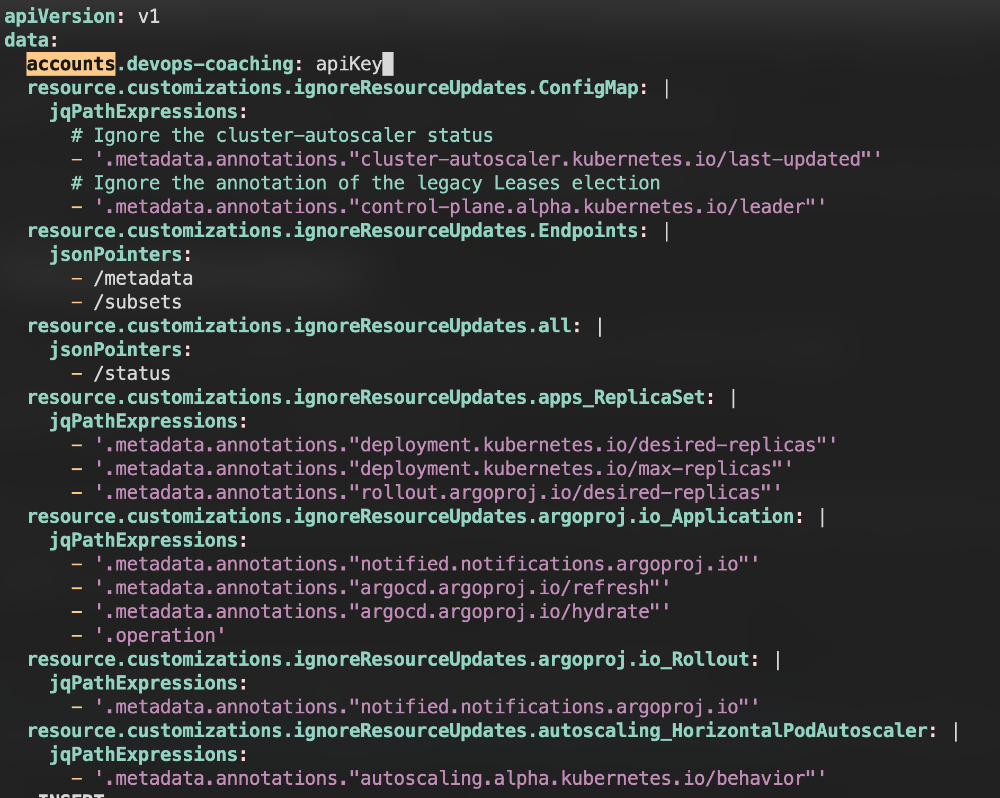
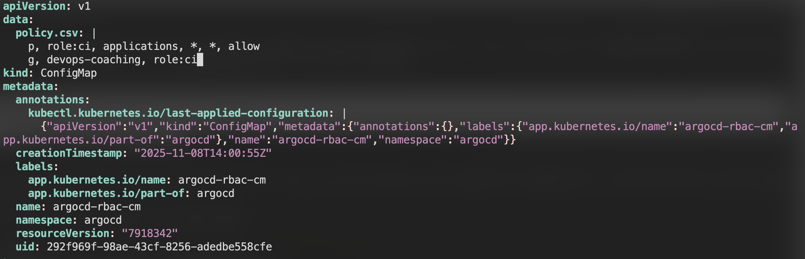
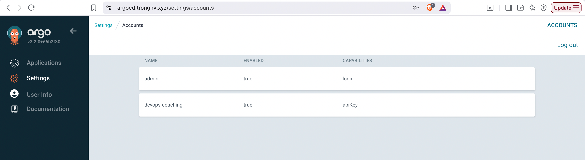
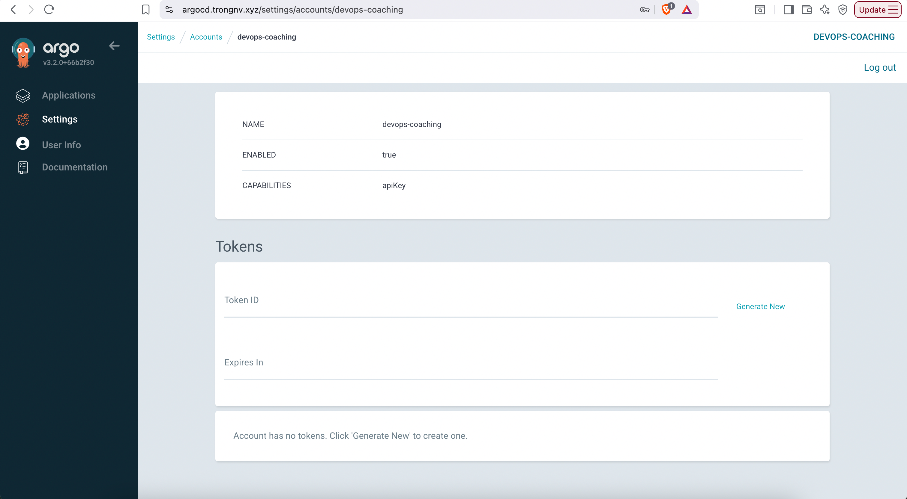
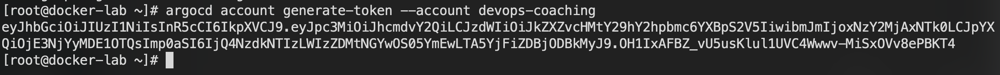

# How to Create a New Account in Argo CD and Configure RBAC
In this guide, we will learn about Argo CD Accounts, RBAC, creating a new account in Argo CD, and configuring RBAC for the account.

## What are Accounts on Argo CD?
-----------------------------

In Argo CD, accounts refer to the identities of users who have permission to access the Argo CD server through the UI or CLI.

Initially, Argo CD only had an admin user with full permission on Argo CD, then user accounts are created for every user with limited permissions by the admin user.

During the user account creation, the admin can assign two types of permissions:

1.  login - which gives UI access to users
2.  apikey - this allows users to create their own API tokens for access.

We can create and disable accounts using the **argocd-cm** configmap, where every account's details are stored; we can even disable the admin user using the **argocd-cm** configmap.

## What is Argo CD RBAC?
---------------------

Argo CD RBAC is used to provide granular permissions for every user and group available on Argo CD.

By giving the least permission to a user according to their task helps to increase the security of Argo CD.

With the help of RBAC, only users with permission can access the resources on Argo CD.

For example, if an application is deployed using Argo CD, the user who has permission on the application can only make changes to the application.

If a user without permission on the application tries to make any changes, they will receive an unauthorized error.

Argo CD RBAC provides permission for the following

1.  Users - Assign every user with specific permissions on Argo CD.
2.  Groups - Using this you can add multiple users to the group and the permissions given to the group are applied for every user in the group.
3.  Argo CD Resources - Gives permission to Argo CD resources like applications, projects, etc.
4.  Actions on Argo CD - Allow users to perform specific actions on Argo CD like creating an application or deleting it.

## Argo CD New Account & RBAC Workflow
-----------------------------------

The diagram given below is the workflow for creating new account in Argo CD and RBAC


Let me explain the diagram

1.  Let's start with the bottom block in which a user creates a new account on Argo CD and add RBAC rules to the new account via Argo CD CLI using configmaps.
2.  You will learn about creating accounts and adding RBAC to the user account in the below example.
3.  The top block shows how RBAC works when a user performs any actions using the new account.
4.  In the diagram, a user tries to delete an application on Argo CD using the new account.
5.  If the account has RBAC policy to delete the application the application will get deleted or else the user will get a permission denied message.

First, let's start with creating a new account on Argo CD.

## Create a New Account in Argo CD
-------------------------------

Before starting the process, make sure you have installed [argocd-cli](https://argo-cd.readthedocs.io/en/stable/cli_installation/?ref=devopscube.com) on your system.

If you have installed Argo CD CLI run the following command to log in to Argo CD.

```bash
argocd login <url>:<port> --username <username> --password <password>
```


Make sure to replace the bolded letters in the above command with your Argo CD URL, port, username, and password.

As an initial step let's list every account in Argo CD using the command given below

```bash
argocd account list
```

You will get every available account on your Argo CD as shown below, my Argo CD only has an admin account so it's only showing it
```text
[root@docker-lab ~]# argocd account list
NAME   ENABLED  CAPABILITIES
admin  true     login
```

Now add a new account using Argo CDs configmap, to do that get the configmap **argocd-cm** by running the following command

```bash
kubectl get configmap argocd-cm -n argocd -o yaml > argocd-cm.yaml
```

To add a new account, open the configmap file **argocd-cm.yaml** and add the following line under data

```text
data:
  accounts.devops-coaching: apiKey
```


> [!NOTE]
> If you want user can login, please add `accounts.devops-coaching: login, apiKey`, because this account is only for deploying applications, so it needs only apiKey for generate authentication token. 

Now run the following command to apply the changes made in Argo CDs configmap

```bash
kubectl apply -n argocd  -f argocd-cm.yaml
```

Once it is executed, you can verify if your account has been added to Argo CD using the account list command

```bash
argocd account list
```

You can see your account has been successfully added to Argo CD
```text
[root@docker-lab ~]# argocd account list
NAME             ENABLED  CAPABILITIES
admin            true     login
devops-coaching  true     apiKey
```

For more information on Argo CD Account creation refer [this](https://argo-cd.readthedocs.io/en/stable/operator-manual/user-management/?ref=devopscube.com#create-new-user) document.

## Configure RBAC for the Account
------------------------------

We are going to use the **argocd-rbac-cm** configmap file of Argo CD to configure RBAC, to get the RBAC configmap file run the following command

```bash
kubectl get configmap argocd-rbac-cm -n argocd -o yaml > argocd-rbac-cm.yml
```

Now open the configmap file, for the newly created account I am only going to give all access to **applications**, to do that add the following line in the **argocd-rbac-cm** file under **data**

```text
data:
  policy.csv: |
    p, role:ci, applications, *, *, allow
    g, devops-coaching, role:ci
```


If you want to give other permission to the account you can replace with readwrite, readexecute, or specify admin to give admin permissions.

Run the following command to update RBAC

```bash
kubectl apply -n argocd -f argocd-rbac-cm.yml
```

The final step is to create a new password for the account, to create a new password run the following command

```bash
argocd account update-password --account <new-account-name> --current-password <admin-password> --new-password <new-account-password>
```

Make sure to replace the bolded letters in the above command with the admin password, new account name, and new password for the account.

Once you have updated the password, you can use the username and password to log in to your Argo CD UI and CLI.
If you go to **Setting/Accounts** on your Argo CD UI, you can see the accounts as shown below



Another way to authenticate with ArgoCD server is token, you can generate a token by login to argocd server, go to **Setting/Accounts** on your Argo CD UI, and click to "Generate New"
 

or run command
```bash
argocd account generate-token --account devops-coaching
```


For more information on Argo CD RBAC Configuration refer [this](https://argo-cd.readthedocs.io/en/stable/operator-manual/rbac/?ref=devopscube.com#basic-built-in-roles) document.

## Conclusion
----------

In summary, we discussed creating a new account, configuring RBAC for that account, and creating a new password for the account.

I hope this blog helps you understand how to create and attach certain permissions to an account in Argo CD.

## References
https://argo-cd.readthedocs.io/en/stable/operator-manual/rbac/
https://devopscube.com/create-a-new-account-in-argo-cd/
