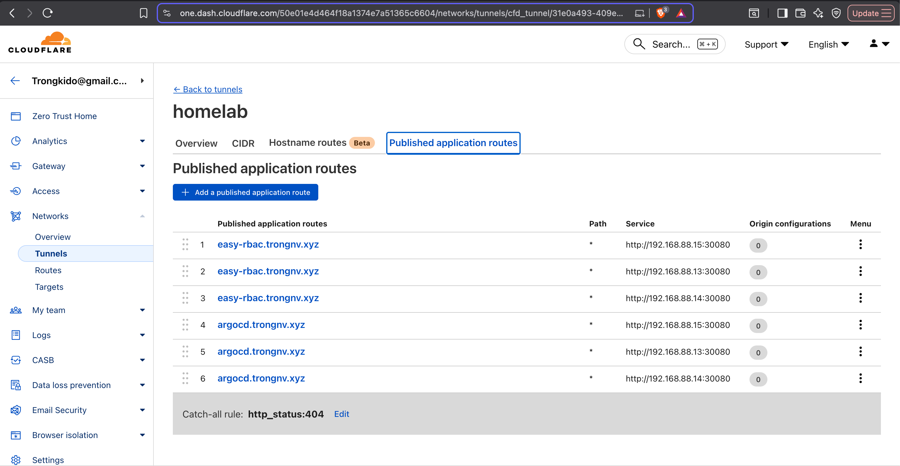
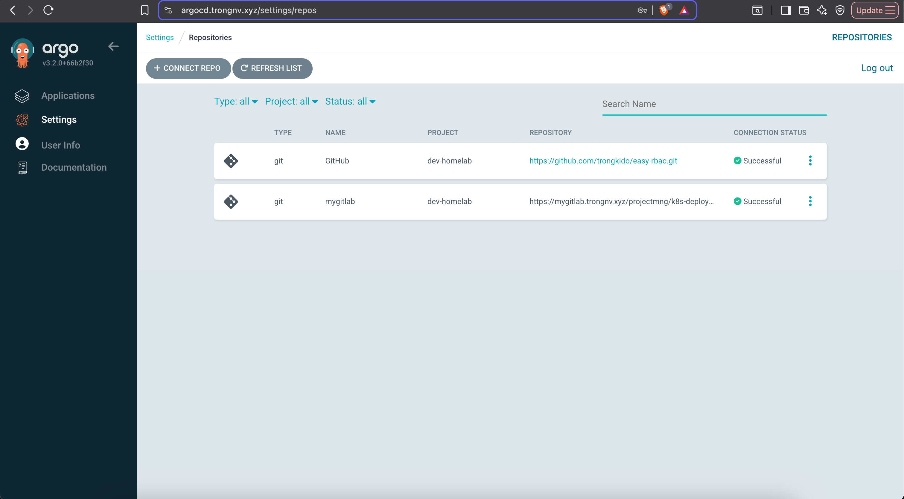
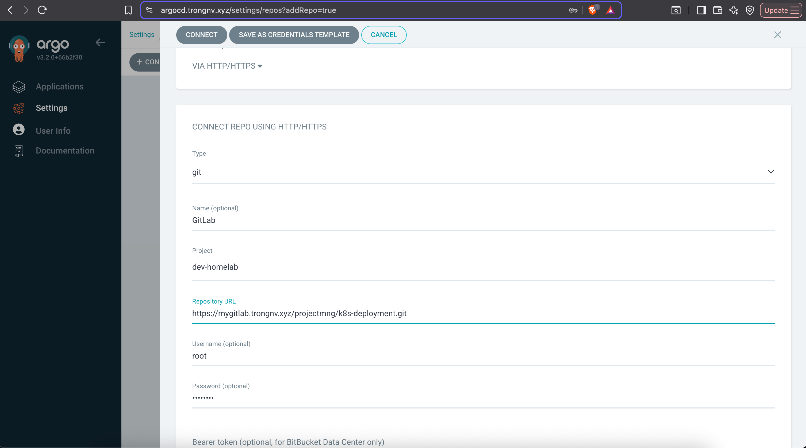
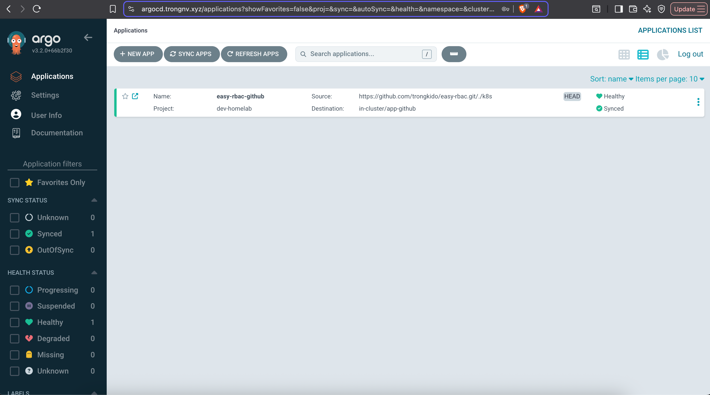
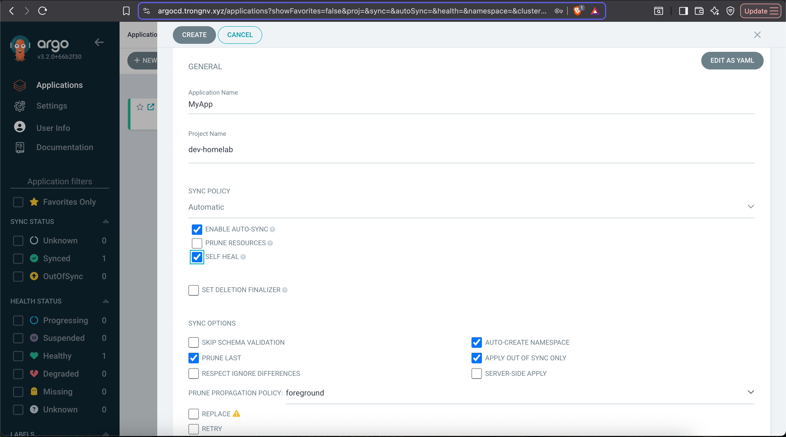
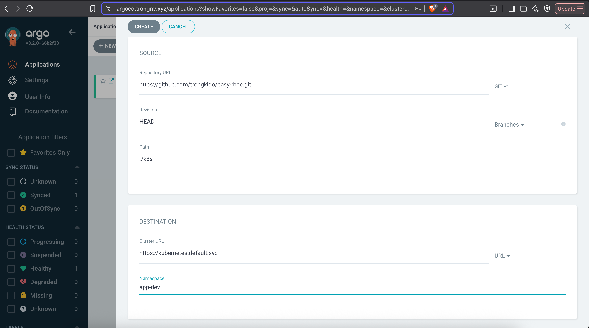
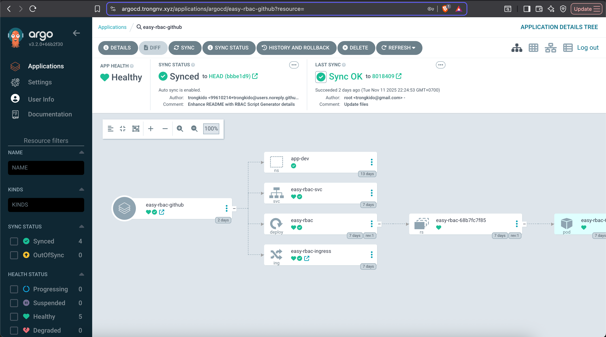

# Hands-on CICD Lab with ArgoCD and Jenkins

## Table of Contents
- [Environment Setup](#environment-setup)
- [Create Simple CICD WorkFlow with Jenkins and ArgoCD](#create-simple-cicd-workflow-with-jenkins-and-argocd)
- [Summary](#summary)

**📋 Lab Objective:** This guide walks you through setting up a complete CI/CD environment using Jenkins integrating with ArgoCD to automatically build and deploy applications in a kubernetes cluster.

>[!NOTE]
>This guide is designed for users who already have a basic understanding of Kubernetes.

## Environment Setup
Before proceeding with the installation, ensure you have a running Kubernetes (K8S) cluster with at least **1 master** and **2 workers**.
You can install a Kubernetes (K8S) cluster with the following guide https://spacelift.io/blog/install-kubernetes

### Install ArgoCD
Let's begin by creating a dedicated namespace for Argo CD, then apply the official installation manifest from the project repository.
```bash
kubectl create namespace argocd
```

Then, install ArgoCD with manifest
```bash
# Install ArgoCD
kubectl apply -n argocd -f https://raw.githubusercontent.com/argoproj/argo-cd/stable/manifests/install.yaml

# Verify installation
kubectl get all -n argocd
---
NAME                                                   READY   STATUS    RESTARTS       AGE
pod/argocd-application-controller-0                    1/1     Running   2 (2d1h ago)   5d2h
pod/argocd-applicationset-controller-fc5545556-m8429   1/1     Running   2 (2d1h ago)   5d2h
pod/argocd-dex-server-f59c65cff-p8cr9                  1/1     Running   2 (2d1h ago)   5d2h
pod/argocd-notifications-controller-59f6949d7-tsfqt    1/1     Running   2 (2d1h ago)   5d2h
pod/argocd-redis-75c946f559-h2dfg                      1/1     Running   2 (2d1h ago)   5d2h
pod/argocd-repo-server-6959c47c44-lnxr6                1/1     Running   2 (2d1h ago)   5d2h
pod/argocd-server-65544f4864-hbwjd                     1/1     Running   2 (2d1h ago)   5d2h

NAME                                              TYPE        CLUSTER-IP       EXTERNAL-IP   PORT(S)                      AGE
service/argocd-applicationset-controller          ClusterIP   10.103.69.50     <none>        7000/TCP,8080/TCP            5d2h
service/argocd-dex-server                         ClusterIP   10.103.109.60    <none>        5556/TCP,5557/TCP,5558/TCP   5d2h
service/argocd-metrics                            ClusterIP   10.99.146.64     <none>        8082/TCP                     5d2h
service/argocd-notifications-controller-metrics   ClusterIP   10.106.122.113   <none>        9001/TCP                     5d2h
service/argocd-redis                              ClusterIP   10.110.25.219    <none>        6379/TCP                     5d2h
service/argocd-repo-server                        ClusterIP   10.109.158.148   <none>        8081/TCP,8084/TCP            5d2h
service/argocd-server                             ClusterIP   10.103.137.197   <none>        80/TCP,443/TCP               5d2h
service/argocd-server-metrics                     ClusterIP   10.100.66.21     <none>        8083/TCP                     5d2h

NAME                                               READY   UP-TO-DATE   AVAILABLE   AGE
deployment.apps/argocd-applicationset-controller   1/1     1            1           5d2h
deployment.apps/argocd-dex-server                  1/1     1            1           5d2h
deployment.apps/argocd-notifications-controller    1/1     1            1           5d2h
deployment.apps/argocd-redis                       1/1     1            1           5d2h
deployment.apps/argocd-repo-server                 1/1     1            1           5d2h
deployment.apps/argocd-server                      1/1     1            1           5d2h

NAME                                                         DESIRED   CURRENT   READY   AGE
replicaset.apps/argocd-applicationset-controller-fc5545556   1         1         1       5d2h
replicaset.apps/argocd-dex-server-f59c65cff                  1         1         1       5d2h
replicaset.apps/argocd-notifications-controller-59f6949d7    1         1         1       5d2h
replicaset.apps/argocd-redis-75c946f559                      1         1         1       5d2h
replicaset.apps/argocd-repo-server-6959c47c44                1         1         1       5d2h
replicaset.apps/argocd-server-65544f4864                     1         1         1       5d2h

NAME                                             READY   AGE
statefulset.apps/argocd-application-controller   1/1     5d2h
---
```

Get ArgoCD admin initial password
```bash
kubectl -n argocd get secret argocd-initial-admin-secret -o jsonpath="{.data.password} | b64decode
```

For access to ArgoCD admin page, you can use 3 types of kubernetes services, which are nodePort, Loadbalance or Ingress. In this lab, I choose Nginx Ingress for routing traffic to the internet.
Let's set up Nginx Ingress, In this guide, I use **NodePort 30080 (HTTP)** and **30443 (HTTPS)** for egress traffic.
```bash
# Add the repository
helm repo add ingress-nginx https://kubernetes.github.io/ingress-nginx --force-update

# Update the local cache
helm repo update

# Install the chart with specified NodePorts
helm upgrade --install ingress-nginx ingress-nginx/ingress-nginx \
  --namespace ingress-nginx \
  --create-namespace \
  --set controller.service.type=NodePort \
  --set controller.service.nodePorts.http=30080 \
  --set controller.service.nodePorts.https=30443 \
  --wait \
  --timeout 300s
```

To access the Argo CD web UI externally via domain name, create an Ingress resource.
```bash
# Create Ingress for ArgoCD
vim argocd_ingress.yml
---
apiVersion: networking.k8s.io/v1
kind: Ingress
metadata:
  name: argocd-ingress
  namespace: argocd
  annotations:
    kubernetes.io/ingress.class: nginx
    nginx.ingress.kubernetes.io/ssl-passthrough: 'true'
    nginx.ingress.kubernetes.io/backend-protocol: 'HTTPS'
spec:
  ingressClassName: nginx
  rules:
  - host: argocd.trongnv.xyz
    http:
      paths:
      - path: /
        pathType: Prefix
        backend:
          service:
            name: argocd-server
            port:
              number: 443
---

# Run file
kubectl apply -f argocd_ingress.yml
```

Finally, setup domain name in Cloudflared Tunnel, please refer to https://github.com/trongkido/easy-rbac for setting Cloudflared tunnel with Cloudflare Zero Trust



Now, we can access the ArgoCD UI with initial password


## Create Simple CICD WorkFlow with Jenkins and ArgoCD

We need to setup for ArgoCD can connect to git repo first, please following these steps
In "Setting", choose "Repositories"


Then, click to "Connect Repo"



Fill out your information and click "Connect"



Now, you can see if your ArgoCD connect to repo successfully.

Next step, we will create an application, please prepare an app with your image has been built and push to a docker repository where your ArgoCD can connect and pull your image.
You also need to prepare manifest files to deploy to kubernetes cluster.
Please refer to this repo https://github.com/trongkido/easy-rbac/ as an example

First, Click on "New Application"


Then, fill out all your information with sepecific path where you prepare manifest files


Define your git repo, app name and other information, then click "Create"


Finish, you can wait ArgoCD finish the deployment.
Let's check the result now



That's all, you can choose many different labs about ArgoCD, good luck.

## Summary

