# Hands-on CICD Lab with ArgoCD and Harbor

## Table of Contents
- [Environment Setup](#environment-setup)
- [CICD with ArgoCD and Harbor](#cicd-with-argocd-and-harbor)
- [Summary](#summary)

**📋 Lab Objective:** This guide walks you through setting up a complete CI/CD environment using Jenkins integrating with ArgoCD and integrate with Harbor to automatically build and deploy applications in a kubernetes cluster.

>[!NOTE]
>This guide is designed for users who already have a basic understanding of Kubernetes.

## Environment Setup
Before proceeding with the installation, ensure you have a running Kubernetes (K8S) cluster with at least **1 master** and **2 workers**.
You can install a Kubernetes (K8S) cluster with the following guide https://spacelift.io/blog/install-kubernetes

### Install ArgoCD
Please refer to this document
https://github.com/trongkido/devops-coaching/edit/main/argocd/hands-on-lab-with-argocd/README.md

### Install Harbor
#### Harbor Overview
Harbor is an open‑source, cloud‑native container registry designed to store, manage, secure, and replicate Docker/OCI images and Helm charts. It is a CNCF Graduated project widely used in Kubernetes and DevOps environments.

#### Harbor Key Features
- **OCI‑compliant registry** for Docker images and artifacts.
- **Role‑Based Access Control (RBAC)** for project‑level permissions.
- **Integrated Vulnerability Scanning** using Trivy.
- **Image Signing & Verification** using Notary v1.
- **Replication Policies** to sync images between multiple Harbor registries.
- **Helm Chart Repository** with chart management built-in.
- **Audit Logs** for all user and system actions.
- **Project Quotas** to control storage usage.
- **LDAP/AD Integration** for enterprise authentication.
- **Retention & Garbage Collection** to clean old images.

#### Harbor Architecture Components
- **core** – main API and business logic.
- **registry** – stores container images (based on distribution).
- **portal** – UI dashboard.
- **notary** – image signing.
- **trivy/scanner** – vulnerability scanning service.
- **jobservice** – background tasks (replication, garbage collection).
- **database (PostgreSQL)** – stores metadata.
- **Redis** – caching and job queuing.

#### Why Harbor?
- Secure-by-default container registry.
- Fully open-source (CNCF).
- Designed for Kubernetes & GitOps.
- Enterprise-ready with authentication, auditing, and replication.
- Excellent for multi-cluster deployments.

#### Harbor Common Use Cases
- Private registry for Kubernetes clusters.
- Storing application images for CI/CD pipelines.
- Multi-datacenter or multi-cloud image replication.
- Enforcing DevSecOps security standards.
- Serving Helm charts with version control.

#### When to Choose Harbor
Choose Harbor if you need:
- A **secure container registry** for images and Helm charts.
- **Built-in scanning** and **image signing**.
- **OCI-compliant** registry deeply integrated with Kubernetes.
- **Replication** across environments (dev/staging/prod).
- **Project-based access control** for large teams.

#### Harbor is Not Ideal For
Harbor is **not** designed to store:
- Maven, NPM, PyPI, or other software package types.
- Non-container artifacts (use Nexus or Artifactory for that).

#### Conclusion
Harbor is one of the best solutions for organizations operating Kubernetes environments that need a secure, enterprise-grade container registry with advanced features like RBAC, vulnerability scanning, and replication. It is purpose-built for cloud-native DevSecOps workflows.

#### Install Harbor
First, we need to download installation package
```bash
# Create archive folder
mkdir /opt/src
# Download installation package
cd /opt/src
wget https://github.com/goharbor/harbor/releases/download/v2.14.1/harbor-offline-installer-v2.14.1.tgz
# Extract compressed file
tar -xzf harbor-offline-installer-v2.14.1.tgz
# Make a running folder
mv harbor /opt/harbor-cluster
# Configure the Harbor YML File for Installation
cd /opt/harbor-cluster
cp harbor.yml.tmpl harbor.yml
vim harbor.yml
---
# Domain name
hostname: harbor-registry.trongnv.xyz
# http related config
http:
  # port for http, default is 80. If https enabled, this port will redirect to https port
  port: 8088 
# We need to disable the https and manage the traffic via proxy
#https
# Set an initial password for the Harbor system administrator. This password is only used on the first time that Harbor starts. On subsequent logins, this setting is ignored and the administrator's password is set in the Harbor Portal. The default username and password are admin and Harbor12345
harbor_admin_password: Harbor12345
# Harbor DB configuration
database:
  # The password for the user('postgres' by default) of Harbor DB. Change this before any production use.
  password: password
# The location on the target host in which to store Harbor's data
data_volume: /opt/harbor-cluster/data
---

# Create folder to store data
mkdir /opt/harbor-cluster/data
```

After finish update the config file, now we will run install.sh script with options to enable scan tool Trivy
```bash
cd /opt/harbor-cluster
sh install.sh --with-trivy
```

Finally, let's check the result
```bash
docker ps -a
```text
CONTAINER ID   IMAGE                                   COMMAND                  CREATED         STATUS                   PORTS                                                                                      NAMES
62d2b5921d09   goharbor/nginx-photon:v2.14.1           "nginx -g 'daemon of…"   3 minutes ago   Up 3 minutes (healthy)   0.0.0.0:8088->8080/tcp, :::8088->8080/tcp                                                  nginx
20b73928fdb9   goharbor/harbor-jobservice:v2.14.1      "/harbor/entrypoint.…"   3 minutes ago   Up 2 minutes (healthy)                                                                                              harbor-jobservice
cf13e2af737a   goharbor/harbor-core:v2.14.1            "/harbor/entrypoint.…"   3 minutes ago   Up 3 minutes (healthy)                                                                                              harbor-core
a96df634f70e   goharbor/trivy-adapter-photon:v2.14.1   "/home/scanner/entry…"   3 minutes ago   Up 3 minutes (healthy)                                                                                              trivy-adapter
40696c23930e   goharbor/harbor-db:v2.14.1              "/docker-entrypoint.…"   3 minutes ago   Up 3 minutes (healthy)                                                                                              harbor-db
45637d21c04f   goharbor/registry-photon:v2.14.1        "/home/harbor/entryp…"   3 minutes ago   Up 3 minutes (healthy)                                                                                              registry
61917c87b447   goharbor/harbor-registryctl:v2.14.1     "/home/harbor/start.…"   3 minutes ago   Up 3 minutes (healthy)                                                                                              registryctl
9eb874df971d   goharbor/harbor-portal:v2.14.1          "nginx -g 'daemon of…"   3 minutes ago   Up 3 minutes (healthy)                                                                                              harbor-portal
566e4c9a9fba   goharbor/redis-photon:v2.14.1           "redis-server /etc/r…"   3 minutes ago   Up 3 minutes (healthy)                                                                                              redis
7bf2330a665d   goharbor/harbor-log:v2.14.1             "/bin/sh -c /usr/loc…"   3 minutes ago   Up 3 minutes (healthy)   127.0.0.1:1514->10514/tcp                                                                  harbor-log
```
```

Next, we need to update the proxy config and access to the harbor web UI
```bash
cd /etc/nginx
vim harbor-registry.conf
---
server {
  listen *:443 ssl;

  server_name harbor-registry.trongnv.xyz;
  server_tokens off; ## Don't show the nginx version number, a security best practice
  client_max_body_size 0;
  add_header Strict-Transport-Security "max-age=31536000";
  proxy_hide_header Referrer-Policy;
  add_header Referrer-Policy strict-origin-when-cross-origin;

  ssl_certificate /etc/gitlab/ssl/mygitlab.trongnv.xyz.crt;
  ssl_certificate_key /etc/gitlab/ssl/mygitlab.trongnv.xyz.key;

  access_log  /var/log/gitlab/nginx/harbor_access.log gitlab_access;
  error_log   /var/log/gitlab/nginx/harbor_error.log error;

  gzip on;
  gzip_static on;
  gzip_comp_level 2;
  gzip_http_version 1.1;
  gzip_vary on;
  gzip_disable "msie6";
  gzip_min_length 250;
  gzip_proxied no-cache no-store private expired auth;
  gzip_types text/plain text/css application/x-javascript text/xml application/xml application/xml+rss text/javascript application/json;


  location /  {
	proxy_pass http://192.168.88.140:8088;
	proxy_set_header Host $host:$server_port;
	proxy_set_header X-Real-IP $remote_addr;
        proxy_set_header X-Forwarded-For $proxy_add_x_forwarded_for;
  }

}

server {
        listen          80;
        server_name     harbor-registry.trongnv.xyz;
        return 301 https://$server_name;
}
---

systemctl reload nginx
```

Access the web UI
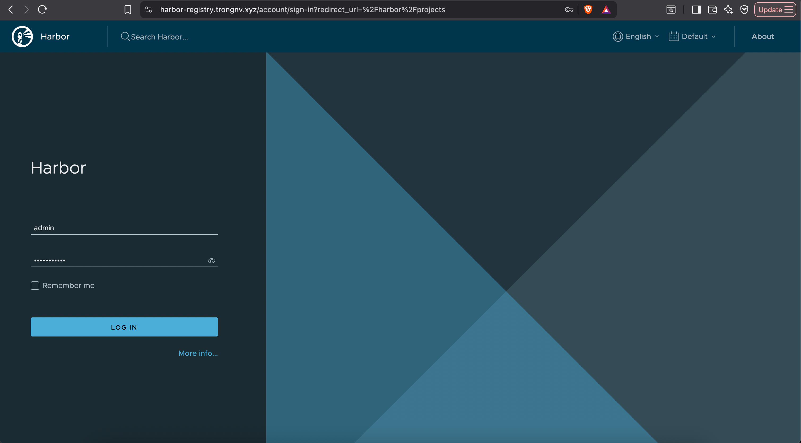

Change password at the first login
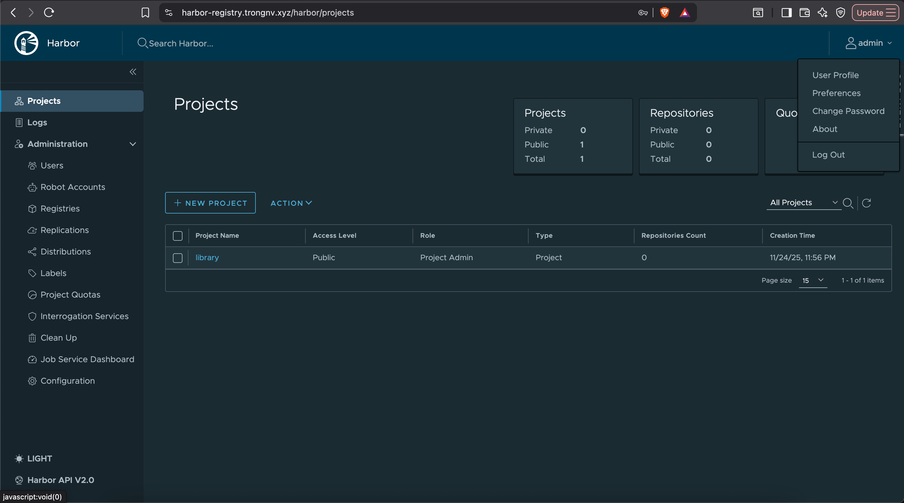

Fill new password and click "OK"
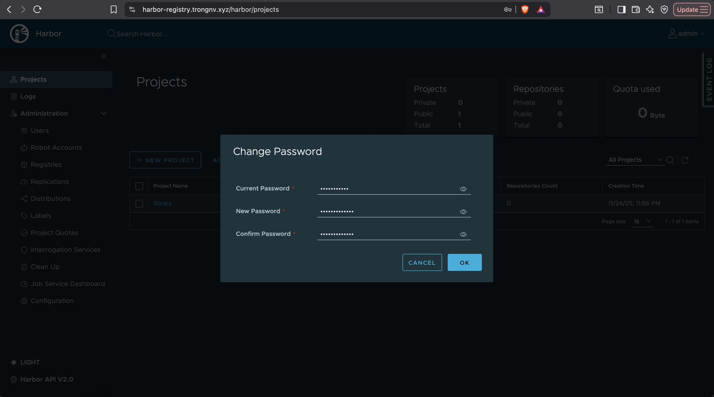

Next, we need to create new project
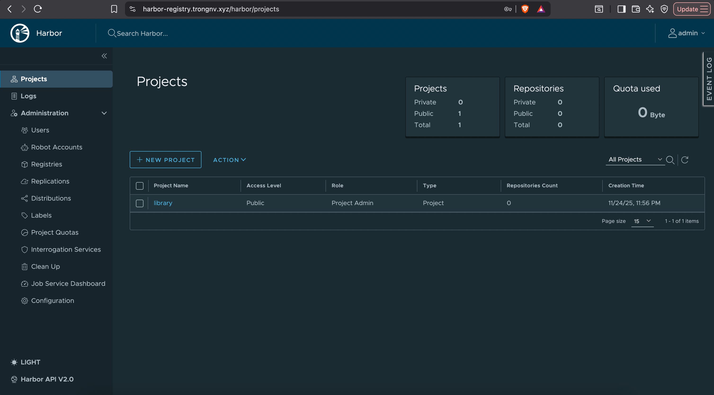

Fill out the information
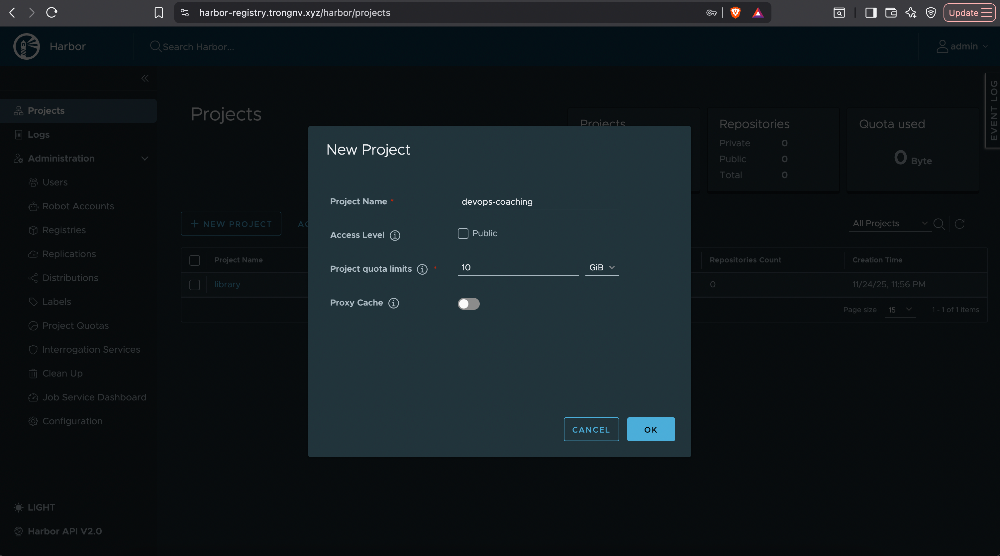

Then, we will create a user for this project
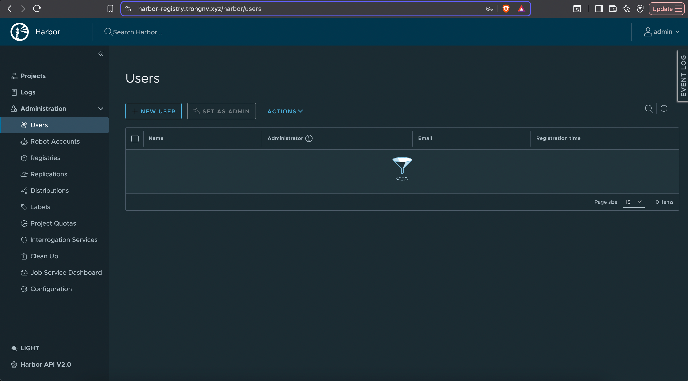

Fill out the information
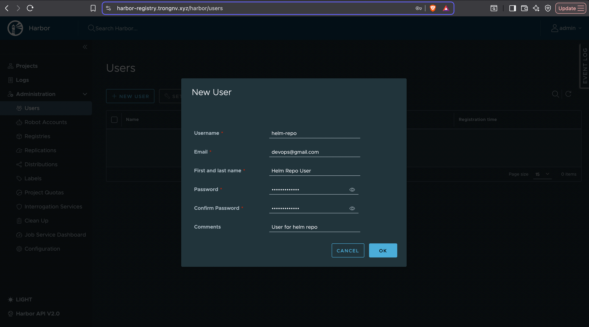

Finally, add user to repo
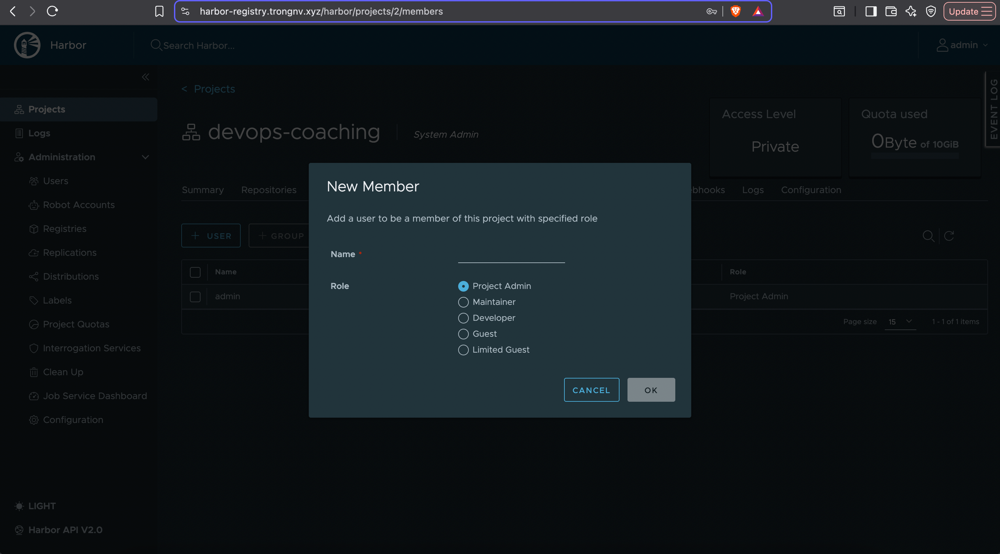

#### Install Helm
We need to install helm and helm-push plugin in order to push your chart to harbor registry
```bash
# Install helm
curl -fsSL -o get_helm.sh https://raw.githubusercontent.com/helm/helm/main/scripts/get-helm-3
chmod 700 get_helm.sh
./get_helm.sh
helm version
# Install helm push plugin
helm plugin install https://github.com/chartmuseum/helm-push
# Test login with created user
helm registry login harbor-registry.trongnv.xyz:8088 -u helm-repo
```

Now, we will use helm create to create the standard directory structure, then “clean up” (empty) unnecessary template files
```bash
# Create folder
mkdir -p /opt/helm && cd /opt/helm
# Create new helm chart
helm create app-template
# Update service file
cd app-template
vim templates/service.yaml
---
apiVersion: v1
kind: Service
metadata:
  name: {{ include "app-template.fullname" . }}
  labels:
    {{- include "app-template.labels" . | nindent 4 }}
spec:
  type: {{ .Values.service.type }}
  ports:
    - port: {{ .Values.service.port }}
      targetPort: {{ .Values.service.targetPort }}
      protocol: TCP
  selector:
    {{- include "app-template.selectorLabels" . | nindent 4 }}
---

# Update value.yaml file
vim values_tpl.yaml
---
replicaCount: 1
serviceAccount:
  create: false
image:
  repository: registry-nexus.trongnv.xyz/easy-rbac/easy-rbac
  tag: lastest
  pullPolicy: IfNotPresent
imagePullSecrets:
  - name: nexus-registry-secret
service:
  type: ClusterIP
  port: 80
  targetPort: 80
ingress:
  enabled: true
  className: "nginx"
  annotations: {}
  hosts:
    - host: 
      paths:
        - path: /
          pathType: Prefix
livenessProbe:
  httpGet:
    path: /
    port: http
readinessProbe:
  httpGet:
    path: /
    port: http
---
```

Now, package the helm chart and push it to harbor registry
```bash
# Package the helm chart
cd /opt/helm
helm package app-template
# Push to registry
helm push app-template-0.1.0.tgz oci://harbor-registry.trongnv.xyz:8088/devops-coaching/app-template
```

You can check the package in harbor registry
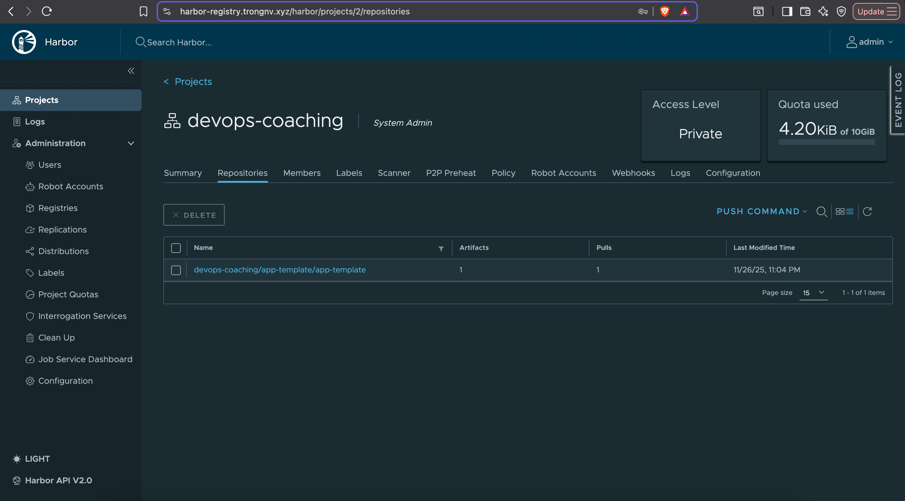

## CICD with ArgoCD and Harbor
We need to connect ArgoCD to Harbor repo, on ArgoCD web UI, choose "Setting -> Repositories"
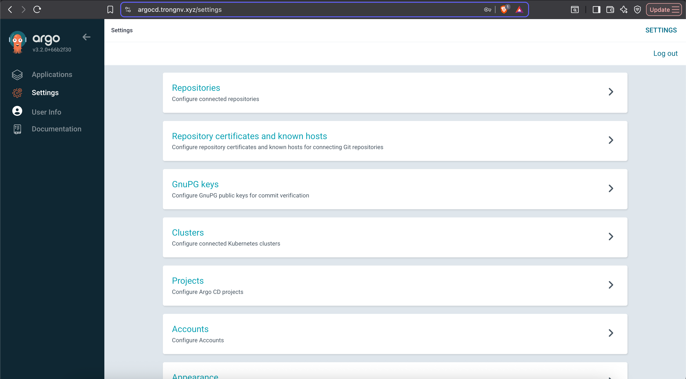

Click "Connect Repo"
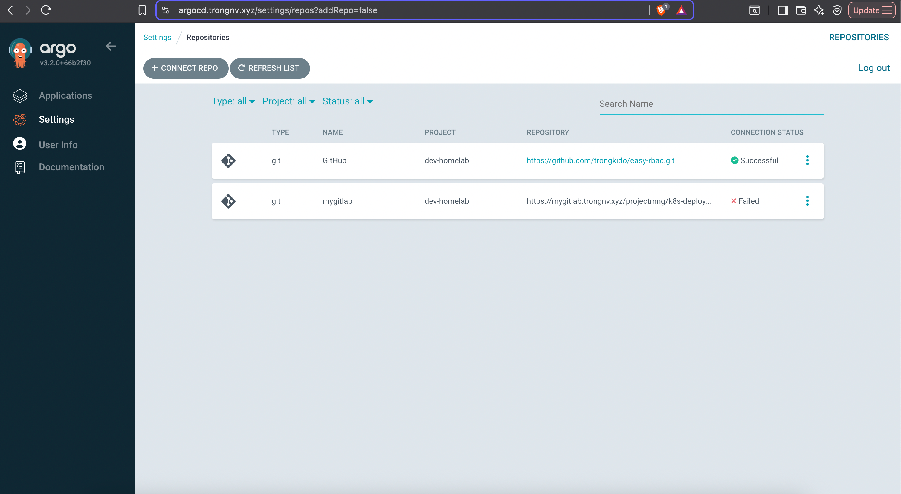

Fill out the information and click "Save"
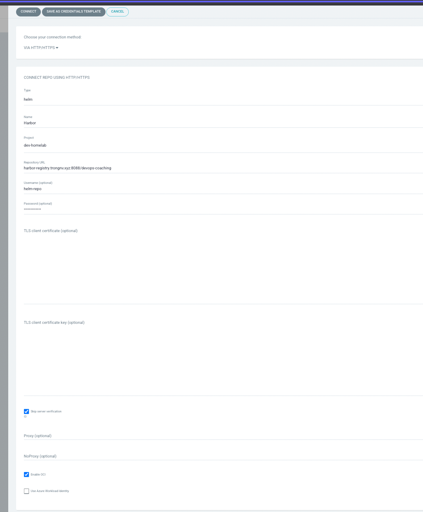

Now, ArgoCD can connect to Harbor registry
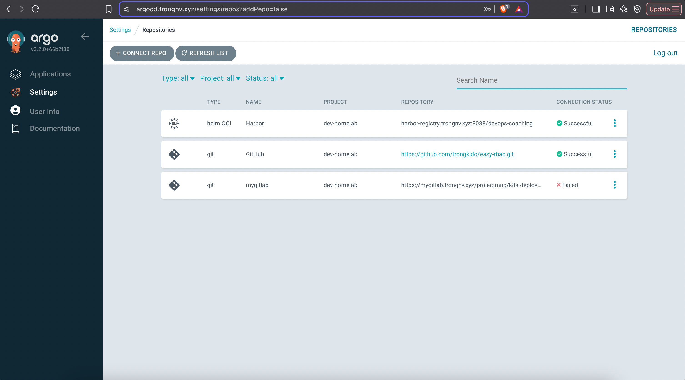

