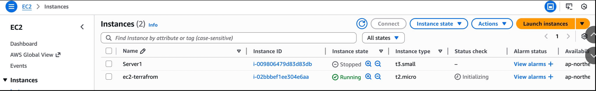
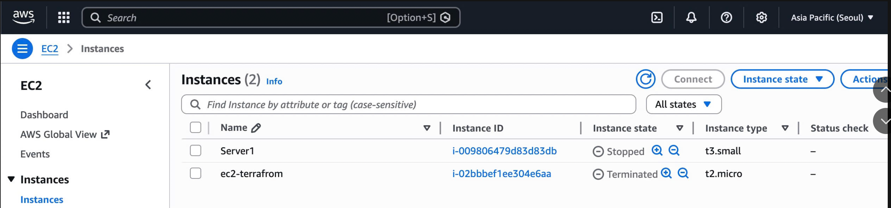

## Part 2: Auto Deploy VM on AWS EC2

We will create an EC2 instance in the Korean region (`ap-northeast-2`).

### 1. Prepare Infrastructure Information

Before writing code, collect the following from the AWS Console:

- **Access Key & Secret Key** – for Terraform authentication  
- **AMI ID** – from **EC2 > AMI Catalog**  
- **Subnet ID** – from **VPC > Subnets**

### 2. Write Terraform Code (AWS)

Create these files:

provider.tf
```hcl
terraform {
  required_providers {
    aws = {
      source  = "hashicorp/aws"
      version = "~> 3.27"
    }
  }
}
```

main.tf
```hcl
provider "aws" {
  profile = "YOUR-PROFILE"
  region  = "ap-northeast-2"
}

resource "aws_instance" "ec2-terraform" {
  ami           = "ami-0b818a04bc9c2133c"
  instance_type = "t2.micro"
  key_name      = "your_ssh_key"
  tags = {
    Name = "ec2-terrafrom"
  }
}
```

Now, run these code
```bash
# Purpose: Initializes the working directory containing your Terraform configuration files.
# What it does:
  # Downloads and installs required providers (e.g., AWS, Azure, Google) and modules.
  # Configures the backend for storing state (if specified).
  # Creates a .terraform directory (with plugins and modules) and a dependency lock file (.terraform.lock.hcl).
# When to run:
  # First time in a new project or after cloning a repository.
  # Whenever you add/change providers, modules, or backend configuration.
# Key notes: Safe to run multiple times; it won't delete existing state or infrastructure.
terraform init

# Purpose: Automatically formats your Terraform configuration files (.tf) to follow the canonical (standard) HashiCorp style and format.
# What it does:
  # Rewrites files for consistent indentation, spacing, alignment, and readability.
  # Enforces opinionated but standardized styling (no customization options).
# When to run:
  # Before committing code to version control (often as a pre-commit hook).
  # To ensure team consistency.
# Key notes: Optional but highly recommended for clean, readable code. Use terraform fmt -check to verify without modifying files.
terraform fmt

# Purpose: Generates and displays an execution plan showing what changes Terraform will make to your infrastructure.
# What it does:
  # Compares your current configuration (code) against the current state (real infrastructure).
  # Previews actions: create (+), update (~), delete (-), or no changes.
  # Performs a "dry run" — no actual changes are applied.
# When to run:
  # After init and before apply.
  # To review and approve changes (great for code reviews or CI/CD).
# Key notes: Safe to run anytime; helps catch errors early. You can save the plan with -out=planfile for later use.
terraform plan

# Purpose: Applies the changes required to reach the desired state defined in your configuration.
# What it does:
  # If no plan file is provided: Automatically runs a plan, prompts for approval (type "yes"), then executes it.
  # Creates, updates, or destroys resources via provider APIs.
  # Updates the state file with the new infrastructure reality.
# When to run:
  # After reviewing the plan.
  # To actually provision or modify infrastructure.
# Key notes:
  # Use -auto-approve to skip confirmation (common in automation).
  # Can apply a saved plan file: terraform apply planfile (no prompt).
terraform apply
```

After completion, the EC2 instance will appear in AWS Console.


To delete all the resources
```bash
# Purpose
  # To completely delete all infrastructure resources managed by the current Terraform configuration.
  # Provides a clean and controlled way to tear down environments when they are no longer needed.
# What it does
  # Reads the Terraform configuration files (.tf) and the current state file.
  # Generates a destruction plan that lists every resource that will be deleted.
  # After user approval, calls the respective provider APIs (e.g., AWS, Azure) to destroy resources in the correct dependency order.
  # Updates the Terraform state file (usually emptying it once all resources are removed).
# When to run
  # When decommissioning an entire environment (e.g., deleting a test or staging setup).
  # After finishing experiments or proofs-of-concept (POC).
  # When you want to start fresh before applying major configuration changes.
  # During cleanup in CI/CD pipelines for temporary resources.
# Key notes
  # Highly destructive: Permanently deletes resources and any data they contain (e.g., databases, object storage) unless separately backed up.
  # Interactive by default: Shows a plan and requires typing yes to proceed. Use -auto-approve to skip confirmation in automated scripts.
  # Targeted destruction (use cautiously): terraform destroy -target=resource_type.resource_name destroys only specific resources, but can leave state inconsistent.
  # Not reversible: Terraform cannot undo a destroy. You must run terraform apply again to recreate resources.
  # Safe to preview: Always review the plan output carefully before confirming, especially in production.
  # Best practice: Protect production workspaces with state locking, required approvals, or separate configurations to prevent accidental destruction.
terraform destroy
```

After completion, the EC2 instance will be terminated.

