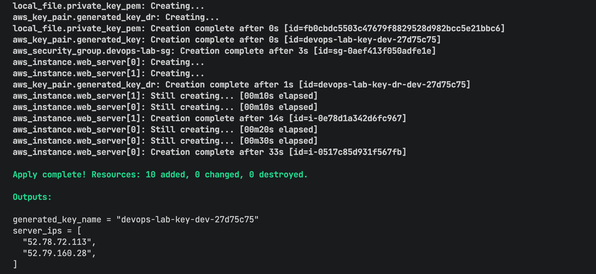
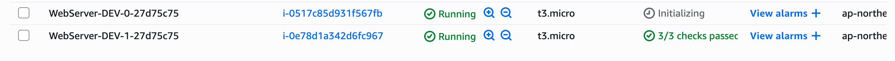
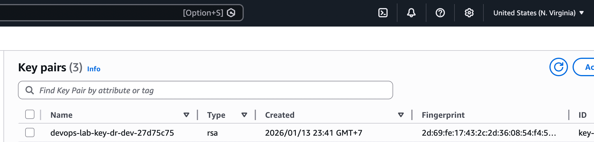
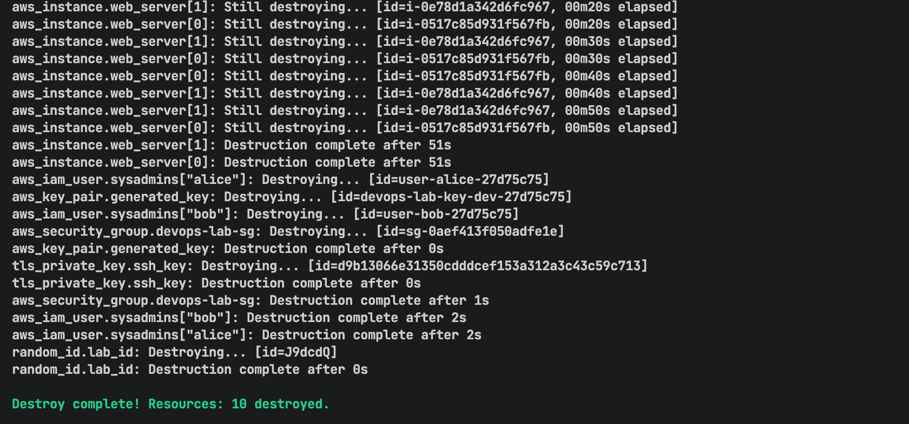

# Arguments and Meta Arguments

## Write Terraform Code

Create these files:

provider.tf
```hcl
# [1] BLOCK: Terraform configuration
terraform {
  required_version = ">= 1.0.0"
  required_providers {
    aws = {
      source  = "hashicorp/aws"
      version = "~> 5.0"
    }
    random = {
      source  = "hashicorp/random"
      version = "~> 3.0"
    }
    local = {
      source  = "hashicorp/local"
      version = "~> 2.0"
    }
    tls = {
      source  = "hashicorp/tls"
      version = "~> 4.0"
    }
  }
}
```

variables.tf
```hcl
# --- VARIABLES ---
variable "project_config" {
  type = object({
    env            = string
    instance_size  = map(string)
    whitelist_ips  = list(string)
    instance_count = number
  })

  default = {
    env = "dev"
    instance_size = {
      dev  = "t3.micro"
      prod = "t3.medium"
    }
    whitelist_ips  = ["0.0.0.0/0"]
    instance_count = 2  # Create 2 servers
  }
}

variable "sysadmin_users" {
  description = "Admin users list (Map)"
  type        = map(string)
  default = {
    "alice" = "DevOps-Lead"
    "bob"   = "SysAdmin-Intern"
  }
}
```

main.tf
```hcl
# --- PROVIDERS (META-ARGUMENT: ALIAS) ---
# Main provider
provider "aws" {
  profile = "trong-aws"
  region  = "ap-northeast-2"
}

# [META-ARGUMENT 1: Provider Alias]
provider "aws" {
  alias  = "dr_region"
  profile = "trong-aws"
  region = "us-east-1"
}

# --- RANDOM ID GENERATOR ---
# Create 4 random strings (e.g: a1b2) for passing this string to resource name
resource "random_id" "lab_id" {
  byte_length = 4
  keepers = {
    env = var.project_config.env
  }
}

# --- RESOURCES ---
# 1. SSH KEY & KEY PAIR
resource "tls_private_key" "ssh_key" {
  algorithm = "RSA"
  rsa_bits  = 4096
}

# Main Key Pair
resource "aws_key_pair" "generated_key" {
  key_name   = format("devops-lab-key-%s-%s", var.project_config.env, random_id.lab_id.hex)
  public_key = tls_private_key.ssh_key.public_key_openssh
  # [META-ARGUMENT 2: Lifecycle]
  lifecycle {
    # prevent_destroy = true # Turn this on if the ENV is PROD
    ignore_changes = [tags]
  }
}

# Secondary Key Pair - Provider Alias
resource "aws_key_pair" "generated_key_dr" {
  # [META-ARGUMENT 1: Provider]
  provider = aws.dr_region
  key_name   = format("devops-lab-key-dr-%s-%s", var.project_config.env, random_id.lab_id.hex)
  public_key = tls_private_key.ssh_key.public_key_openssh
}

resource "local_file" "private_key_pem" {
  content         = tls_private_key.ssh_key.private_key_pem
  filename        = "${path.module}/generated-key.pem"
  file_permission = "0400"
}

# 2. IAM USERS (Identity)
resource "aws_iam_user" "sysadmins" {
  # [META-ARGUMENT 3: For_each]
  # Use `for_each` for IAM User instead of `Count` for safety when deleting/modifying lists.
  for_each = var.sysadmin_users

  name = "user-${each.key}-${random_id.lab_id.hex}"
  tags = {
    Department = each.value
    Role       = "SystemOperator"
  }
}

# 3. SECURITY GROUP (Network)
resource "aws_security_group" "devops-lab-sg" {
  name        = "devops-lab-sg-${var.project_config.env}-${random_id.lab_id.hex}"
  description = "Allow HTTP and SSH"

  ingress {
    from_port   = 80
    to_port     = 80
    protocol    = "tcp"
    cidr_blocks = ["0.0.0.0/0"]
  }
  ingress {
    from_port   = 22
    to_port     = 22
    protocol    = "tcp"
    cidr_blocks = var.project_config.whitelist_ips
  }
  egress {
    from_port   = 0
    to_port     = 0
    protocol    = "-1"
    cidr_blocks = ["0.0.0.0/0"]
  }

  # [META-ARGUMENT 2: Lifecycle]
  lifecycle {
    # Create a new SG first, then delete the old one -> Zero Downtime
    create_before_destroy = true
  }
}

# 4. COMPUTE (EC2)
data "aws_ami" "ubuntu" {
  most_recent = true
  owners      = ["099720109477"]
  filter {
    name   = "name"
    values = ["ubuntu/images/hvm-ssd/ubuntu-jammy-22.04-amd64-server-*"]
  }
}

resource "aws_instance" "web_server" {
  # [META-ARGUMENT 4: Count]
  count = var.project_config.instance_count

  # [META-ARGUMENT 5: Depends_on]
  # Flow Control: Requires waiting for the IAM User and Key Pair to be created.
  depends_on = [
    aws_iam_user.sysadmins,
    aws_key_pair.generated_key
  ]

  ami           = data.aws_ami.ubuntu.id
  instance_type = var.project_config.env == "prod" ? var.project_config.instance_size["prod"] : var.project_config.instance_size["dev"]

  vpc_security_group_ids = [aws_security_group.devops_web_sg.id]
  key_name               = aws_key_pair.generated_key.key_name

  user_data = <<-EOF
              #!/bin/bash
              sudo apt-get update
              sudo apt-get install -y nginx
              echo "<h1>Server #${count.index + 1} (${var.project_config.env})</h1>" > /var/www/html/index.html
              sudo systemctl enable nginx
              sudo systemctl start nginx
              EOF

  tags = {
    # Assign sequential numbers to VMs using count.index
    Name = "WebServer-${upper(var.project_config.env)}-${count.index}-${random_id.lab_id.hex}"
  }
}
```

outputs.tf
```hcl
output "server_ips" {
  description = "List of IP addresses of the servers (Splat Operator)"
  value       = aws_instance.web_server[*].public_ip
}

output "generated_key_name" {
  description = "The Key Pair name has been generated (with a random ID)"
  value       = aws_key_pair.generated_key.key_name
}
```

## Deploy

Run these command
```bash
terraform init
terraform fmt
terraform plan
terraform apply --auto-approve
```

Terraform run result







To delete the resource
```hcl
terraform destroy
```

