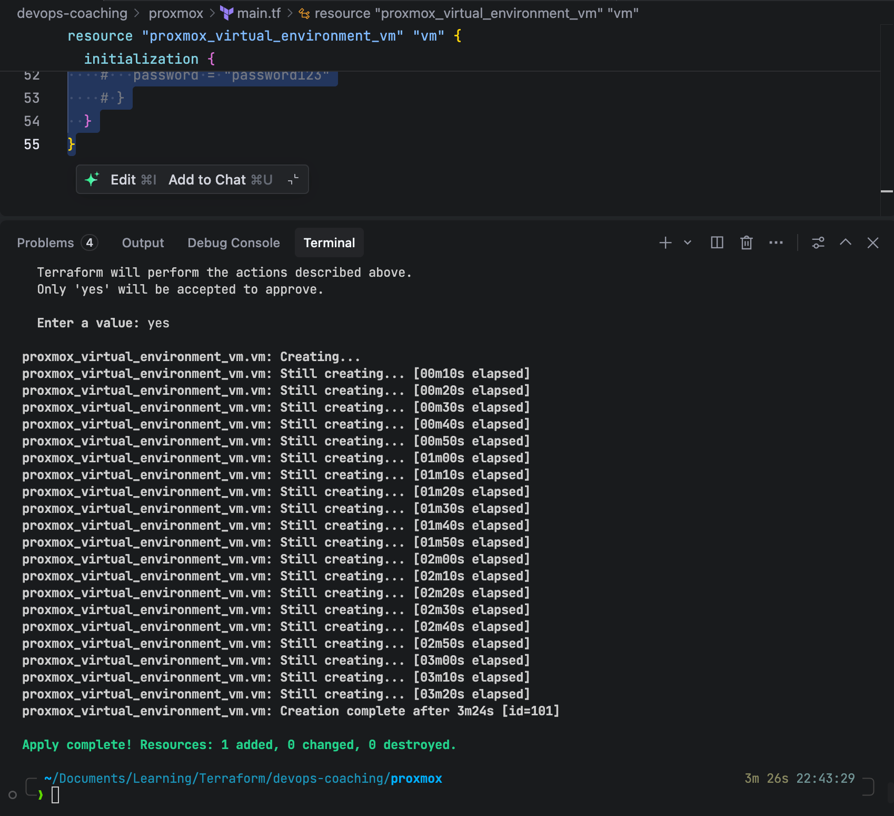
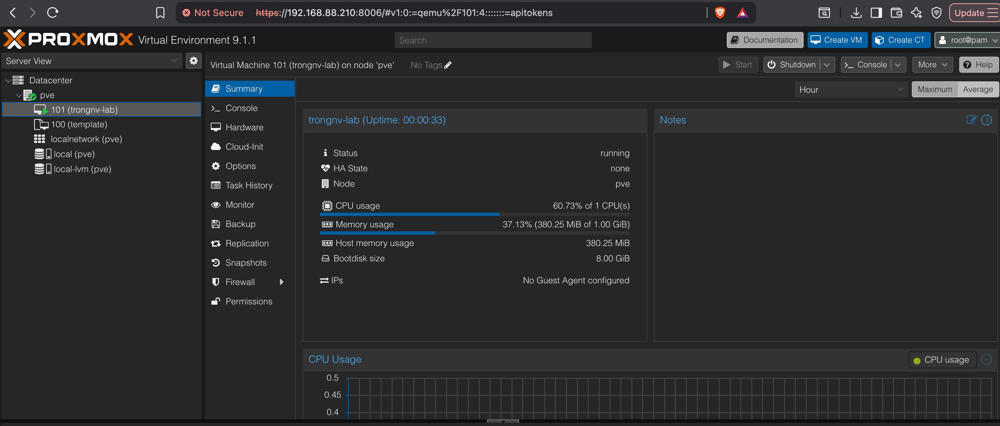
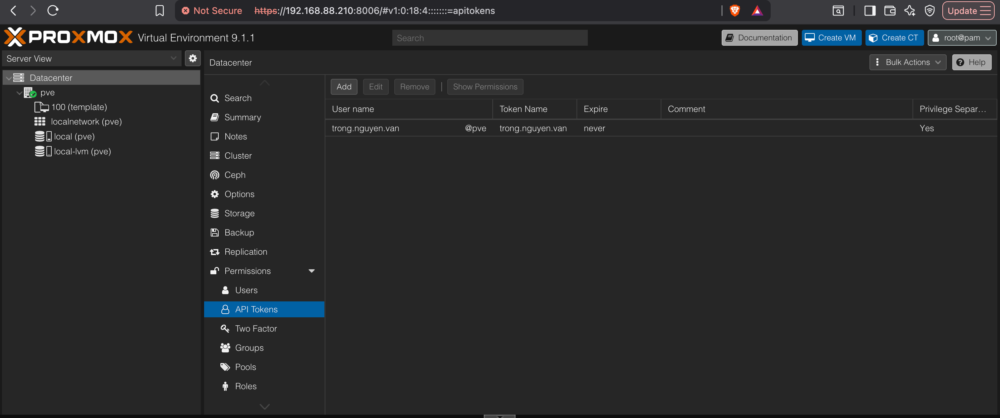

## Auto Deploy VM on Proxmox

This section uses the Proxmox API and template cloning.

### 1. Prepare Template and API Token

1. Create an Ubuntu VM and **Convert to Template**
2. Create an **API Token** and assign permissions

Please follow these instruction: https://github.com/trongkido/devops-coaching/blob/main/proxmox/README.md

### 2. Collect Proxmox Parameters

- Endpoint URL
- Node name
- Template VM ID

### 3. Write Terraform Code (Proxmox)

Please prepare these files
provider.tf
```hcl
terraform {
  required_providers {
    proxmox = {
      source  = "bpg/proxmox"
      version = ">=0.80.0"
    }
  }
}
```

main.tf
```hcl
provider "proxmox" {
  endpoint = "<proxmox_url>"
  # Token User
  api_token = "<user_name!<api_token_id>=<api_token>"
  insecure  = true
}

resource "proxmox_virtual_environment_vm" "vm" {
  name      = "trongnv-lab"
  node_name = "pve"

  # --- [REQUIREMENT: AUTO START] ---
  # Auto start after clone
  started = true

  clone {
    vm_id = 100
    full  = true
    # [Mẹo nhỏ] Tăng thời gian chờ clone nếu disk lớn
    # retries = 3 
  }

  cpu {
    cores = 1
    type = "host"
  }

  memory {
    dedicated = 1024
  }

  network_device {
    bridge = "vmbr0"
  }

  # Disable QEMU Agent
  agent {
    enabled = false
  }

  initialization {
    ip_config {
      ipv4 {
        address = "dhcp"
      }
    }

    # [Optional] Set default user/pass if Cloud-Init supports
    # user_account {
    #   username = "student"
    #   password = "password123"
    # }
  }
}
```

### 4. Deploy
Run these command
```bash
terraform init
terraform fmt
terraform plan
terraform apply --auto-approve
```

Terraform run result


VM on Proxmox


To delete the resource
```bash
terraform destroy
```


