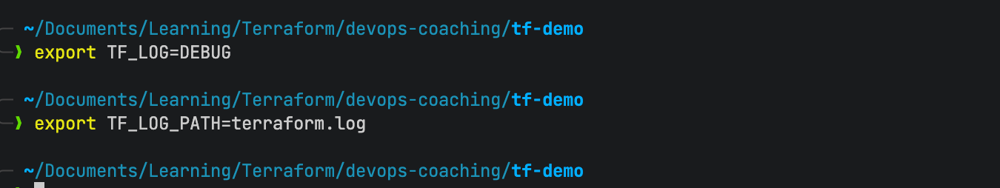
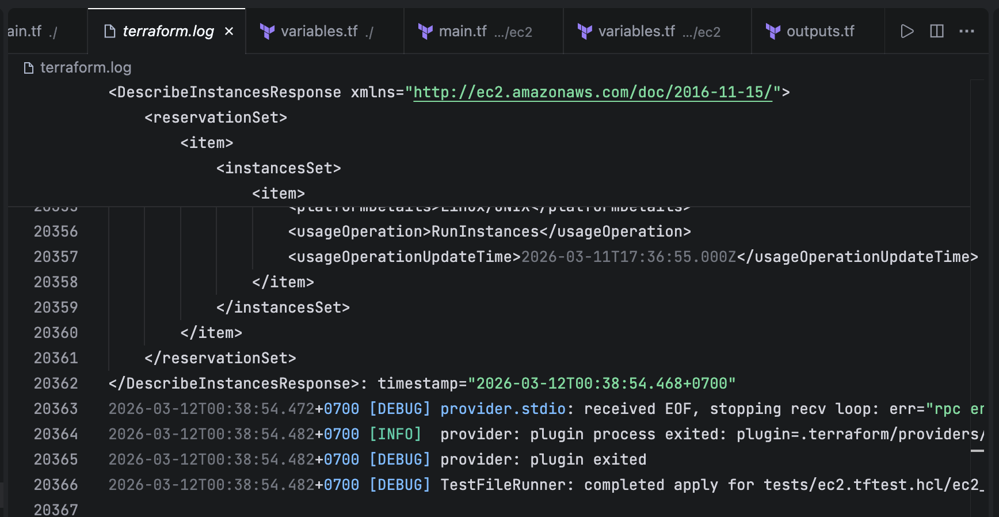
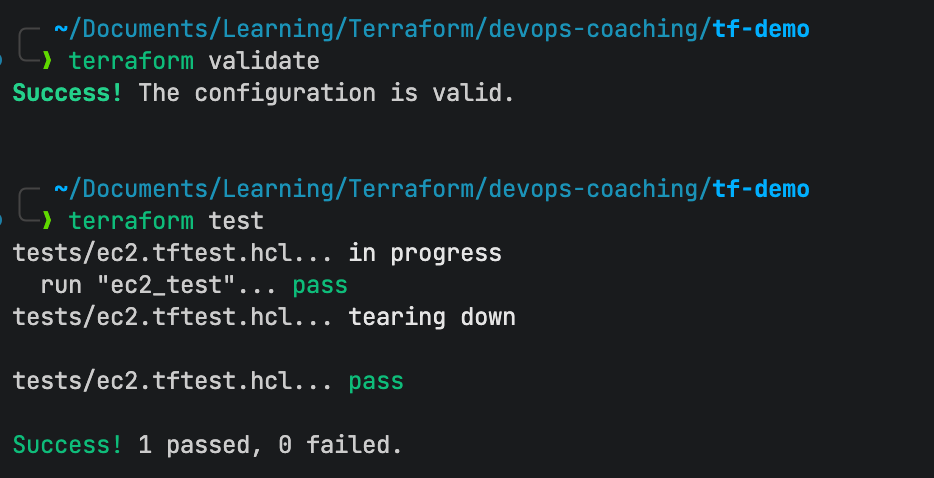
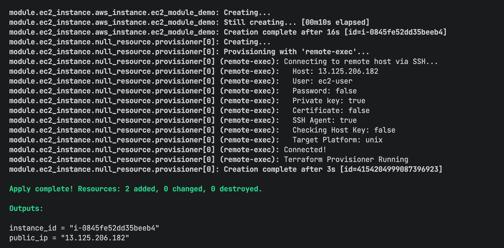
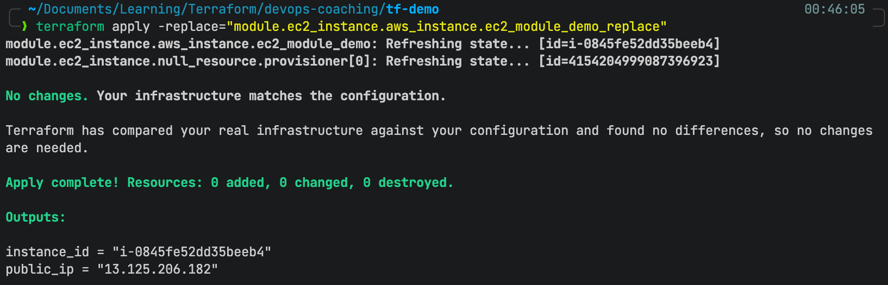
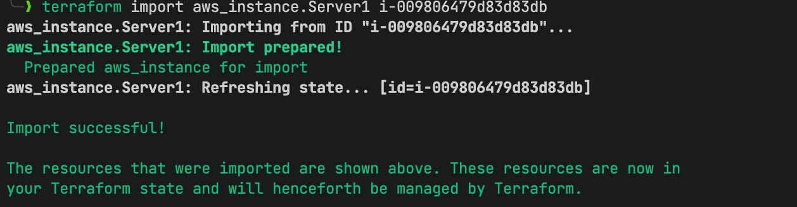

# Terraform Module, Provisioner, Import, Logging, Overwrite and Testing

## Write Terraform Code

Create these files:

provider.tf
```hcl
terraform {
  required_providers {
    aws = {
      source  = "hashicorp/aws"
      version = "~> 3.27"
    }
  }
}
```

variables.tf
```hcl
variable "region" {
  default = "ap-northeast-2"
}

variable "enable_provisioner" {
  type    = bool
  default = true
}

variable "ami" {
  type    = string
  default = "ami-0ecfdfd1c8ae01aec"
}

variable "instance_type" {
  type    = string
  default = "t3.micro"
}

variable "key_name" {
  type    = string
  default = "ec2-key"
}

variable "key_path" {
  type    = string
  default = "~/.ssh/ec2-key.pem"
}

variable "security_group_ids" {
  type    = list(string)
  default = ["sg-0bd171fd5b491ad8f"]
}
```

main.tf
```hcl
provider "aws" {
  profile = "trong-aws"
  region  = "ap-northeast-2"
}

module "ec2_instance" {

  source = "./modules/ec2"

  ami           = var.ami
  instance_type = var.instance_type
  key_name      = var.key_name
  key_path      = var.key_path
  security_group_ids = var.security_group_ids

  enable_provisioner = var.enable_provisioner

}
```

outputs.tf
```hcl
output "instance_id" {
  value = module.ec2_instance.instance_id
}

output "public_ip" {
  value = module.ec2_instance.public_ip
}
```

modules/ec2/main.tf
```hcl
resource "aws_instance" "ec2_module_demo" {

  ami           = var.ami
  instance_type = var.instance_type
  key_name      = var.key_name
  vpc_security_group_ids = var.security_group_ids

  tags = {
    Name = "terraform-module-demo"
  }

  # Overwrite control
  lifecycle {
    create_before_destroy = true
    ignore_changes = [
      tags
    ]
  }
}

# Provisioner example
resource "null_resource" "provisioner" {

  count = var.enable_provisioner ? 1 : 0

  provisioner "remote-exec" {

    inline = [
      "echo Terraform Provisioner Running"
    ]

    connection {
      type        = "ssh"
      user        = "ec2-user"
      private_key = file(var.key_path)
      host        = aws_instance.ec2_module_demo.public_ip
    }

  }

}
```

modules/ec2/variables.tf 
```hcl
variable "ami" {
  type = string
}

variable "instance_type" {
  type = string
}

variable "key_name" {
  type = string
}

variable "key_path" {
  type = string
}

variable "security_group_ids" {
  description = "Existing Security Groups"
  type        = list(string)
}

variable "enable_provisioner" {
  description = "Enable provisioner"
  type        = bool
  default     = true
}
```

modules/ec2/outputs.tf
```hcl
output "instance_id" {
  value = aws_instance.ec2_module_demo.id
}

output "public_ip" {
  value = aws_instance.ec2_module_demo.public_ip
}
```

tests/ec2.tftest.hcl
```hcl
variables {
  enable_provisioner = false
}

run "ec2_test" {

  command = apply

  assert {
    condition     = module.ec2_instance.instance_id != ""
    error_message = "EC2 instance should be created"
  }

}
```

## Enable Terraform Logging
```bash
export TF_LOG=DEBUG
export TF_LOG_PATH=terraform.log
```





## Terraform Check, Test and Deploy

Run these command
```bash
terraform init
terraform fmt
terraform validate
terraform plan
terraform test
terraform apply
```

Terraform check and test result


Terraform apply result


## Terraform Overwrite / Replacement
```bash
terraform apply -replace="module.ec2_instance.aws_instance.ec2_module_demo_replace"
```

Terraform replace output:


## Terraform Import
Update the main.tf file
```hcl
provider "aws" {
  profile = "trong-aws"
  region  = "ap-northeast-2"
}

module "ec2_instance" {

  source = "./modules/ec2"

  ami           = var.ami
  instance_type = var.instance_type
  key_name      = var.key_name
  key_path      = var.key_path
  security_group_ids = var.security_group_ids

  enable_provisioner = var.enable_provisioner
}

resource "aws_instance" "Server1" {
  ami           = "vami-0cf1ead55e8259a57"
  instance_type = "t3.small"

  tags = {
    Name = "Server1"
  }
}
```

```bash
terraform import aws_instance.Server1 i-009806479d83d83db
terraform state show aws_instance.Server1
```

Terraform import result


Delete all resources
```bash
terraform destroy
```
