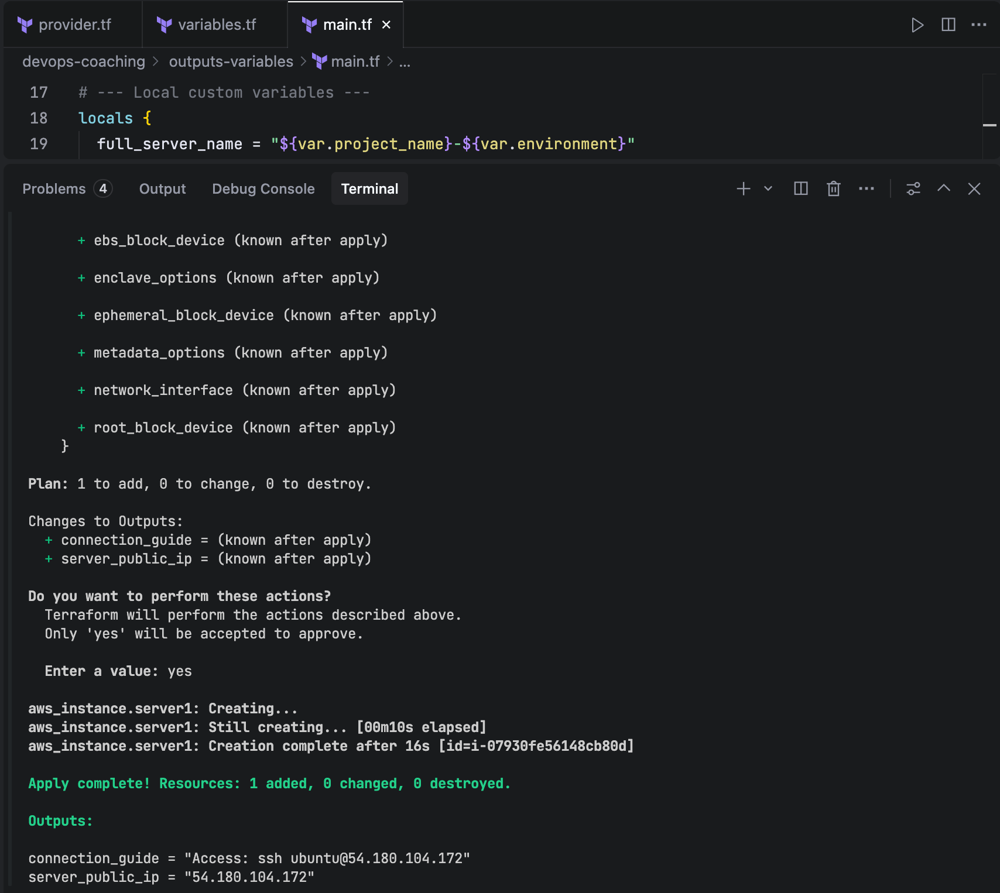
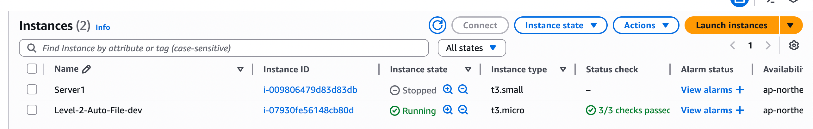
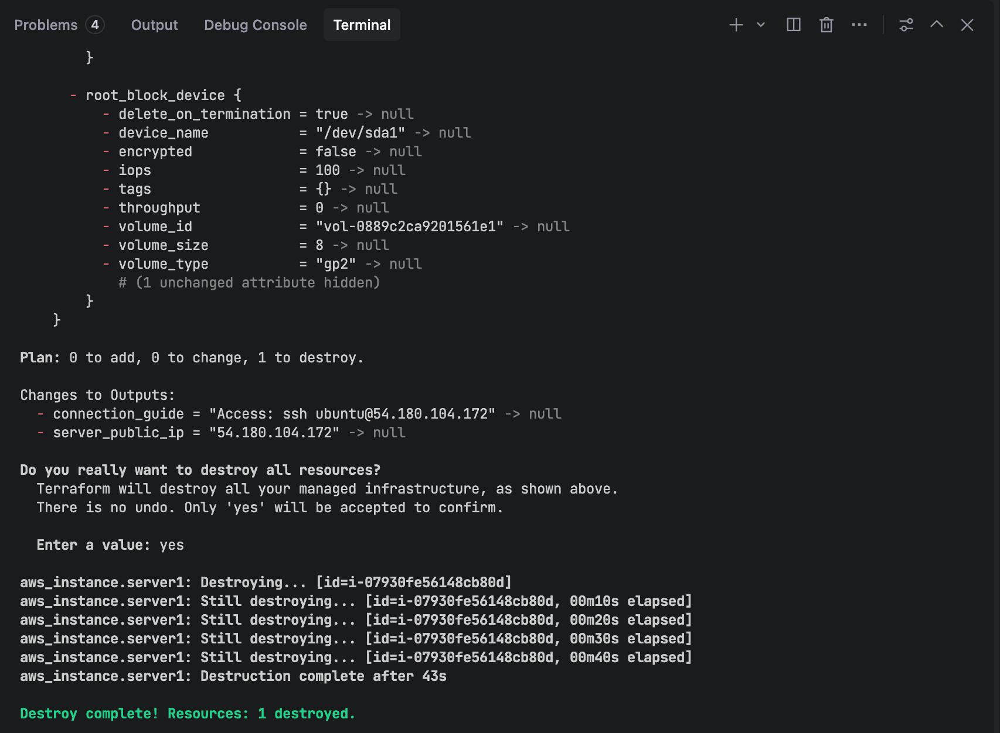

# Variables and Output

## Write Terraform Code

Create these files:

provider.tf
```hcl
terraform {
  required_providers {
    aws = {
      source  = "hashicorp/aws"
      version = "~> 3.27"
    }
  }
}
```

variables.tf
```hcl
# 1. Projectname (Required)
variable "project_name" {
  type        = string
  description = "Name of your project"
  default     = "devops-coaching"
}

# 2. Running Environment (required)
variable "environment" {
  type        = string
  description = "Running environment (dev, prod, staging)"
}

# 3. EC2 type (default: t2.micro)
variable "instance_type" {
  type    = string
  default = "t2.micro"
}
```

main.tf
```hcl
provider "aws" {
  profile = "trong-aws"
  region  = "ap-northeast-2"
}

# Use Data Source to find the newest Ubuntu AMI
data "aws_ami" "ubuntu" {
  most_recent = true
  owners      = ["099720109477"] # Canonical Owner ID

  filter {
    name   = "name"
    values = ["ubuntu/images/hvm-ssd/ubuntu-jammy-22.04-amd64-server-*"]
  }
}

# --- Local custom variables ---
locals {
  full_server_name = "${var.project_name}-${var.environment}"
  
  common_tags = {
    Owner       = "TrongNguyen"
    ManagedBy   = "Terraform"
    CreatedDate = formatdate("YYYY-MM-DD", timestamp())
  }
}

# --- RESOURCE: Create VM ---
resource "aws_instance" "server1" {
  # Get ID from Data Source
  ami           = data.aws_ami.ubuntu.id 
  
  instance_type = var.instance_type

  tags = merge(
    local.common_tags,
    {
      Name = local.full_server_name
    }
  )
}
```

outputs.tf
```hcl
# Print public IP of the server
output "server_public_ip" {
  description = "Public IP of the server"
  value       = aws_instance.server1.public_ip
}

# Print connection guide
output "connection_guide" {
  value       = "Access: ssh ubuntu@${aws_instance.server1.public_ip}"
}
```

terraform.tfvars
```hcl
# Real variables
project_name  = "terraform-test-app"
environment   = "dev"
instance_type = "t3.micro"
```

override.auto.tfvars
```hcl
project_name = "Level-2-Auto-File"
```

## Deploy

Run these command
```bash
terraform init
terraform fmt
terraform plan
terraform apply --auto-approve
```

Terraform run result





>[!NOTE]
>As you can see, the variable 'project_name = "Level-2-Auto-File"' in file override.auto.tfvars overrides the variable 'project_name  = "terraform-test-app"' in file terraform.tfvars

Destroy
```bash
terraform destroy
```


