# 🚀 Deploying AWS ALB Ingress Controller & Exposing ArgoCD

This guide outlines the process of deploying the AWS Load Balancer Controller and exposing your ArgoCD instance publicly using an Application Load Balancer (ALB) Ingress.

## 🎯 Goal: Access ArgoCD via a Production-ready Load Balancer (ALB) URL.
Cluster: my-eks-cluster
Region: ap-northeast-2

## PHASE 1 — ENVIRONMENT PREPARATION (PREREQUISITES)
### 1. Ensure Wildcard SSL is Set Up (AWS Cert Manager)
You must have a valid SSL Certificate ARN available from AWS Certificate Manager (ACM) to use in the Ingress configuration. This certificate should cover your desired domain (e.g., \*.yourdomain.com).
You can find how to create a Validate ACM SSL Certificate via this link: https://github.com/trongkido/devops-coaching/blob/main/aws/aws-acm/README.md
**Action**: Retrieve the Certificate ARN from ACM for later use.
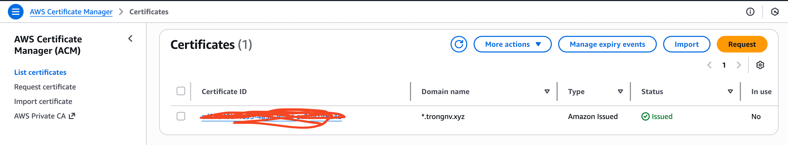

### 2. Enable OIDC (Security Bridge)
Associate the IAM OIDC provider with your EKS cluster to allow Kubernetes Service Accounts to assume IAM roles.
```bash
eksctl utils associate-iam-oidc-provider --cluster my-eks-cluster --region ap-northeast-2 --approve
```

If you use another aws profile, please run this command:
```bash
eksctl utils associate-iam-oidc-provider --cluster my-eks-cluster --region ap-northeast-2 --approve --profile your-profile-name
```
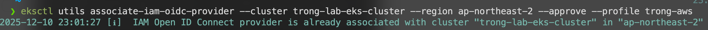

### 3. Tag Public Subnets (MANDATORY)
>[!NOTE]
>⚠️ Skipping this step prevents the Controller from creating the Load Balancer.

You must tag all Public Subnets used by your cluster in the specified region.
Navigate to AWS Console -> VPC -> Subnets.
Identify your cluster's Public Subnets (e.g., my-eks-cluster/SubnetPublicAPNORTHEAST2A, etc.).
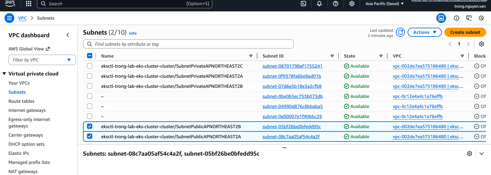

For ALL Public Subnets, go to the Tags tab, click Manage tags, and ensure the following tag exists:
- Key: kubernetes.io/role/elb
- Value: 1
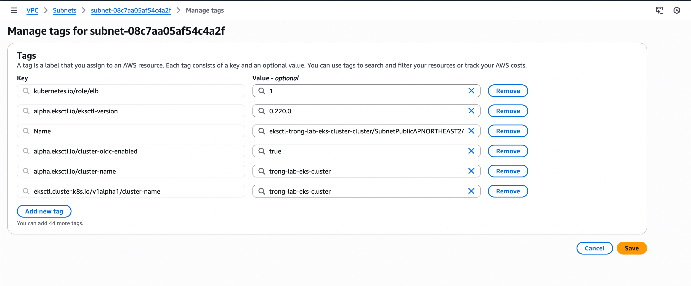

### 4. Allow Port HTTP or HTTPS port on EC2 Security Group
If your ArgoCD server is exposed internally on port 8080, ensure the EC2 Node Security Group allows:
```text
Inbound: TCP 8080 → 0.0.0.0/0
```
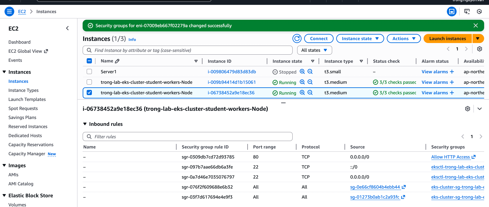

## PHASE 2 — IAM & SERVICE ACCOUNT SETUP
### 1. Download Latest IAM Policy
```bash
curl -O https://raw.githubusercontent.com/kubernetes-sigs/aws-load-balancer-controller/main/docs/install/iam_policy.json
```
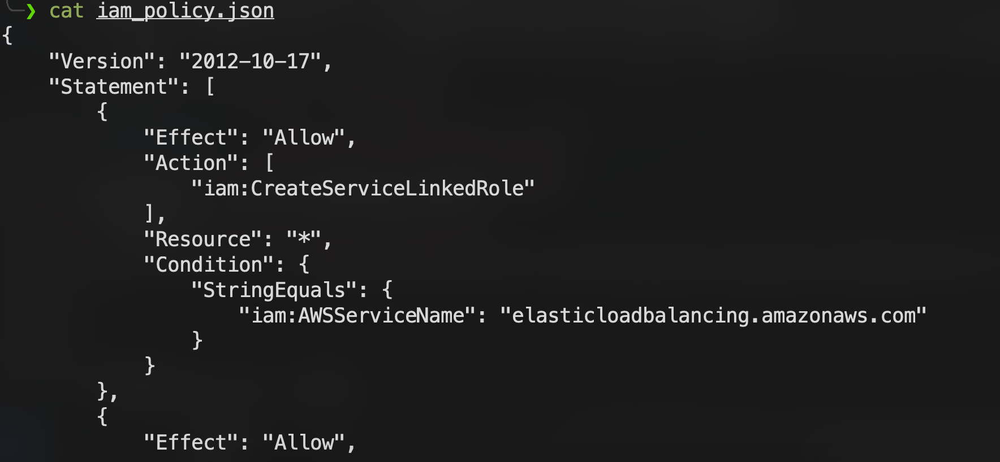

### 2. Create IAM Policy
```bash
aws iam create-policy \
  --policy-name AWSLoadBalancerControllerIAMPolicy \
  --policy-document file://iam_policy.json
```

If you use another aws profile, please run this command:
```bash
aws iam create-policy \
  --policy-name AWSLoadBalancerControllerIAMPolicy \
  --policy-document file://iam_policy.json --profile your-profile-name
```

Copy the Policy ARN returned, for example:
```text
arn:aws:iam::241688915712:policy/AWSLoadBalancerControllerIAMPolicy
```

### 3. Create Service Account (Bind IAM to Kubernetes)
Replace ARN_POLICY_HERE with the ARN you copied:
```bash
eksctl create iamserviceaccount \
  --cluster=my-eks-cluster \
  --namespace=kube-system \
  --name=aws-load-balancer-controller \
  --role-name AmazonEKSLoadBalancerControllerRole \
  --attach-policy-arn=ARN_POLICY_HERE \
  --region=ap-southeast-1 \
  --override-existing-serviceaccounts \
  --approve
```

If you use another aws profile, please run this command:
```bash
eksctl create iamserviceaccount \
  --cluster=my-eks-cluster \
  --namespace=kube-system \
  --name=aws-load-balancer-controller \
  --role-name AmazonEKSLoadBalancerControllerRole \
  --attach-policy-arn=ARN_POLICY_HERE \
  --region=ap-southeast-1 \
  --override-existing-serviceaccounts \
  --approve --profile your-profile-name
```
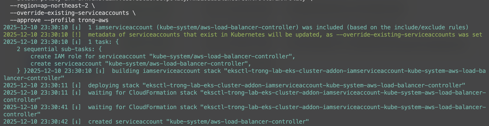

## PHASE 3 — INSTALL EKS LB CONTROLLER
We will using helm to install eks loadbalance controller, so we need to install helm on your machine.
Helm is a package manager for Kubernetes that helps you manage applications using Helm Charts.
This guide shows how to install Helm on three major operating systems.

### 1. Install Helm 
#### Windows Installation
1. Download the latest release: https://github.com/helm/helm/releases
2. Extract the .zip file.
3. Move helm.exe to a folder in your PATH, for example:
```cmd
move helm.exe "C:\Windows\System32"
```
4. Verify
```cmd
helm version
```

#### Linux Installation
```bash
curl https://raw.githubusercontent.com/helm/helm/master/scripts/get-helm-3 | bash
helm version
```

#### macOS Installation
```bash
brew install helm
helm version
```
### 2. Add Helm Repo & Install Controller
```bash
helm repo add eks https://aws.github.io/eks-charts
helm repo update
helm repo list

helm install aws-load-balancer-controller eks/aws-load-balancer-controller \
  -n kube-system \
  --set clusterName=my-eks-cluster \
  --set serviceAccount.create=false \
  --set serviceAccount.name=aws-load-balancer-controller
```


### 3. Verify It Is Running
```bash
kubectl get deployment -n kube-system aws-load-balancer-controller
```
READY = 2/2 → OK
0/2 → Check logs.
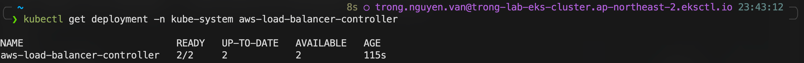

## PHASE 4 — DEPLOY ARGOCD INGRESS (ENABLE PUBLIC ACCESS)
### 1. Create argocd-ingress.yaml
```yaml
apiVersion: networking.k8s.io/v1
kind: Ingress
metadata:
  name: argocd-server-ingress
  namespace: argocd
  annotations:
    kubernetes.io/ingress.class: alb
    alb.ingress.kubernetes.io/scheme: internet-facing
    alb.ingress.kubernetes.io/target-type: ip

    # Replace with YOUR ACM Certificate ARN
    alb.ingress.kubernetes.io/certificate-arn: arn:aws:acm:ap-southeast-1:241688915712:certificate/70c58476-9a59-4bdc-b1df-cca71c88963a

    alb.ingress.kubernetes.io/listen-ports: '[{"HTTP": 80}, {"HTTPS":443}]'
    alb.ingress.kubernetes.io/actions.ssl-redirect: >-
      {"Type": "redirect", "RedirectConfig": {"Protocol": "HTTPS", "Port": "443", "StatusCode": "HTTP_301"}}

    alb.ingress.kubernetes.io/backend-protocol: HTTPS
    alb.ingress.kubernetes.io/healthcheck-protocol: HTTPS
    alb.ingress.kubernetes.io/healthcheck-path: /healthz
    alb.ingress.kubernetes.io/success-codes: '200'

spec:
  ingressClassName: alb
  rules:
    - http:
        paths:
        - path: /
          pathType: Prefix
          backend:
            service:
              name: argocd-server
              port:
                number: 80
```

❓ Why target-type: ip?
Old (instance mode)

ALB → NodePort → kube-proxy → Pod
(Extra hop → higher latency)

New (ip mode)

ALB → Pod directly
(Faster, better performance)

❓ Why backend-protocol = HTTP?

This uses SSL Termination at the ALB:

Connection	Protocol
Client → ALB	HTTPS
ALB → Pod	HTTP

**Benefits:**
- Reduce CPU load on ArgoCD Pod
- Avoid ArgoCD “login loop” bug
- Traffic inside VPC is safe

**Requirements**
Before applying this file:
- AWS Load Balancer Controller is installed
- Correct ACM Certificate ARN
- ArgoCD API server running with --insecure
```bash
kubectl edit deployment argocd-server -n argocd
kubectl rollout restart deployment argocd-server -n argocd
kubectl get pods -n argocd
```
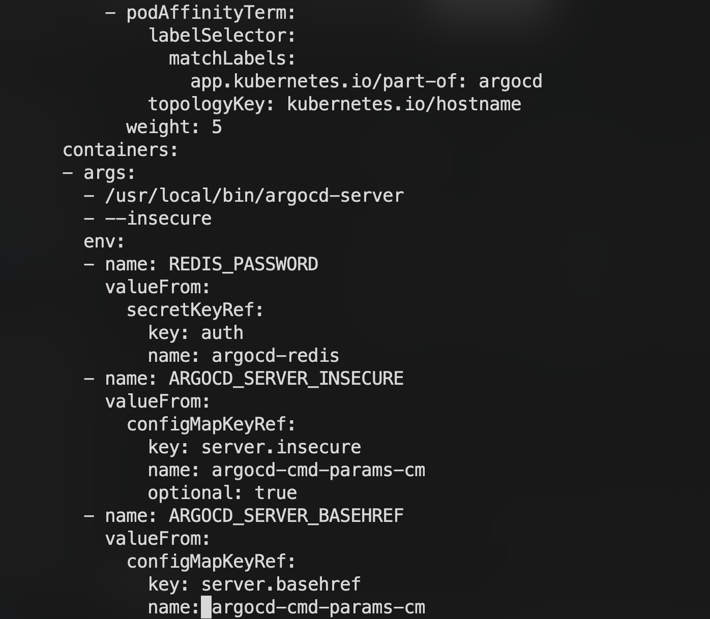

### 2. Apply Ingress
```bash
kubectl apply -f argocd-ingress.yaml
```

## PHASE 5 — VERIFICATION
Check Ingress
```bash
kubectl get ingress -n argocd
```
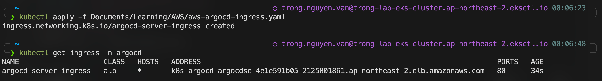

Configure Cloudflare (Final Step)
In Cloudflare DNS:

Name	Target
Your subdomain	ALB DNS Name (from kubectl get ingress)

👉 Proxy should be OFF (DNS Only) for HTTPS passthrough.

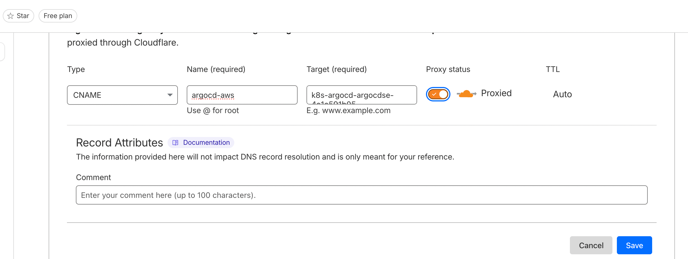

Check access


