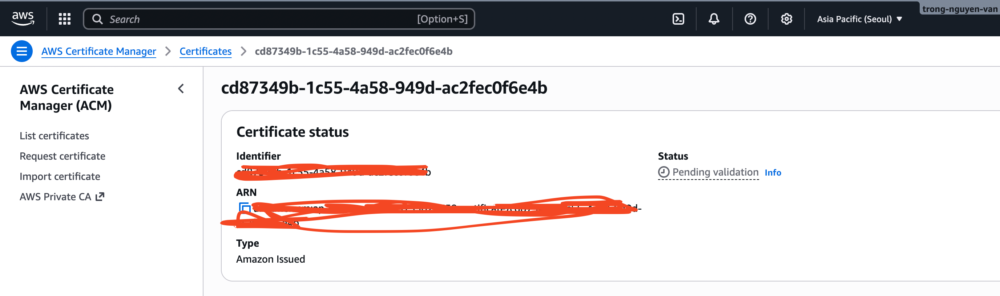
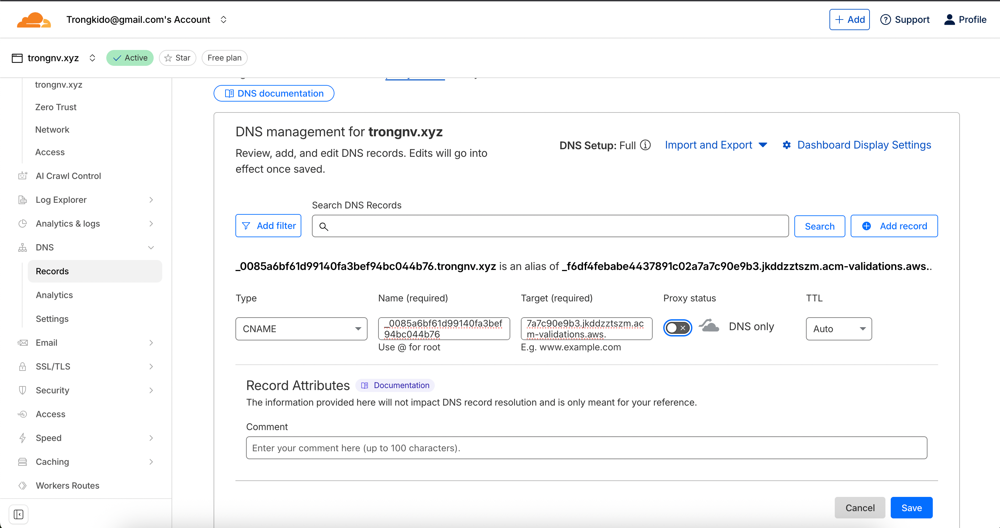
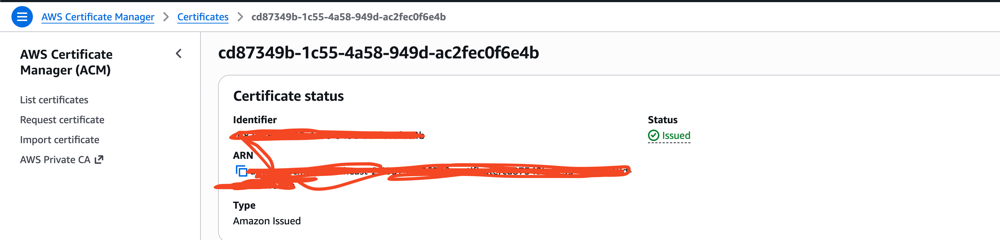

# Create & Validate ACM SSL Certificate Using AWS CLI

## 🎯 Goal
- Request a wildcard SSL certificate (`*.yourdomain.com`) using AWS ACM.
- Retrieve CNAME validation details using CLI.
- Add DNS validation manually in Cloudflare.
- Verify certificate issuance.

## ✅ What is AWS ACM (AWS Certificate Manager)?
AWS Certificate Manager (ACM) is an AWS service that helps you request, manage, and automatically renew SSL/TLS certificates for use with AWS services such as:

- Elastic Load Balancer (ALB/NLB/CLB)
- CloudFront
- API Gateway
- App Runner
- AWS Nitro Enclaves
- IoT Core

It eliminates the manual process of generating CSR, validating domains, installing certificates, and managing renewals.

## 🚀 How AWS ACM Works
###  1️⃣ Request a Certificate

You request a public certificate for a domain, such as:
```text
example.com
www.example.com
api.example.com
```

ACM supports validation methods:
- DNS validation (recommended)
- Email validation

DNS validation = easiest → ACM auto-renews forever.

###  2️⃣ Domain Ownership Validation

You must prove you own the domain:
- For DNS validation → ACM gives you a CNAME record
- You add it to your DNS provider (Route53, Cloudflare, GoDaddy, etc.)

Once validated, ACM automatically renews certificates without downtime.

###  3️⃣ ACM Manages and Renews

After validation:
- ACM issues the certificate
- Automatically renews before expiration
- Deploys renewed certificates to AWS services automatically

No manual renewal needed — ACM handles everything.

###  4️⃣ Attach Certificate to AWS Services

You can attach the certificate to:
- Load balancers (ALB, NLB, CLB)
- CloudFront CDN
- API Gateway Custom Domains
- App Runner
- Elastic Beanstalk
- NLB TLS listeners (new)
- EKS Ingress Controller (via AWS Load Balancer Controller)

## 💰 AWS ACM Pricing
### ✅ 1. Public Certificates (FREE)

Public SSL/TLS certificates from ACM are completely FREE, including:

- Domain Validation (DV) Certificates
- Automatic renewals
- Multiple domain SAN support

💡 You pay nothing for the certificates themselves.

BUT — you pay for the AWS service using the certificate. Example:
- ALB costs ~ $0.0225/hour
- CloudFront charges per traffic

So certificates are free, but infrastructure is not.

### 2. Private Certificates (from Private CA) – NOT free

AWS ACM Private CA (Certificate Authority) is paid.
Pricing Structure:
- Private CA monthly fee: ~ $400 per month per CA
- Private certificate issuance: ~ $0.75 per certificate per month

Use cases:
- Internal corporate systems
- Device certificates
- Mutual TLS (mTLS)
- Private Kubernetes cluster communications

## Create & Validate ACM SSL Certificate Using AWS CLI
### ✅ Step 1: Request ACM Certificate
Run this command in CMD/Terminal to request the certificate (region: ap-southeast-1):
```bash
aws acm request-certificate --domain-name *.trongnv.xyz --validation-method DNS --region ap-northeast-2 --output text
```
If you use another aws profile, please run this command:
```bash
aws acm request-certificate --domain-name *.trongnv.xyz --validation-method DNS --region ap-northeast-2 --output text --profile your-profile-name
```
**Output:**  
AWS returns a Certificate ARN, for example:
```text
arn:aws:acm:ap-southeast-1:123456789012:certificate/xxxx-xxxx-xxxx
```
>[!NOTE]
>Save this ARN — you’ll need it.

You can check your ACM request in "AWS Certificate Manager -> Certificates"


### ✅ Step 2: Get CNAME Validation Record
Replace `YOUR_ARN_HERE` with the returned certificate ARN:
```bash
aws acm describe-certificate  --certificate-arn YOUR_ARN_HERE  --region ap-northeast-2 --query "Certificate.DomainValidationOptions[0].ResourceRecord"
```
If you use another aws profile, please run this command:
```bash
aws acm describe-certificate  --certificate-arn YOUR_ARN_HERE  --region ap-northeast-2 --query "Certificate.DomainValidationOptions[0].ResourceRecord" --profile your-profile-name
```

**Expected Output:**
```json
{
    "Name": "_643798ca65fdc78b8c59be861a8662d7.trongnv.xyz.",
    "Type": "CNAME",
    "Value": "_587c3ddec7b93831f27994e5be27ee37.jkddzztSzm.acm-validations.aws."
}
```

Copy the **Name** and **Value** fields.

### ✅ Step 3: Add DNS Record in Cloudflare
Go to **Cloudflare → DNS** → Add Record:

| Field | Value |
|------|-------|
| Type | CNAME |
| Name | Paste the “Name” (remove trailing domain suffix `.trongnv.xyz.`) |
| Target | Paste the “Value” |
| Proxy | **DNS Only (Gray Cloud)** — must be OFF |

Save the record.


### ✅ Step 4: Verify Certificate Status
Wait 1–2 minutes, then check status:
```bash
aws acm describe-certificate --certificate-arn YOUR_ARN_HERE --region ap-northeast-2 --query "Certificate.Status"
```
f you use another aws profile, please run this command:
```bash
aws acm describe-certificate --certificate-arn YOUR_ARN_HERE --region ap-northeast-2 --query "Certificate.Status" --profile your-profile-name
```

Possible results:
- `"PENDING_VALIDATION"` → Wait a bit more
- `"ISSUED"` → 🎉 **Certificate is ready!**

You can check status in "AWS Certificate Manager -> Certificates"


Now you can use the ARN in your Kubernetes Ingress, Load Balancer, etc.
