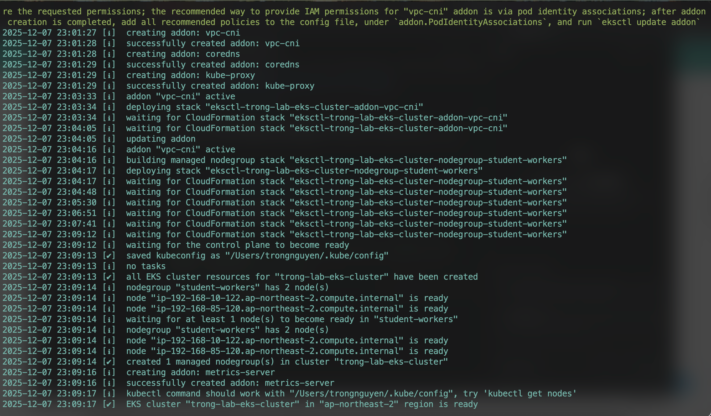
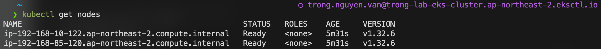
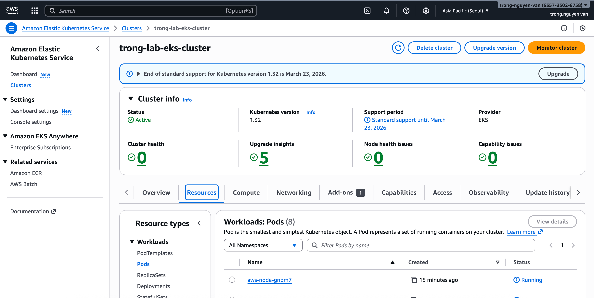

# Step-by-Step Guide: Creating an EKS Cluster with eksctl

---

## 📑 Table of Contents

[Introduction to EKS](#introduction-to-eks)

[Prerequisites](#prerequisites)

[Create IAM Roles](#create-iam-roles)

[Create EC2 Key Pair](#create-ec2-key-pair)

[Install eksctl](#install-eksctl)

[Create the EKS Cluster](#create-the-eks-cluster)

---

## Introduction to Amazon EKS

Amazon Elastic Kubernetes Service (EKS) is a fully managed Kubernetes service that makes it easy to run Kubernetes on AWS without needing to manage your own control plane or nodes.

## Prerequisites

Before creating your EKS cluster, ensure you have:
- An AWS account
- IAM admin permissions
- AWS CLI installed
- kubectl installed
- eksctl installed

## Create IAM Roles
### Create Cluster Role
You need to create 2 roles, EKS Cluster Role and EKS Worker Role.
First, we will create EKS Cluster Role
On "IAM Access management", choose "Role", Click "Create role"


On "Trusted entity type", choose "AWS service", in "Use case" choose "EKS- Cluster", click "Next"


Click "Next" in "Step 2: Add permissions"


Fill out the "Role Name" and click "Create role"


### Create Worker Role
Next, we need to create EKS Worker Role
On "Trusted entity type", choose "AWS service", in "Use case" choose "EC2", click "Next"


In "Step 2: Add permissions", add these 3 permissions
- AmazonEKSWorkerNodePolicy
- AmazonEC2ContainerRegistryReadOnly
- AmazonEKS_CNI_Policy


Fill out the "Role Name" and click "Create role"


You can check the role after created by searching in IAM Roles


## Create EC2 Key Pair
On "EC2 Network & Security" screen, choose "Key Pairs" and click "Create key pair"


Then proceed to set:
Name: The name of the key. Remember this name, as it will be used later in the creation script.
Key pair type: Select RSA
Private key file format: .pem
Click Create key pair to generate the key


Key pair create successfully


## Install eksctl
### macOS

``` bash
brew tap weaveworks/tap
brew install weaveworks/tap/eksctl
```

### Linux

``` bash
curl -sLO "https://github.com/eksctl-io/eksctl/releases/latest/download/eksctl_$(uname -s)_amd64.tar.gz"
tar -xzf eksctl_$(uname -s)_amd64.tar.gz -C /tmp
sudo mv /tmp/eksctl /usr/local/bin
```

### Windows (PowerShell)

``` powershell
choco install eksctl
```

## Create the EKS Cluster
You can launch an EKS cluster using eksctl in two ways.
- Using eksctl CLI and parameters
- Using eksctl CLI and YAML config

To create an EKS cluster using eksctl CLI and parameters, we can use command-line arguments to specify the cluster configuration
```bash
eksctl create cluster \
    --name my-eks-cluster \
    --region us-east-1 \
    --version 1.29 \
    --nodegroup-name my-nodegroup \
    --node-type t3.medium \
    --nodes 2 \
    --nodes-min 1 \
    --nodes-max 3

With
--name: Specifies the name of your EKS cluster.
--region: Defines the AWS region where the cluster will be deployed.
--version: Sets the Kubernetes version for the cluster.
--nodegroup-name: Provides a name for the default node group.
--node-type: Specifies the EC2 instance type for your worker nodes. 
--nodes: Sets the desired number of nodes in the node group.
--nodes-min: Defines the minimum number of nodes for auto-scaling.
--nodes-max: Defines the maximum number of nodes for auto-scaling.
```

In this lab, we will create an EKS Cluster with a YAML configuration file. Now, we need to create a eks-cluster.yaml file
```yaml
apiVersion: eksctl.io/v1alpha5
kind: ClusterConfig

metadata:
  name: trong-lab-eks-cluster
  region: ap-northeast-2
  version: "1.32"

# =======================================================
# 1. NETWORKING
# =======================================================
vpc:
  # Disable NAT Gateway to save costs (~$30/month).
  # Nodes will use Public IPs for internet access.
  nat:
    gateway: Disable
  
  clusterEndpoints:
    publicAccess: true
    privateAccess: false

# =======================================================
# 2. IAM (CLUSTER ROLE)
# =======================================================
iam:
  # ACTION REQUIRED: Replace Role ARN with YOUR AWS Account ID
  serviceRoleARN: "arn:aws:iam::63573576312:role/EKS_Cluster"
  withOIDC: true

# =======================================================
# 3. ADD-ONS
# =======================================================
addons:
  - name: vpc-cni
  - name: coredns
  - name: kube-proxy
  - name: metrics-server

# =======================================================
# 4. NODE GROUP (WORKER)
# =======================================================
managedNodeGroups:
  - name: student-workers
    instanceType: t3.medium
    amiFamily: Ubuntu2404
    
    # Scaling configuration
    minSize: 1
    maxSize: 2
    desiredCapacity: 2
    volumeSize: 20
    
    # SSH Access
    # ACTION REQUIRED: Ensure key pair 'eks-worker' exists in EC2
    ssh:
      allow: true
      publicKeyName: eks-worker

    # Node IAM Role
    # ACTION REQUIRED: Replace Role ARN with YOUR AWS Account ID
    iam:
      instanceRoleARN: "arn:aws:iam::63573576312:role/EKS_Worker"
```

Now, we need to run command to create eks cluster
```bash
eksctl create cluster -f eks-cluster.yaml
```

If you use another aws profile, please run this command to create eks cluster
```bash
eksctl create cluster -f eks-cluster.yaml --profile your-profile-name
```


Check eks worker nodes
```bash
kubectl get nodes
```


Check eks cluster info


# ⚠️ Time Warning

## Running the Command

After pressing **Enter**, this command will take approximately **15 – 20 minutes** to run.

---

## Process

You will see log lines appear, such as:
* **building cluster stack**
* **creating VPC**
* **creating nodegroup**

---

## Action

**Do not close the CMD window.** Just let it run and go make a cup of coffee. ☕

## Delete an EKS Cluster
To delete an eks cluster, we can run command
```bash
eksctl delete cluster -f eks-cluster.yaml
```


This will remove ALL resources that eksctl created:

- EKS Control Plane (master)
- Managed node groups / worker nodes
- IAM roles created by eksctl
- VPC (if eksctl created it)
- CloudFormation stacks
- Security groups and EC2 instances
- Fargate profiles (if any)

## 🔥 Important Notes

### 1️⃣ eksctl deletes the cluster based on the same config file
- It reads the **cluster name** from the YAML.
- It deletes **all cluster-related CloudFormation stacks**.

---

### 2️⃣ If you lost the YAML file?
You can still delete the cluster using only the name:
```sh
eksctl delete cluster --name <CLUSTER_NAME>
```

Optionally specify the region:
```bash
eksctl delete cluster --name <CLUSTER_NAME> --region ap-southeast-1
```

🧹 Check CloudFormation after deleting

Sometimes VPC or Security Group dependencies prevent deletion.
If deletion fails, go to:

AWS Console → CloudFormation

Delete stacks named:
```text
eksctl-<cluster-name>-cluster
eksctl-<cluster-name>-nodegroup-xyz
```
