# Step-by-Step Guide: Creating an EKS Cluster with eksctl

---

## 📑 Table of Contents

[Introduction to EKS](#introduction-to-eks)

[Prerequisites](#prerequisites)

[Create IAM Roles](#create-iam-roles)

[Create EC2 Key Pair](#create-ec2-key-pair)

[Install eksctl](#install-eksctl)

[Create the EKS Cluster](#create-the-eks-cluster)

[Summary](#summary)

[References](#references)

---

## Introduction to Amazon EKS

Amazon Elastic Kubernetes Service (EKS) is a fully managed Kubernetes service that makes it easy to run Kubernetes on AWS without needing to manage your own control plane or nodes.

## Prerequisites

Before creating your EKS cluster, ensure you have:
- An AWS account
- IAM admin permissions
- AWS CLI installed
- kubectl installed
- eksctl installed

## Create IAM Roles
### Create Cluster Role
You need to create 2 roles, EKS Cluster Role and EKS Worker Role.
First, we will create EKS Cluster Role
On "IAM Access management", choose "Role", Click "Create role"
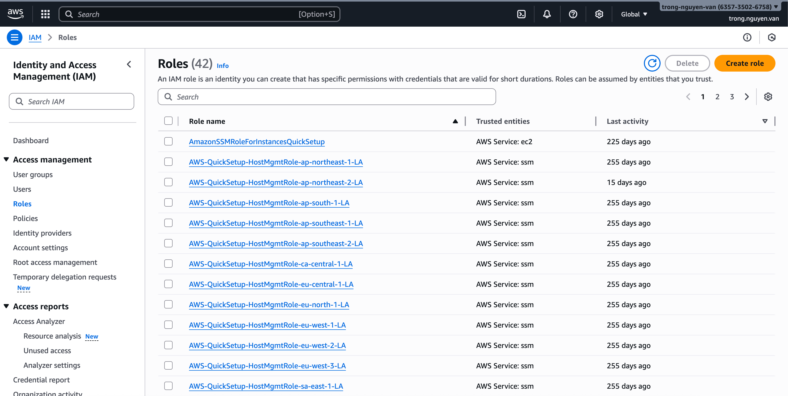

On "Trusted entity type", choose "AWS service", in "Use case" choose "EKS- Cluster", click "Next"
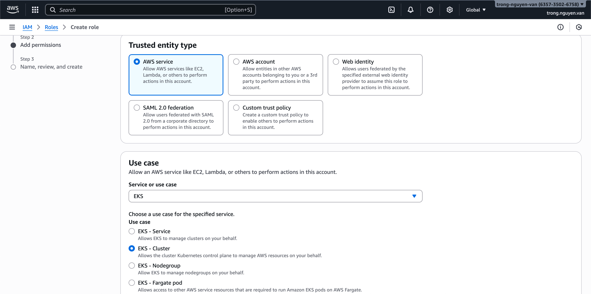

Click "Next" in "Step 2: Add permissions"
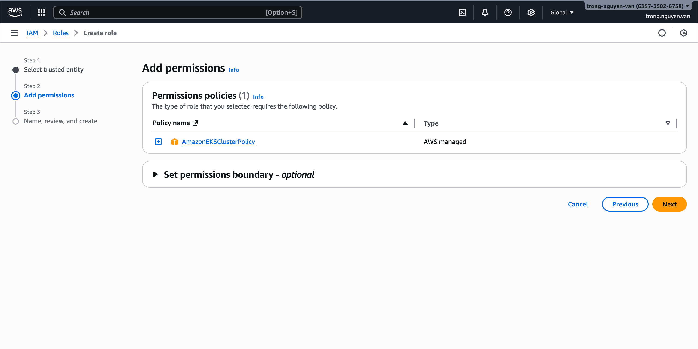

Fill out the "Role Name" and click "Create role"
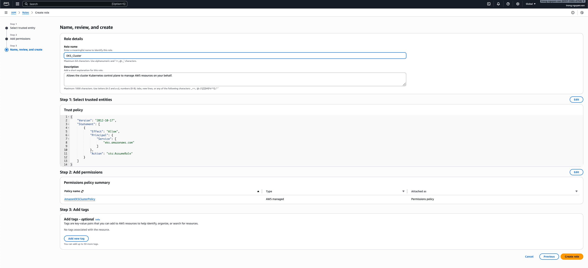

### Create Worker Role
Next, we need to create EKS Worker Role
On "Trusted entity type", choose "AWS service", in "Use case" choose "EC2", click "Next"
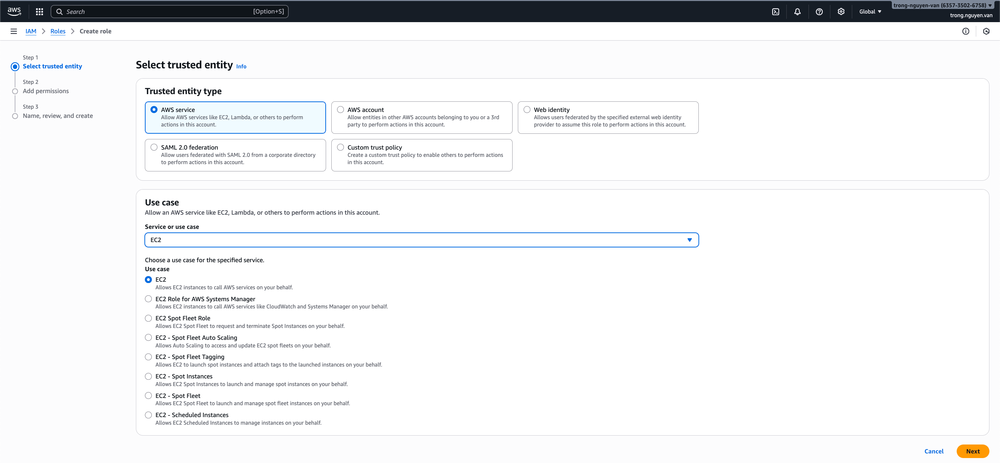

In "Step 2: Add permissions", add these 3 permissions
- AmazonEKSWorkerNodePolicy
- AmazonEC2ContainerRegistryReadOnly
- AmazonEKS_CNI_Policy
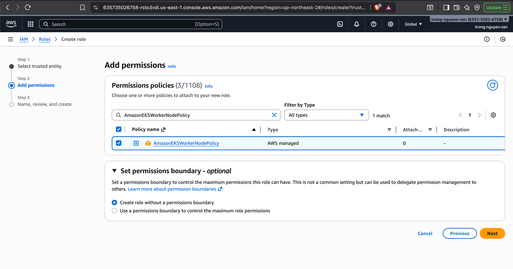

Fill out the "Role Name" and click "Create role"
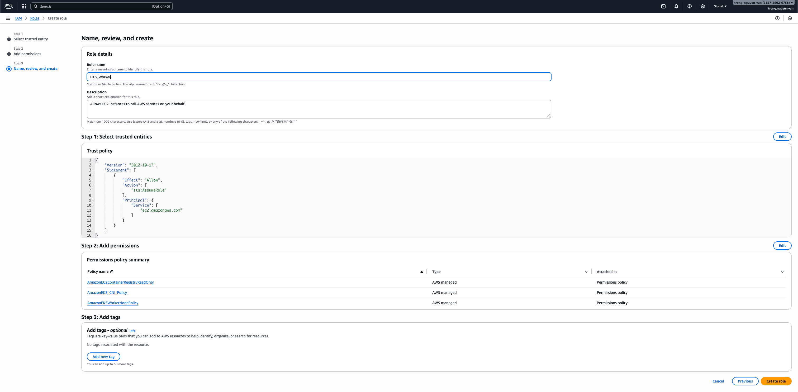

You can check the role after created by searching in IAM Roles
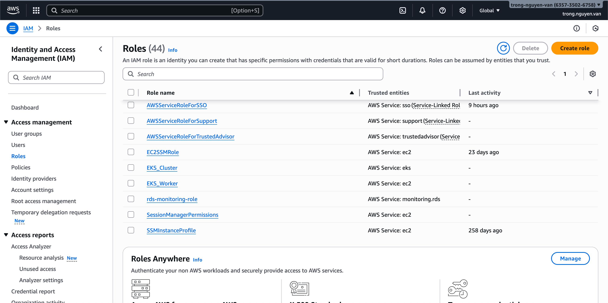

## Create EC2 Key Pair
On "EC2 Network & Security" screen, choose "Key Pairs" and click "Create key pair"
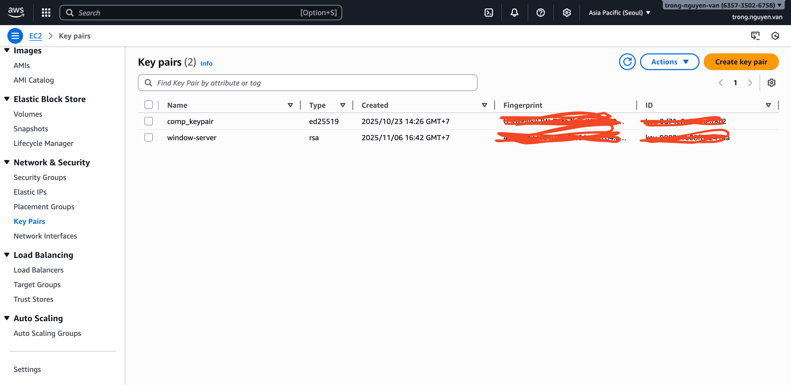

Then proceed to set:
Name: The name of the key. Remember this name, as it will be used later in the creation script.
Key pair type: Select RSA
Private key file format: .pem
Click Create key pair to generate the key
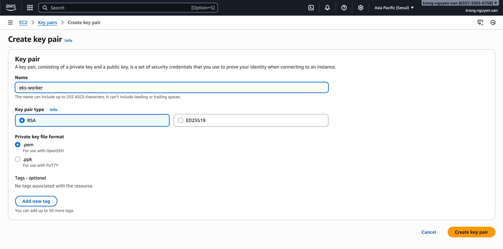

Key pair create successfully
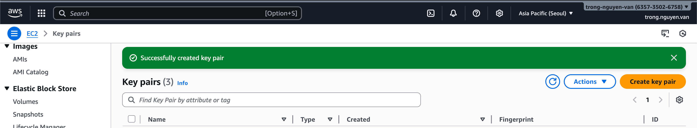

## Install eksctl
### macOS

``` bash
brew tap weaveworks/tap
brew install weaveworks/tap/eksctl
```

### Linux

``` bash
curl -sLO "https://github.com/eksctl-io/eksctl/releases/latest/download/eksctl_$(uname -s)_amd64.tar.gz"
tar -xzf eksctl_$(uname -s)_amd64.tar.gz -C /tmp
sudo mv /tmp/eksctl /usr/local/bin
```

### Windows (PowerShell)

``` powershell
choco install eksctl
```

## Create the EKS Cluster

