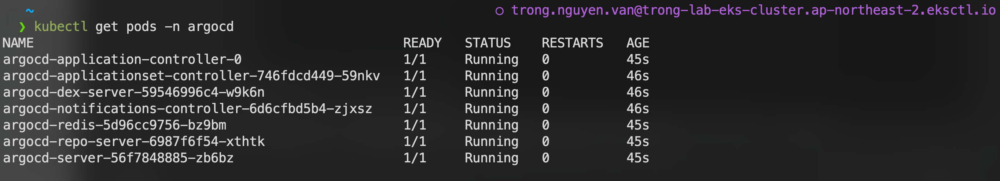
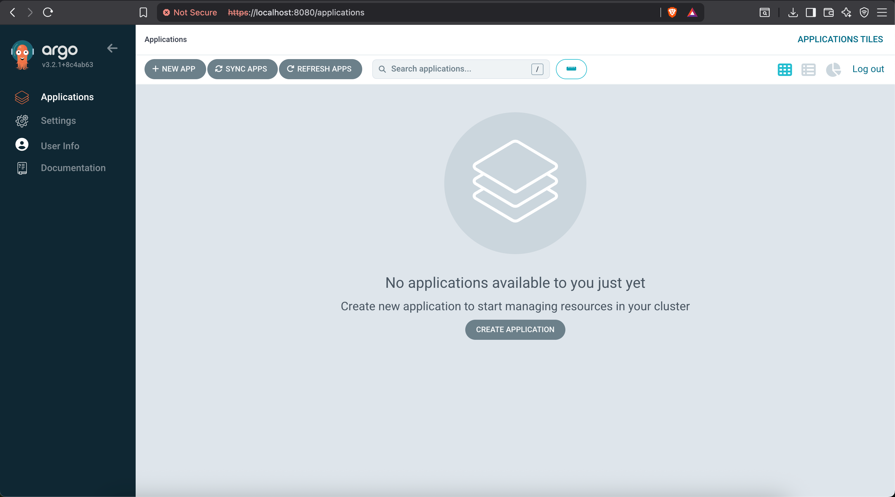

# Part 1: Installing ArgoCD

Before we begin, we need to install **Argo CD** into the newly created **EKS cluster**.

---

## Step 1: Install ArgoCD on EKS Cluster

Open your terminal (already configured to connect to your eks cluster) and run the following commands:
```bash
# 1. Create a dedicated namespace for Argo CD
kubectl create namespace argocd

# 2. Install Argo CD using the official stable manifest
kubectl apply -n argocd -f https://raw.githubusercontent.com/argoproj/argo-cd/stable/manifests/install.yaml
```

You can verify the installation with:

```bash
kubectl get pods -n argocd
```


---

## Step 2: Install ArgoCD CLI

ArgoCD CLI (argocd) allows you to interact with the ArgoCD API server directly from your terminal.
Below is a step-by-step guide for installing it on Windows, macOS, and Linux.

📌 1. Install ArgoCD CLI on Windows
Method 1: Manual Download (Recommended)
- Go to ArgoCD GitHub Releases:
👉 https://github.com/argoproj/argo-cd/releases
- Download the file:
```text
argocd-windows-amd64.exe (for most Windows PCs)
```
- Rename the file to:
```text
argocd.exe
```
- Move it into a folder included in your PATH, for example:
```text
C:\tools\
or
C:\Windows\System32\
```
- Test:
```sh
argocd version
```

📌 2. Install ArgoCD CLI on macOS
Method 1: Homebrew (Recommended)
```bash
brew install argocd
```
Upgrade if needed:
```bash
brew upgrade argocd
```
Method 2: Manual Download
```bash
curl -sSL -o argocd \
  https://github.com/argoproj/argo-cd/releases/latest/download/argocd-darwin-amd64
chmod +x argocd
sudo mv argocd /usr/local/bin/
```
Test:
```bash
argocd version
bash

📌 3. Install ArgoCD CLI on Linux
Method 1: Download + Install
```bash
sudo curl -sSL -o /usr/local/bin/argocd \
  https://github.com/argoproj/argo-cd/releases/latest/download/argocd-linux-amd64
sudo chmod +x /usr/local/bin/argocd
```

Method 2: Using wget
```bash
wget https://github.com/argoproj/argo-cd/releases/latest/download/argocd-linux-amd64 -O argocd
sudo install -m 555 argocd /usr/local/bin/argocd
rm argocd
```
Verify installation:
```bash
argocd version
```

# Part 2: Logging In to Argo CD

Argo CD is **not exposed to the internet by default** (for security).  
We will use **port forwarding (tunneling)** to access it safely from your local machine.

---

## Step 1: Retrieve the Argo CD Admin Password

Argo CD automatically generates a random admin password.  
Run the following commands:

```bash
kubectl -n argocd get secret argocd-initial-admin-secret -o jsonpath="{.data.password}" | base64 --decode
```

The output is your **admin password**.

---

## Step 2: Create a Local Tunnel with Port Forwarding

Keep the CMD terminal open and run:

```bash
kubectl port-forward svc/argocd-server -n argocd 8080:443
```

### Explanation:
This command forwards:
- **localhost:8080** → **Argo CD server port 443 (HTTPS)**

Then access Argo CD in your browser:

👉 http://localhost:8080

Login using:
- **Username:** `admin`
- **Password:** your **admin password**



---

You are now successfully logged into Argo CD! 🎉
