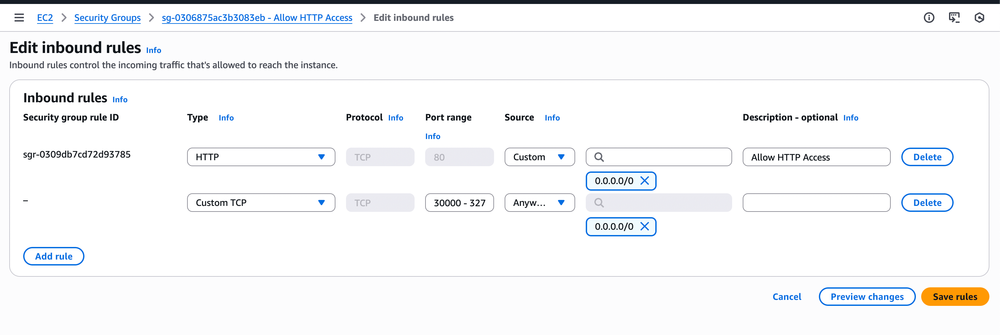
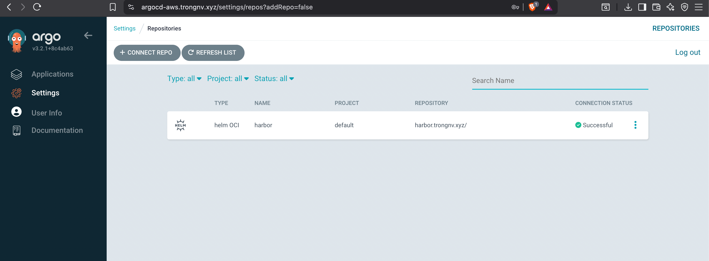
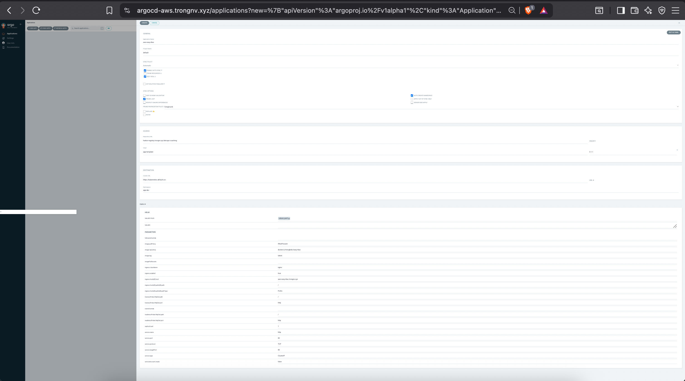
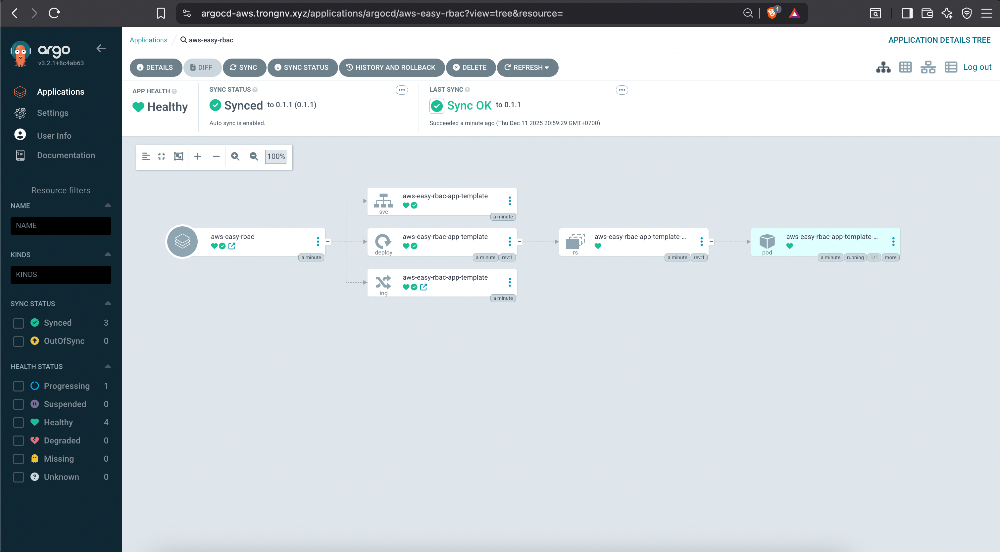

# Deploying Helm Chart via ArgoCD with Nginx Load Balancer on EKS

## 🏗️ PART 1: INSTALLING NGINX WITH AWS ACM (NLB SSL TERMINATION)

This is the most important change. We configure AWS NLB to automatically attach an ACM SSL certificate to port 443.

>[!NOTE]
>Preparation
>Copy the ARN of your ACM certificate for `*.yourdomain.com`. 
>Example:
```text
arn:aws:acm:ap-southeast-1:241688915712:certificate/70c58476-9a59-4bdc-b1df-cca71c88963a
```

### Install Ingress Nginx
Replace the ARN with your own:
```bash
helm repo add ingress-nginx https://kubernetes.github.io/ingress-nginx
helm repo update
helm repo list 

helm install nginx-ingress ingress-nginx/ingress-nginx \
  --namespace ingress-nginx \
  --create-namespace \
  --set controller.service.type=LoadBalancer \
  --set controller.service.annotations."service.beta.kubernetes.io/aws-load-balancer-type"="nlb" \
  --set controller.service.annotations."service.beta.kubernetes.io/aws-load-balancer-scheme"="internet-facing" \
  --set controller.service.annotations."service.beta.kubernetes.io/aws-load-balancer-ssl-cert"="arn:aws:acm:your-cert-here" \
  --set controller.service.annotations."service.beta.kubernetes.io/aws-load-balancer-ssl-ports"="443" \
  --set controller.service.targetPorts.https=http
```

**Why These Parameters?**
- `aws-load-balancer-ssl-cert` → Attaches ACM certificate to NLB  
- `aws-load-balancer-ssl-ports` → Enables port 443  
- `targetPorts.https=http` → SSL offloading at NLB, forward HTTP (80) to Nginx

## 🛡️ PART 2: OPEN NODE PORT RANGE (REQUIRED)

EKS automatically creates a default Security Group for Worker Nodes.  
You must open NodePort ranges for NLB to send traffic.

### Step 1: Identify Worker Node Security Group
1. AWS Console → EC2 → Instances  
2. Select a Worker Node  
3. Open **Security** tab  
4. Look for SG named:
```
eks-cluster-sg-<cluster-name>-xxxx
```

### Step 2: Add Inbound Rule
Add rule:

| Field | Value |
|-------|-------|
| Type | Custom TCP |
| Port range | 30000–32767 |
| Source | 0.0.0.0/0 |
| Description | Allow Nginx Ingress Traffic |



## 🚀 PART 3: DEPLOY APPLICATION WITH ARGOCD

Since NLB handles SSL, your app Ingress **no longer needs a `tls:` section**.

You can refer to this link https://github.com/trongkido/devops-coaching/tree/main/argocd/hands-on-lab-with-argocd/argocd-with-helm about arogcd working with helm

### Steps:
1. Add your Git repo in ArgoCD 

 
2. Create Application from repo


3. Sync & deploy


4. Verify pod running
```bash
kubectl get pods -A                                                                                                            ----
NAMESPACE       NAME                                                      READY   STATUS    RESTARTS   AGE
app-dev         aws-easy-rbac-app-template-5cf9c9c997-qlkjl               1/1     Running   0          58s
argocd          argocd-application-controller-0                           1/1     Running   0          22h
argocd          argocd-applicationset-controller-746fdcd449-qmv5m         1/1     Running   0          22h
argocd          argocd-dex-server-59546996c4-9dg76                        1/1     Running   0          22h
argocd          argocd-notifications-controller-6d6cfbd5b4-pfsjc          1/1     Running   0          22h
argocd          argocd-redis-5d96cc9756-qtxgd                             1/1     Running   0          22h
argocd          argocd-repo-server-6987f6f54-kmkrz                        1/1     Running   0          22h
argocd          argocd-server-645458ff84-ztl7n                            1/1     Running   0          21h
ingress-nginx   nginx-ingress-ingress-nginx-controller-5c7bc54f5c-snbzz   1/1     Running   0          20h
kube-system     aws-load-balancer-controller-d987c5b47-4kb22              1/1     Running   0          21h
kube-system     aws-load-balancer-controller-d987c5b47-9tdsk              1/1     Running   0          21h
kube-system     aws-node-grkk9                                            2/2     Running   0          22h
kube-system     aws-node-sjnj5                                            2/2     Running   0          22h
kube-system     coredns-844d8f59bb-cgb69                                  1/1     Running   0          22h
kube-system     coredns-844d8f59bb-l6d5r                                  1/1     Running   0          22h
kube-system     kube-proxy-q2pm5                                          1/1     Running   0          22h
kube-system     kube-proxy-zjllv                                          1/1     Running   0          22h
kube-system     metrics-server-7645d75fbf-njtj9                           1/1     Running   0          22h
kube-system     metrics-server-7645d75fbf-vlpfz                           1/1     Running   0          22h
```

## 🌐 Configure DNS on Cloudflare

Get NLB address:
```
kubectl get ingress -A
```

Output
```text
NAMESPACE   NAME                         CLASS   HOSTS                       ADDRESS                                                                              PORTS   AGE
app-dev     aws-easy-rbac-app-template   nginx   aws-easy-rbac.trongnv.xyz   k8s-ingressn-nginxing-5acd946dc7-14das1231c6df65c.elb.ap-northeast-2.amazonaws.com   80      3m40s
argocd      argocd-server-ingress        alb     *                           k8s-argocd-argocdse-4e1e591b05-212hd1221da.ap-northeast-2.elb.amazonaws.com           80      20h
```

### Add CNAME in Cloudflare
| Name | Value |
|------|-------|
| nlb | <your-nlb-hostname> |

Enable **Proxy (orange cloud)**.


Access your app: https://aws-easy-rbac.trongnv.xyz


---

## 🧩 FINAL ARCHITECTURE OVERVIEW

| Component | Uses | Layer |
|----------|------|-------|
| ArgoCD | ALB + ACM | Layer 7 |
| App | NLB + ACM | Layer 4 |
| Certificates | AWS ACM | Free, Auto-renew |
| Extra Tools | None | No Cert-Manager |

---

## ✅ Conclusion
This architecture aligns with **AWS Best Practices**:
- Secure
- Scalable
- No external certificate managers needed
- Automatic SSL lifecycle handling
