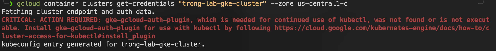

# **Create a Google Cloud GKE Cluster**

>[!Note]
> You need to have a Google Cloud Account. You can follow this guide to create a GCP account: https://www.geeksforgeeks.org/devops/how-to-create-a-free-tier-account-on-gcp/

Google Kubernetes Engine (GKE) is a managed environment for deploying, managing, and scaling containerized applications using Kubernetes.
 * Modes:
   * Autopilot: Fully managed nodes; you pay only for pod resources (recommended for most workloads).
   * Standard: You manage node pools; more control over configuration.

Integrates seamlessly with other Google Cloud services like Cloud Build, Cloud Run, and Artifact Registry.
Supports zonal, regional, and private clusters.

**Prerequisites**
- Google Cloud project with billing enabled.
- gcloud CLI installed and initialized (gcloud init).
- Enable Kubernetes Engine API: gcloud services enable container.googleapis.com.

**Install Google Cloud SDK (gcloud) & Access GCP Project**
- On Linux
```bash
# Debian / Ubuntu
sudo apt update
sudo apt install -y apt-transport-https ca-certificates gnupg curl

curl https://packages.cloud.google.com/apt/doc/apt-key.gpg \
| sudo gpg --dearmor -o /usr/share/keyrings/cloud.google.gpg

echo "deb [signed-by=/usr/share/keyrings/cloud.google.gpg] \
https://packages.cloud.google.com/apt cloud-sdk main" \
| sudo tee /etc/apt/sources.list.d/google-cloud-sdk.list

sudo apt update
sudo apt install -y google-cloud-sdk

# RHEL / CentOS / AlmaLinux / Rocky Linux
# Add Google Cloud SDK repository
sudo tee /etc/yum.repos.d/google-cloud-sdk.repo <<EOF
[google-cloud-sdk]
name=Google Cloud SDK
baseurl=https://packages.cloud.google.com/yum/repos/cloud-sdk-el9-x86_64
enabled=1
gpgcheck=1
repo_gpgcheck=1
gpgkey=https://packages.cloud.google.com/yum/doc/yum-key.gpg
       https://packages.cloud.google.com/yum/doc/rpm-package-key.gpg
EOF

sudo dnf install -y google-cloud-sdk

# Verify
gcloud version
```

- On MacOS
```bash
brew install --cask google-cloud-sdk
source "$(brew --prefix)/Caskroom/google-cloud-sdk/latest/google-cloud-sdk/path.zsh.inc"
source "$(brew --prefix)/Caskroom/google-cloud-sdk/latest/google-cloud-sdk/completion.zsh.inc"
# Verify
gcloud version
```

- On Window
  * Download installer: https://cloud.google.com/sdk/docs/install
  * Run the .exe installer
  * Enable: Add gcloud to PATH
Verify in PowerShell:
```bash
gcloud version
```

- Initialize gcloud
```bash
gcloud init
```
This will:
  * Open browser for Google login
  * Ask you to select or create a project
  * Set default region/zone

Result:
```text
Welcome! This command will take you through the configuration of gcloud.

Your current configuration has been set to: [default]

You can skip diagnostics next time by using the following flag:
  gcloud init --skip-diagnostics

Network diagnostic detects and fixes local network connection issues.
Checking network connection...done.
Reachability Check passed.
Network diagnostic passed (1/1 checks passed).

You must sign in to continue. Would you like to sign in (Y/n)?  y

Go to the following link in your browser, and complete the sign-in prompts:

    https://accounts.google.com/o/oauth2/auth?response_type=code&client_id=32555940559.apps.googleusercontent.com&redirect_uri=https%3A%2F%2Fsdk.cloud.google.com%2Fauthcode.html&scope=openid+https%3A%2F%2Fwww.googleapis.com%2Fauth%2Fuserinfo.email+https%3A%2F%2Fwww.googleapis.com%2Fauth%2Fcloud-platform+https%3A%2F%2Fwww.googleapis.com%2Fauth%2Fappengine.admin+https%3A%2F%2Fwww.googleapis.com%2Fauth%2Fsqlservice.login+https%3A%2F%2Fwww.googleapis.com%2Fauth%2Fcompute+https%3A%2F%2Fwww.googleapis.com%2Fauth%2Faccounts.reauth&state=ovl8XQD3r6aY7o6asvIS1zVzP2XYvb&prompt=consent&token_usage=remote&access_type=offline&code_challenge=SRGGeT_hMlyUcsrktq1XbooBCFrWo8ZEqABYPRdy7qQ&code_challenge_method

Once finished, enter the verification code provided in your browser: 4/0ATX87lMDwMzMjjioh4eU61P3QkGNzVE5UoBD2hXT_X_XdzBGbOomVBxi7ZaiIJ6V
You are signed in as: [trong@gmail.com].

Pick cloud project to use:
 [1] gen-lang-client-0260111409
 [2] pelagic-pod-476510-v7
 [3] Enter a project ID
 [4] Create a new project
Please enter numeric choice or text value (must exactly match list item):  2

Your current project has been set to: [pelagic-pod-476510-v7].

Do you want to configure a default Compute Region and Zone? (Y/n)?  y

Which Google Compute Engine zone would you like to use as project default?
If you do not specify a zone via a command line flag while working with Compute Engine resources, the default is assumed.
 [1] Do not set default zone
 [2] us-east1-b
 [3] us-east1-c
 [4] us-east1-d
 [5] us-east4-c
 [6] us-east4-b
 [7] us-east4-a
 [8] us-central1-c
 [9] us-central1-a
 [10] us-central1-f
 [11] us-central1-b
 [12] us-west1-b
 [13] us-west1-c
 [14] us-west1-a
 [15] europe-west4-a
 [16] europe-west4-b
 [17] europe-west4-c
 [18] europe-west1-b
 [19] europe-west1-d
 [20] europe-west1-c
 [21] europe-west3-c
 [22] europe-west3-a
 [23] europe-west3-b
 [24] europe-west2-c
 [25] europe-west2-b
 [26] europe-west2-a
 [27] asia-east1-b
 [28] asia-east1-a
 [29] asia-east1-c
 [30] asia-southeast1-b
 [31] asia-southeast1-a
 [32] asia-southeast1-c
 [33] asia-northeast1-b
 [34] asia-northeast1-c
 [35] asia-northeast1-a
 [36] asia-south1-c
 [37] asia-south1-b
 [38] asia-south1-a
 [39] australia-southeast1-b
 [40] australia-southeast1-c
 [41] australia-southeast1-a
 [42] southamerica-east1-b
 [43] southamerica-east1-c
 [44] southamerica-east1-a
 [45] africa-south1-a
 [46] africa-south1-b
 [47] africa-south1-c
 [48] asia-east2-a
 [49] asia-east2-b
 [50] asia-east2-c
Did not print [78] options.
Too many options [128]. Enter "list" at prompt to print choices fully.
Please enter numeric choice or text value (must exactly match list item):  us-central1-c

Your project default Compute Engine zone has been set to [us-central1-c].
You can change it by running [gcloud config set compute/zone NAME].

Your project default Compute Engine region has been set to [us-central1].
You can change it by running [gcloud config set compute/region NAME].

Created a default .boto configuration file at [/root/.boto]. See this file and
[https://cloud.google.com/storage/docs/gsutil/commands/config] for more
information about configuring Google Cloud Storage.
The Google Cloud CLI is configured and ready to use!

* Commands that require authentication will use trongkido@gmail.com by default
* Commands will reference project `pelagic-pod-476510-v7` by default
* Compute Engine commands will use region `us-central1` by default
* Compute Engine commands will use zone `us-central1-c` by default

Run `gcloud help config` to learn how to change individual settings

This gcloud configuration is called [default]. You can create additional configurations if you work with multiple accounts and/or projects.
Run `gcloud topic configurations` to learn more.

Some things to try next:

* Run `gcloud --help` to see the Cloud Platform services you can interact with. And run `gcloud help COMMAND` to get help on any gcloud command.
* Run `gcloud topic --help` to learn about advanced features of the CLI like arg files and output formatting
* Run `gcloud cheat-sheet` to see a roster of go-to `gcloud` commands.
```

**Verify Authentication**
```bash
gcloud auth list
   Credentialed Accounts
ACTIVE  ACCOUNT
*       trong@gmail.com

To set the active account, run:
    $ gcloud config set account `ACCOUNT`
```

Now, we will use gcloud to create a GKE Cluster
```bash
gcloud beta container --project "pelagic-pod-476510-v7" clusters create "trong-lab-gke-cluster" \
    --zone "us-central1-c" \
    --no-enable-basic-auth \
    --cluster-version "1.33.5-gke.1308000" \
    --release-channel "regular" \
    --machine-type "e2-medium" \
    --image-type "COS_CONTAINERD" \
    --disk-type "pd-standard" \
    --disk-size "20" \
    --metadata disable-legacy-endpoints=true \
    --num-nodes "2" \
    --logging=SYSTEM,WORKLOAD \
    --monitoring=SYSTEM,STORAGE,POD,DEPLOYMENT,STATEFULSET,DAEMONSET,HPA,JOBSET,CADVISOR,KUBELET,DCGM \
    --enable-ip-alias \
    --network "projects/pelagic-pod-476510-v7/global/networks/my-vpc1" \
    --subnetwork "projects/pelagic-pod-476510-v7/regions/us-central1/subnetworks/my-vpc1" \
    --no-enable-intra-node-visibility \
    --default-max-pods-per-node "110" \
    --enable-ip-access \
    --security-posture=standard \
    --workload-vulnerability-scanning=disabled \
    --enable-dataplane-v2 \
    --no-enable-google-cloud-access \
    --addons HorizontalPodAutoscaling,HttpLoadBalancing,GcePersistentDiskCsiDriver \
    --enable-autoupgrade \
    --enable-autorepair \
    --max-surge-upgrade 1 \
    --max-unavailable-upgrade 0 \
    --binauthz-evaluation-mode=DISABLED \
    --enable-managed-prometheus \
    --enable-shielded-nodes \
    --shielded-integrity-monitoring \
    --no-shielded-secure-boot \
    --node-locations "us-central1-c"
```


Once the cluster is created execute the below command to connect to the Cluster
```bash
gcloud container clusters get-credentials "trong-lab-gke-cluster" --zone us-central1-c
```


Install gke-gcloud-auth-plugin before using kubectl command.
>[!Note]
> This will also resolve the "ERROR" log in create cluster step
```bash
gcloud components install gke-gcloud-auth-plugin
```

Result:
```tetx
Your current Google Cloud CLI version is: 549.0.1
Installing components from version: 549.0.1

┌────────────────────────────────────────────────────────────────┐
│              These components will be installed.               │
├────────────────────────────────────────────┬─────────┬─────────┤
│                    Name                    │ Version │   Size  │
├────────────────────────────────────────────┼─────────┼─────────┤
│ gke-gcloud-auth-plugin (Platform Specific) │  0.5.10 │ 3.3 MiB │
└────────────────────────────────────────────┴─────────┴─────────┘

For the latest full release notes, please visit:
  https://cloud.google.com/sdk/release_notes

Once started, canceling this operation may leave your SDK installation in an inconsistent state.

Do you want to continue (Y/n)?  y

Performing in place update...

╔════════════════════════════════════════════════════════════╗
╠═ Downloading: gke-gcloud-auth-plugin                      ═╣
╠════════════════════════════════════════════════════════════╣
╠═ Downloading: gke-gcloud-auth-plugin (Platform Specific)  ═╣
╠════════════════════════════════════════════════════════════╣
╠═ Installing: gke-gcloud-auth-plugin                       ═╣
╠════════════════════════════════════════════════════════════╣
╠═ Installing: gke-gcloud-auth-plugin (Platform Specific)   ═╣
╚════════════════════════════════════════════════════════════╝

Performing post processing steps...done.

Google Cloud CLI works best with Python 3.13 and certain modules.

Setting up virtual environment
Updating modules...
Modules updated.
Virtual env enabled.

Update done!
```

Now, check nodes status
```bash
kubectl get nodes
```


To delete a GKE cluster, please run this command:
```bash
# Delete GKE Cluster
gcloud container clusters delete trong-lab-gke-cluster \
  --zone us-central1-c \
  --project pelagic-pod-476510-v7
# Delete kube context
kubectl config delete-context gke_pelagic-pod-476510-v7_us-central1-c_trong-lab-gke-cluster
kubectl config delete-cluster gke_pelagic-pod-476510-v7_us-central1-c_trong-lab-gke-cluster
kubectl config unset users.gke_pelagic-pod-476510-v7_us-central1-c_trong-lab-gke-cluster
```

Verify
```bash
gcloud container clusters list \
  --zone us-central1-c \
  --project pelagic-pod-476510-v7
```
