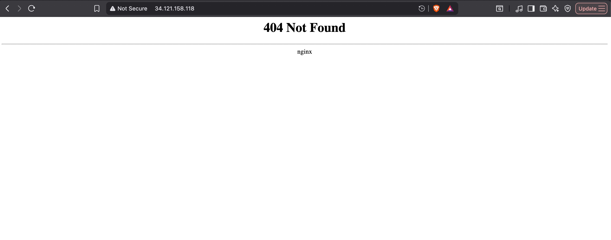

# Running Ingress Nginx on GKE

> [!NOTE]
> In GKE, we can use Google Load Balancer to public Ingress Nginx as I have used to expose ArgoCD to the internet, you can refer with these guide:
> - https://github.com/trongkido/devops-coaching/blob/main/gcp/create-gke-cluster/running-argocd-on-gke/README.md
> - https://gist.github.com/gabihodoroaga/1289122db3c5d4b6c59a43b8fd659496
> - https://support.tools/setup-nginx-ingress-gke/

> The prerequisite is that the ingress nginx service must be "ClusterIP" or "NodePort", so please modify Ingress Nginx service in advanced.

**In this lab, I will use Ingress Nginx with public IP and Cert Manager deployed in GKE for manage certificates**

## 1. Install Ingress Nginx
First, install Ingress Nginx on GKE
```bash
helm repo add ingress-nginx https://kubernetes.github.io/ingress-nginx
helm repo update
helm repo list 

helm install nginx-ingress ingress-nginx/ingress-nginx \
  --namespace ingress-nginx \
  --create-namespace 
```

Verify
```bash
kubectl get pods -n ingress-nginx
---
NAME                                                      READY   STATUS    RESTARTS   AGE
nginx-ingress-ingress-nginx-controller-655f448d64-4t4zh   1/1     Running   0          78s
---

kubectl get svc -n ingress-nginx
---
NAME                                               TYPE           CLUSTER-IP       EXTERNAL-IP      PORT(S)                      AGE
nginx-ingress-ingress-nginx-controller             LoadBalancer   34.118.238.189   34.121.158.118   80:30486/TCP,443:31266/TCP   2m16s
nginx-ingress-ingress-nginx-controller-admission   ClusterIP      34.118.239.147   <none>           443/TCP                      2m16s
---
```

You can see the external IP, you can access it via this IP


## 2. Install CertManager
Next, we will install CertManager for sefl manage certificates
```bash
helm install \
  cert-manager oci://quay.io/jetstack/charts/cert-manager \
  --version v1.19.2 \
  --namespace cert-manager \
  --create-namespace \
  --set crds.enabled=true

# It's a good idea to verify the signature on the chart too, which requires the GPG keyring to be downloaded from this website first.
helm install \
  cert-manager oci://quay.io/jetstack/charts/cert-manager \
  --version v1.19.2 \
  --namespace cert-manager \
  --create-namespace \
  --verify \
  --keyring ./cert-manager-keyring-2021-09-20-1020CF3C033D4F35BAE1C19E1226061C665DF13E.gpg \
  --set crds.enabled=true
```

Verify
```bash
kubectl get pods -n cert-manager
---
NAME                                       READY   STATUS    RESTARTS   AGE
cert-manager-7ff7f97d55-pqmhj              1/1     Running   0          53s
cert-manager-cainjector-59bb669f8d-6dhnb   1/1     Running   0          53s
cert-manager-webhook-59bbd786df-w8xbd      1/1     Running   0          53s
---

kubectl get crds | grep cert-manager
---
ertificaterequests.cert-manager.io                    2025-12-18T15:14:40Z
certificates.cert-manager.io                           2025-12-18T15:14:41Z
challenges.acme.cert-manager.io                        2025-12-18T15:14:42Z
clusterissuers.cert-manager.io                         2025-12-18T15:14:44Z
issuers.cert-manager.io                                2025-12-18T15:14:43Z
orders.acme.cert-manager.io                            2025-12-18T15:14:40Z
---
```

To uninstall, you can run
```bash
helm uninstall cert-manager -n cert-manager
```

By default, the CustomResourceDefinition for Issuers,ClusterIssuers,Certificates,CertificateRequests,Orders and Challenges are not removed by the Helm uninstall command. This is to prevent data loss, as removing the CustomResourceDefinition would also remove all instances of those resources.
This will remove all Issuers,ClusterIssuers,Certificates,CertificateRequests,Orders and Challenges resources from the cluster:
```bash
kubectl delete crd \
  issuers.cert-manager.io \
  clusterissuers.cert-manager.io \
  certificates.cert-manager.io \
  certificaterequests.cert-manager.io \
  orders.acme.cert-manager.io \
  challenges.acme.cert-manager.io
```

## 3. Create a ClusterIssuer
This is your "Certificate Authority" config. Save this as issuer.yaml and apply it:
```yaml
apiVersion: cert-manager.io/v1
kind: ClusterIssuer
metadata:
  name: letsencrypt-prod
spec:
  acme:
    server: https://acme-v02.api.letsencrypt.org/directory
    email: your-email@example.com # You will get renewal alerts here
    privateKeySecretRef:
      name: letsencrypt-prod
    solvers:
    - http01:
        ingress:
          class: nginx
```

Apply it
```bash
kubectl apply -f issuer.yaml -n app-dev
```

## 4. Config Ingress
Now, you just add one "Magic Annotation" to your Ingress. cert-manager will see it and automatically create the certificate secret for you.
```yaml
apiVersion: networking.k8s.io/v1
kind: Ingress
metadata:
  name: my-web-ingress
  annotations:
    kubernetes.io/ingress.class: nginx
    cert-manager.io/cluster-issuer: "letsencrypt-prod" # <--- MAGIC LINE
spec:
  tls:
  - hosts:
    - yourdomain.com
    secretName: my-web-cert-auto # cert-manager will create this for you
  rules:
  - host: yourdomain.com
    http:
      paths:
      - path: /
        pathType: Prefix
        backend:
          service:
            name: your-web-service
            port:
              number: 80
```

Apply it
```bash
kubectl apply -f ingress.yaml -n app-dev
```
