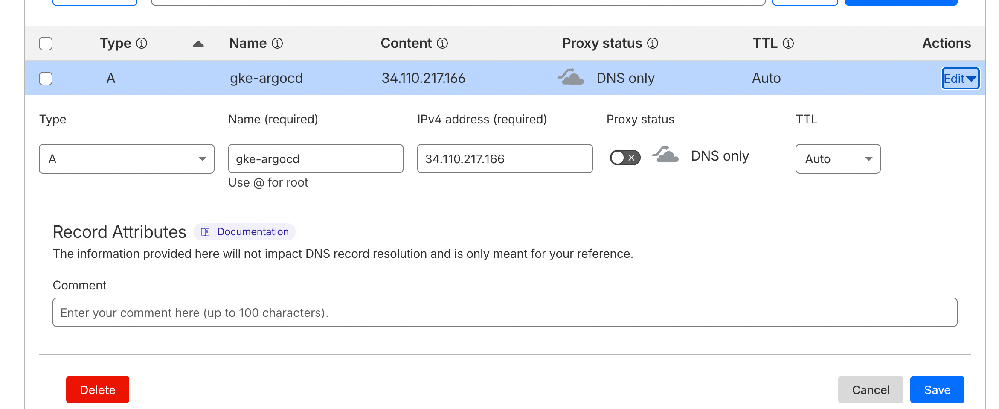
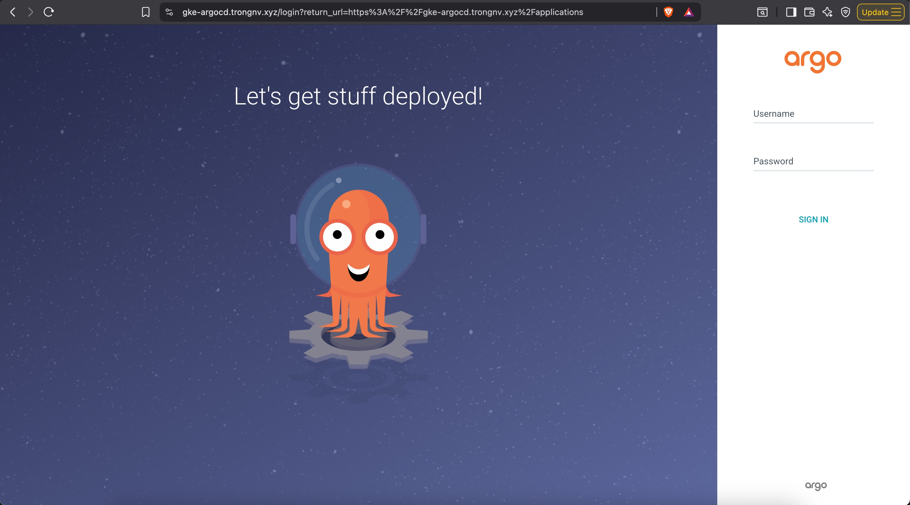

# Part 1: Installing ArgoCD

Before we begin, we need to install **Argo CD** into the newly created **EKS cluster**.

---

## Step 1: Install ArgoCD on EKS Cluster

Open your terminal (already configured to connect to your eks cluster) and run the following commands:
```bash
# 1. Create a dedicated namespace for Argo CD
kubectl create namespace argocd

# 2. Install Argo CD using the official stable manifest
kubectl apply -n argocd -f https://raw.githubusercontent.com/argoproj/argo-cd/stable/manifests/install.yaml
```

You can verify the installation with:

```bash
kubectl get pods -n argocd
```
Result
```text
NAME                                                READY   STATUS    RESTARTS   AGE
argocd-application-controller-0                     1/1     Running   0          34s
argocd-applicationset-controller-746fdcd449-9kpqv   1/1     Running   0          39s
argocd-dex-server-59546996c4-tg6x9                  1/1     Running   0          39s
argocd-notifications-controller-6d6cfbd5b4-fcrwp    1/1     Running   0          37s
argocd-redis-5d96cc9756-csnw9                       1/1     Running   0          36s
argocd-repo-server-6987f6f54-psqnb                  1/1     Running   0          35s
argocd-server-56f7848885-sxtds                      1/1     Running   0          35s
```

**Disable internal TLS**
To disable internal TLS, we need to pass the --insecure flag to the argocd-server command, this will avoid an internal redirection loop from HTTP to HTTPS. For this, we need to edit the deployment named “argocd-server” and make the following changes
```bash
kubectl get deployment -n argocd
kubectl edit deployment argocd-server -n argocd
```

The container command should change from:
```text
containers:
- args:
  - /usr/local/bin/argocd-server
```

To
```text
containers:
- args:
  - /usr/local/bin/argocd-server
  - --insecure
```

Restart ArgoCD server
```bash
kubectl rollout restart deployment argocd-server -n argocd
```

# Part 2: Logging In to Argo CD

Argo CD is **not exposed to the internet by default** (for security).  
We will use **port forwarding (tunneling)** to access it safely from your local machine.

---

## Step 1: Retrieve the Argo CD Admin Password

Argo CD automatically generates a random admin password.  
Run the following commands:

```bash
kubectl -n argocd get secret argocd-initial-admin-secret -o jsonpath="{.data.password}" | base64 --decode
```

The output is your **admin password**.

## Step 2: Access to ArgoCD Web UI

**Create a Local Tunnel with Port Forwarding**

Keep the CMD terminal open and run:

```bash
kubectl port-forward svc/argocd-server -n argocd 8080:443
```

Explanation:
This command forwards:
- **localhost:8080** → **Argo CD server port 443 (HTTPS)**

Then access Argo CD in your browser:

👉 http://localhost:8080

Login using:
- **Username:** `admin`
- **Password:** your **admin password**

**Create Loadblancer IP**
```bash
kubectl patch svc argocd-server -n argocd -p '{"spec":{"type":"LoadBalancer"}}'

# Verify
kubectl get svc argocd-server -n argocd                                                                                                ─╯
NAME            TYPE           CLUSTER-IP      EXTERNAL-IP      PORT(S)                      AGE
argocd-server   LoadBalancer   34.118.238.73   34.135.137.205   80:30323/TCP,443:30168/TCP   135m
```

Access to the Loadbalance IP
http://34.135.137.205

**GKE Ingress Configuration**
1. Create an Externally Accessible Service with NEG Annotation
Annotate the existing argocd-server service to use Network Endpoint Groups (NEGs). This allows the ALB to send traffic directly to pods.
```yaml
apiVersion: v1
kind: Service
metadata:
  name: argocd-server-external
  namespace: argocd
  annotations:
    cloud.google.com/neg: '{"ingress": true}'
    cloud.google.com/backend-config: '{"ports": {"http":"argocd-backend-config"}}'
spec:
  type: ClusterIP
  ports:
  - name: http
    port: 80
    protocol: TCP
    targetPort: 8080
  selector:
    app.kubernetes.io/name: argocd-server
```

Apply the changes
```bash
kubectl apply -f argocd-server-external.yaml
```

2. Create BackendConfig
Define health checks using a BackendConfig custom resource, referenced by the service. 
```yaml
apiVersion: cloud.google.com/v1
kind: BackendConfig
metadata:
  name: argocd-backend-config
  namespace: argocd
spec:
  healthCheck:
    checkIntervalSec: 30
    timeoutSec: 5
    healthyThreshold: 1
    unhealthyThreshold: 2
    type: HTTP
    requestPath: /healthz
    port: 8080
```

Apply the BackendConfig
```bash 
kubectl apply -f argocd-backend-config.yaml
```

3. Create FrontendConfig
Now we will create Frontend Config that will redirect HTTP to HTTPS
```yaml
apiVersion: networking.gke.io/v1beta1
kind: FrontendConfig
metadata:
  name: argocd-frontend-config
  namespace: argocd
spec:
  redirectToHttps:
    enabled: true
```

Apply the FrontendConfig
```bash
kubectl apply -f argocd-frontend-config.yaml
```

4. Create Global Static IP
Create a static global IP which will be mapped to DNS
```bash
gcloud compute addresses create argocd-ingress-ip --global --ip-version IPV4
```

5. Create ManagedCertificate
Here we will be creating Managed SSL certificate which will be used in the Load balancer
```yaml
apiVersion: networking.gke.io/v1
kind: ManagedCertificate
metadata:
  name: argocd-gke-cert
  namespace: argocd
spec:
  domains:
    - gke-argocd.trongnv.xyz
```

Apply the cert
```bash
kubectl apply -f argocd-gke-cert.yaml
```

Verify cert
```bash
kubectl get managedcertificate -n argocd                                                                                               ─╯
NAME              AGE   STATUS
argocd-gke-cert   25m   Provisioning
```

You must wait until the status is "Active", then the cert is working now.

6. Create Ingress
Finally, we will be creating an Ingress object which is having reference to our frontend config, service, and managed certificate.
```yaml
apiVersion: networking.k8s.io/v1
kind: Ingress
metadata:
  name: argocd
  namespace: argocd
  annotations:
    kubernetes.io/ingress.global-static-ip-name: argocd-ingress-ip
    networking.gke.io/managed-certificates: argocd-gke-cert
    networking.gke.io/v1beta1.FrontendConfig: argocd-frontend-config
spec:
  rules:
    - host: gke-argocd.trongnv.xyz
      http:
        paths:
          - path: /
            pathType: Prefix
            backend:
              service:
                name: argocd-server-external
                port:
                  number: 80
```

Apply the Ingress
```bash
kubectl apply -f gke-argocd-ingress.yaml
```

Get the public ip address
```bash
kubectl get ingress argocd -n argocd
```

Go to Cloudflare → DNS → Records
| Field        | Value            |
| ------------ | ---------------- |
| Type         | `A`              |
| Name         | `gke-argocd`     |
| IPv4 address | `34.110.217.166` |
| TTL          | Auto             |
| Proxy status | **DNS only** ⚠️  |

IMPORTANT
- Cloudflare orange cloud must be OFF
- Must be gray cloud (DNS only)



Verify
```bash
dig gke-argocd.trongnv.xyz +short
```

Check access

