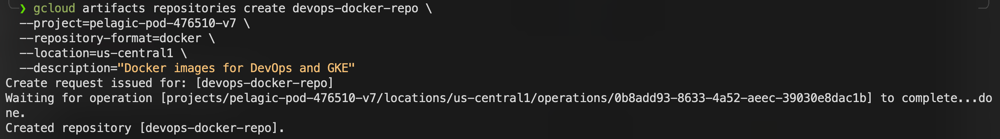
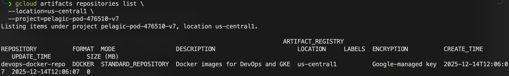

# Google Cloud Artifact Registry – Overview & Usage Guide

## 1. What is Google Cloud Artifact Registry?

**Google Cloud Artifact Registry** is a fully managed service for storing, managing, and securing build artifacts such as:

- 🐳 Docker / OCI container images
- ☕ Maven packages
- 📦 npm packages
- 🐍 Python (PyPI) packages
- 📁 Generic artifacts

It is the **successor to Container Registry (gcr.io)** and is tightly integrated with:
- GKE
- Cloud Build
- Cloud Run
- IAM & VPC security controls

---

## 2. Key Benefits

- Regional and multi‑regional repositories
- Fine‑grained IAM access control
- Native vulnerability scanning
- Cleanup policies to control storage cost
- Seamless integration with GKE & CI/CD

---

## 3. Pricing Summary (High Level)

| Cost Type | Description |
|---------|-------------|
| Storage | $0.10 per GB‑month (first 0.5 GB free) |
| Upload (Ingress) | Free |
| Download within same region | Free |
| Cross‑region / Internet egress | Standard GCP network pricing |

> 💡 Best practice: create the repository in the **same region as your GKE cluster** to avoid egress costs.

---

## 4. Enable Artifact Registry API

Before using Artifact Registry, enable the API:

```bash
# Enable service
gcloud services enable artifactregistry.googleapis.com

# Verify
gcloud services list --enabled | grep artifactregistry.googleapis.com
```

---

## 5. Create an Artifact Registry Repository (gcloud)

### Repository format options

| Format | Value |
|------|------|
| Docker / OCI | docker |
| Maven | maven |
| npm | npm |
| Python (PyPI) | python |
| Generic | generic |


### Create a Docker (OCI) repository

```bash
gcloud artifacts repositories create devops-docker-repo \
  --project=pelagic-pod-476510-v7 \
  --repository-format=docker \
  --location=us-central1 \
  --description="Docker images for DevOps and GKE"
```


---

## 6. Verify Repository

```bash
gcloud artifacts repositories list \
  --location=us-central1 \
  --project=pelagic-pod-476510-v7
```


---

## 7. Configure Docker Authentication
**🔐 OPTION 1 — Service Account + Access Token (RECOMMENDED for local / CI)**
1. **Create service account with only push privileges**
```bash
gcloud iam service-accounts create docker-push-only --display-name "Docker Registry Pusher"
# Result
Created service account [docker-push-only].
```

2. **Grant minimal permission**
```bash
gcloud projects add-iam-policy-binding pelagic-pod-476510-v7 \
  --member="serviceAccount:docker-push-only@pelagic-pod-476510-v7.iam.gserviceaccount.com" \
  --role="roles/artifactregistry.writer"
```

3. **Create a service account keys**
```bash
gcloud iam service-accounts keys create docker-push.json \
  --iam-account docker-push-only@pelagic-pod-476510-v7.iam.gserviceaccount.com

# Verify
cloud iam service-accounts keys list \                                                                                                ─╯
  --iam-account docker-push-only@pelagic-pod-476510-v7.iam.gserviceaccount.com
```

4. **Generate a short-lived OAuth access token**
```bash
gcloud auth activate-service-account \
  docker-push-only@pelagic-pod-476510-v7.iam.gserviceaccount.com \
  --key-file docker-push.json

gcloud auth print-access-token
```

5. **Use docker login on the local host**
```bash
docker login us-central1-docker.pkg.dev \
  -u oauth2accesstoken \
  -p ACCESS_TOKEN_HERE
```

🔐 OPTION 2 — Service Account JSON (NOT recommended, but works)
>[!NOTE]
>⚠️ Use ONLY if Option 1 is impossible
1. **Docker login using JSON key**
```bash
docker login us-central1-docker.pkg.dev  -u _json_key --password-stdin < docker-push.json
```

🔐 OPTION 3 — Use gcloud cli to authenticate artifact registry repository automatically
Authenticate Docker to Artifact Registry:
```bash
gcloud auth configure-docker us-central1-docker.pkg.dev
```

This updates `~/.docker/config.json` automatically.

---

## 8. Push a Docker Image to Artifact Registry

### 8.1 Tag image

```bash
docker tag nginx:latest \
  us-central1-docker.pkg.dev/pelagic-pod-476510-v7/devops-docker-repo/nginx:latest
```

### 8.2 Push image

```bash
docker push \
  us-central1-docker.pkg.dev/pelagic-pod-476510-v7/devops-docker-repo/nginx:latest
```

---

## 9. Pull Image from GKE or Local Machine
**Pull from local host**
```bash
docker pull \
  us-central1-docker.pkg.dev/pelagic-pod-476510-v7/devops-docker-repo/nginx:latest
```

**Pull Images from Artifact Registry in GKE**
In GKE, ensure:
- Nodes or workloads have permission `roles/artifactregistry.reader`
- Workload Identity is correctly configured (recommended)

> Config GKE pulls images from Artifact Registry securely using Workload Identity (the recommended and production-grade method).
> This avoids:
>   Service account keys
>   Node-level permissions
>   Credential leaks

🔐 Architecture (important to understand)
Kubernetes Pod
  ↓ (KSA)
Kubernetes Service Account
  ↓ (Workload Identity binding)
Google Service Account (GSA)
  ↓ (IAM role)
Artifact Registry

👉 Pods authenticate as a Google Service Account, not the node.

✅ Prerequisites checklist
  * GKE Standard cluster (Autopilot also works)
  * Artifact Registry repository already created
  * kubectl + gcloud configured
  * Cluster has Workload Identity enabled (GKE ≥ 1.24 → usually enabled by default)

Verify Workload Identity is enabled on the cluster
```bash
gcloud container clusters describe trong-lab-gke-cluster \
  --zone us-central1-c \
  --project pelagic-pod-476510-v7 \
  --format="value(workloadIdentityConfig.workloadPool)"
```

Expected output:
```text
pelagic-pod-476510-v7.svc.id.goog
```

If empty → cluster was created without Workload Identity, you must enable it.
Enable Workload Identity on an EXISTING cluster
Enable workload pool
```bash
gcloud container clusters update trong-lab-gke-cluster \
  --zone us-central1-c \
  --workload-pool=pelagic-pod-476510-v7.svc.id.goog
```

Enable Workload Identity on node pool(s)
```bash
# List node pools
gcloud container node-pools list \
  --cluster trong-lab-gke-cluster \
  --zone us-central1-c

# Update node pools
gcloud container node-pools update default-pool \
  --cluster trong-lab-gke-cluster \
  --zone us-central1-c \
  --workload-metadata=GKE_METADATA
```

Verify Workload Identity is enabled
```bash
gcloud container clusters describe trong-lab-gke-cluster \
  --zone us-central1-c \
  --format="value(workloadIdentityConfig.workloadPool)"
```

Check node pool metadata mode
```bash
gcloud container node-pools describe default-pool \
  --cluster trong-lab-gke-cluster \
  --zone us-central1-c \
  --format="value(config.workloadMetadataConfig.mode)"
```

Expect:
```text
GKE_METADATA
```

Confirm Kubernetes supports it
```bash
kubectl get nodes -o jsonpath='{.items[0].metadata.labels}'

# Result
{"beta.kubernetes.io/arch":"amd64","beta.kubernetes.io/instance-type":"e2-medium","beta.kubernetes.io/os":"linux","cloud.google.com/gke-boot-disk":"pd-standard","cloud.google.com/gke-container-runtime":"containerd","cloud.google.com/gke-cpu-scaling-level":"2","cloud.google.com/gke-dpv2-ready":"true","cloud.google.com/gke-logging-variant":"DEFAULT","cloud.google.com/gke-max-pods-per-node":"110","cloud.google.com/gke-memory-gb-scaling-level":"4","cloud.google.com/gke-netd-ready":"true","cloud.google.com/gke-nodepool":"default-pool","cloud.google.com/gke-os-distribution":"cos","cloud.google.com/gke-provisioning":"standard","cloud.google.com/gke-stack-type":"IPV4","cloud.google.com/machine-family":"e2","cloud.google.com/private-node":"false","failure-domain.beta.kubernetes.io/region":"us-central1","failure-domain.beta.kubernetes.io/zone":"us-central1-c","iam.gke.io/gke-metadata-server-enabled":"true","kubernetes.io/arch":"amd64","kubernetes.io/hostname":"gke-trong-lab-gke-cluste-default-pool-78cb078a-9qbe","kubernetes.io/os":"linux","node.kubernetes.io/instance-type":"e2-medium","topology.gke.io/zone":"us-central1-c","topology.kubernetes.io/region":"us-central1","topology.kubernetes.io/zone":"us-central1-c"}%
```

Look for
```text
iam.gke.io/gke-metadata-server-enabled=true
```

What happens after enabling Workload Identity
| Before               | After           |
| -------------------- | --------------- |
| Node SA auth         | Pod-level auth  |
| Service account keys | Keyless         |
| Broad permissions    | Least privilege |
| Hard to audit        | IAM-auditable   |

**Create a Google Service Account (GSA)**
This account will have read-only access to Artifact Registry.
```bash
gcloud iam service-accounts create docker-pull-only \
  --project pelagic-pod-476510-v7 \
  --display-name "GKE Artifact Registry Reader"
```

Grant Artifact Registry read permission to the GSA
```bash
gcloud projects add-iam-policy-binding pelagic-pod-476510-v7 \
  --member="serviceAccount:docker-pull-only@pelagic-pod-476510-v7.iam.gserviceaccount.com" \
  --role="roles/artifactregistry.reader"
```

Create a Kubernetes Service Account (KSA)
```bash
kubectl create serviceaccount gke-artifact-reader-sa
# Verify
kubectl get sa gke-artifact-reader-sa
```

Bind KSA → GSA (Workload Identity binding)
> This is the most important step.
```bash
gcloud iam service-accounts add-iam-policy-binding \
  docker-pull-only@pelagic-pod-476510-v7.iam.gserviceaccount.com \
  --role roles/iam.workloadIdentityUser \
  --member "serviceAccount:pelagic-pod-476510-v7.svc.id.goog[default/gke-artifact-reader-sa]"
```
🔑 Meaning:
- Kubernetes SA gke-artifact-reader-sa
- Can impersonate Google SA docker-pull-only

Annotate the Kubernetes Service Account
```bash
kubectl annotate serviceaccount gke-artifact-reader-sa \
  iam.gke.io/gcp-service-account=docker-pull-only@pelagic-pod-476510-v7.iam.gserviceaccount.com
```

Verify:
```bash
kubectl describe sa gke-artifact-reader-sa
```

Expect:
```text
Annotations:
  iam.gke.io/gcp-service-account: docker-pull-only@...
```

Deploy a Pod using this Service Account
Example Pod YAML
```yaml
apiVersion: v1
kind: Pod
metadata:
  name: nginx-artifact-test
spec:
  serviceAccountName: artifact-reader-sa
  containers:
  - name: nginx
    image: us-central1-docker.pkg.dev/pelagic-pod-476510-v7/devops-docker-repo/nginx:test
```

Apply it:
```bash
kubectl apply -f pod.yaml
```

Verify image pull success
```bash
kubectl describe pod nginx-artifact-test
```

Check node logs if needed
```bash
kubectl get events --sort-by=.metadata.creationTimestamp
```

---

## 10. IAM Permissions (Common Roles)

| Role | Purpose |
|----|--------|
| Artifact Registry Reader | Pull images |
| Artifact Registry Writer | Push images |
| Artifact Registry Admin | Full control |

Example:

```bash
gcloud projects add-iam-policy-binding pelagic-pod-476510-v7 \
  --member="serviceAccount:my-sa@pelagic-pod-476510-v7.iam.gserviceaccount.com" \
  --role="roles/artifactregistry.reader"
```

---

## 11. Best Practices

- Use **regional repositories** aligned with GKE region
- Enable **cleanup policies** to remove old images
- Prefer **Workload Identity** over service account keys
- Disable public internet pulls in production clusters

---
- Use **regional repositories** aligned with GKE region
- Enable **cleanup policies** to remove old images
- Prefer **Workload Identity** over service account keys
- Disable public internet pulls in production clusters

---

## 12. Artifact Registry vs Container Registry

| Feature | Artifact Registry | Container Registry |
|------|------------------|------------------|
| Status | Actively developed | Legacy |
| Formats | Multi‑format | Docker only |
| IAM | Fine‑grained | Limited |
| Security | Stronger | Basic |

---

## 13. Useful Commands (Quick Reference)

```bash
# List images
gcloud artifacts docker images list \
  us-central1-docker.pkg.dev/pelagic-pod-476510-v7/devops-docker-repo

# Delete image
gcloud artifacts docker images delete IMAGE_URL

# Describe repository
gcloud artifacts repositories describe devops-docker-repo \
  --location=us-central1

# Delete artifact registry repository
gcloud artifacts repositories delete devops-docker-repo \
  --location=us-central1 \
  --project=pelagic-pod-476510-v7
```

