# Hands-on CICD Lab with Gitlab Runner and Docker

## Table of Contents
- [Environment Setup](#environment-setup)
- [Configuring Runner on Linux Server](#configuring-runner-on-linux-server)
- [Create CICD WorkFlow with .gitlab-ci.yaml](#create-cicd-workflow-with-.gitlab-ci.yaml)
- [Summary](#summary)

**📋 Lab Objective:** This guide walks you through setting up a complete CI/CD environment using GitLab integrating with Docker to automatically build and deploy applications.

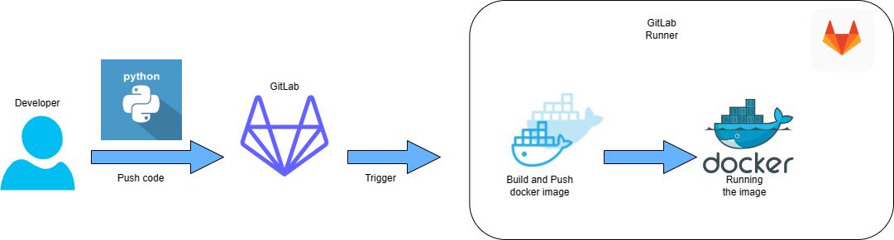

## Environment Setup

### 1. Install Gitlab on local server
In this lab, I will install a sefl-hosted gitlab server on Linux system.
#### Add the GitLab package repository
```bash
sudo dnf install -y curl
curl "https://packages.gitlab.com/install/repositories/gitlab/gitlab-ce/script.rpm.sh" | sudo bash
```
#### Install the package
```bash
sudo dnf install gitlab-ce EXTERNAL_URL="https://gitlab.example.com" GITLAB_ROOT_PASSWORD="strongpassword"
```
#### Logging In for the First Time
Visit the domain name of your GitLab server in your web browser:

On your first visit, you’ll be greeted with a login page:
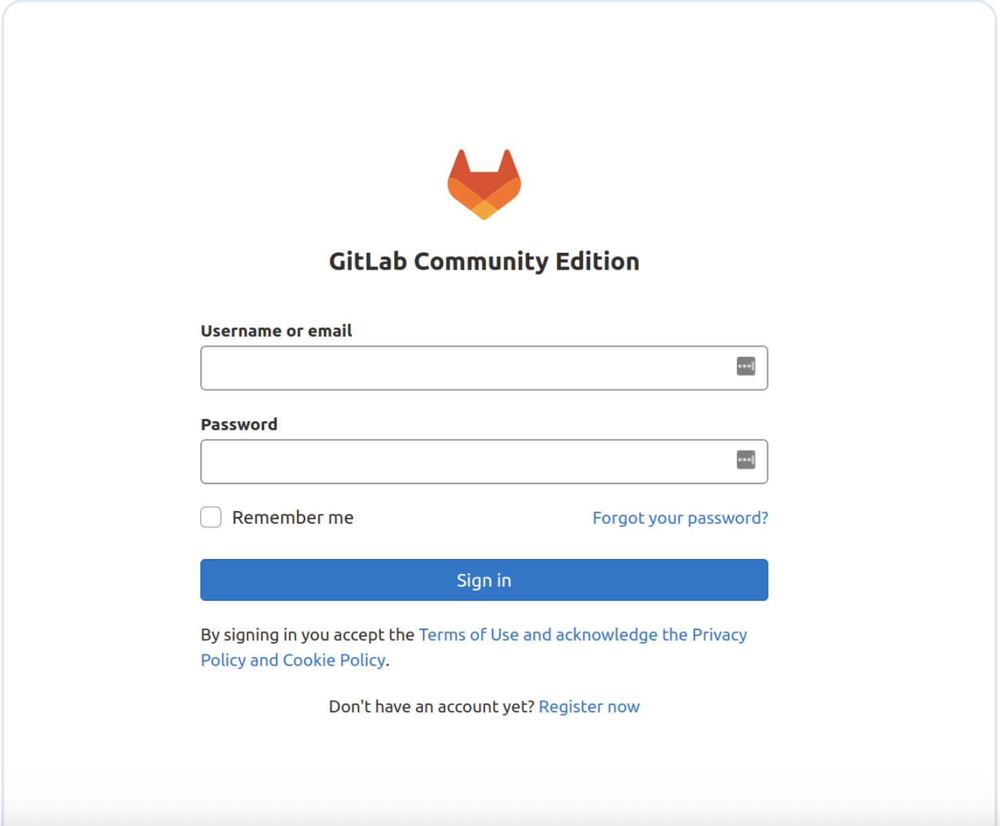

Enter the following:
  Username: root
  Password: strongpassword

#### Create your first project
##### A short look at Gitlab Group
In **GitLab**, a **Group** is like a container (or folder) that holds related projects, subgroups, and shared resources.  
Think of it as an **organization unit** to manage multiple repositories together.

###### 🔹 Key Points about Groups in GitLab
####### 1. Projects Organization
- Instead of having many unrelated repositories, you can group them.  
- Example:
devops-tools/ansible-playbooks
devops-tools/kubernetes-scripts
devops-tools/terraform-modules

Here, `devops-tools` is the **group**, and each repo under it is a **project**.

####### 2. Access Control & Permissions
- Add users to a group with roles:
- **Owner**
- **Maintainer**
- **Developer**
- **Reporter**
- **Guest**
- All projects inside inherit those permissions.
- Makes user management easier compared to setting permissions per project.

####### 3. Subgroups
- Groups can contain **subgroups**, like:
company/
frontend/
project-A
backend/
project-B

####### 4. Shared Resources
Groups can share:
- **CI/CD variables** → available to all projects in the group.
- **Runners** → one GitLab Runner for multiple projects in the group.
- **Issue boards & milestones** → manage work across projects.
- **Package registries** → publish Docker images, npm packages, etc. scoped by group.

####### 5. Visibility
- A group can be **private, internal, or public**, same as projects.

####### ✅ In Short
A **GitLab Group** = a way to **organize projects, manage users, and share CI/CD resources across multiple repos**.  

> [!NOTE]
> If you create a project without creating any group, this project will be in the defautl group (root).

###### Create your first group
- Log in to GitLab with Admin privileges.
- Navigate to **Admin Area** (wrench icon in the top-left corner).
- Select **New Group**.
- Enter the Group name (e.g., `devops`).
- After creation, switch to the newly created Group to work within it.
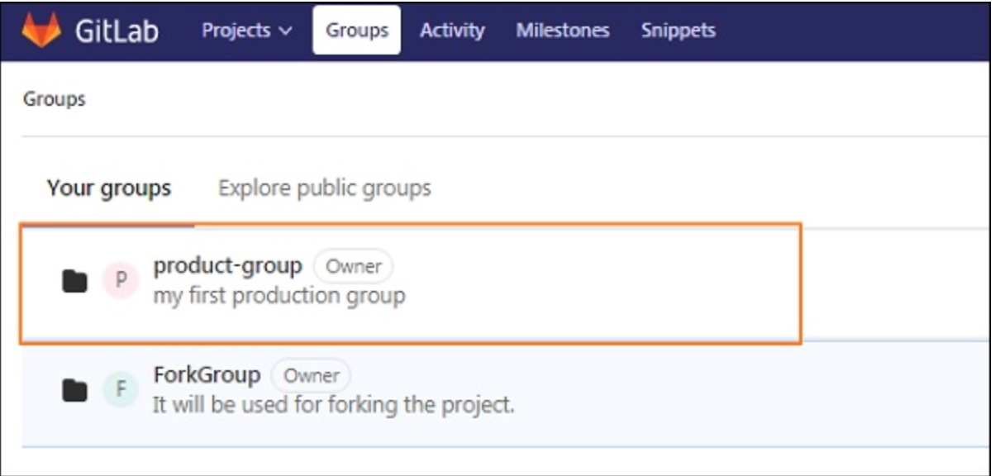

##### Create new project in groups
Create a new project to hold your source code and CI/CD pipeline configuration.

- Within the created Group, select **New Project**.
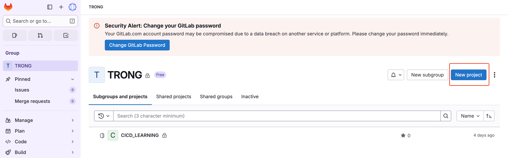
- Choose **Create blank project**.
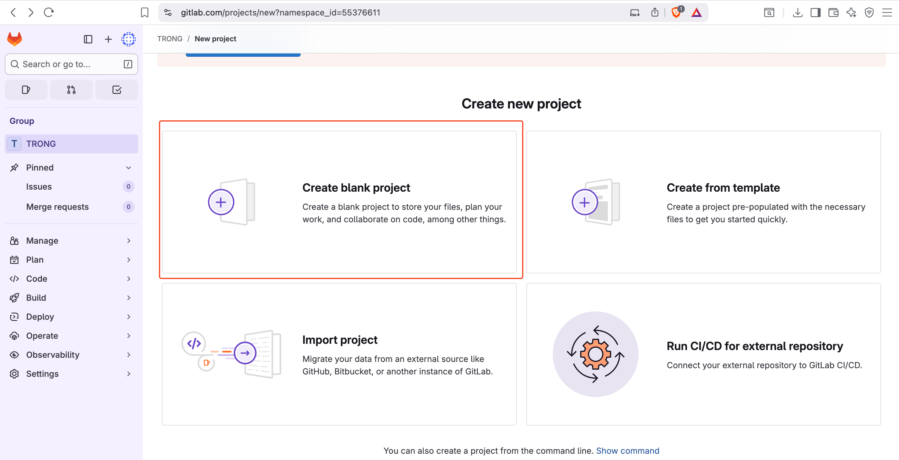
- Configure the project:
  - **Project name**: Name your project.
  - **Visibility Level**: Select **Internal**.
- Click **Create project**.
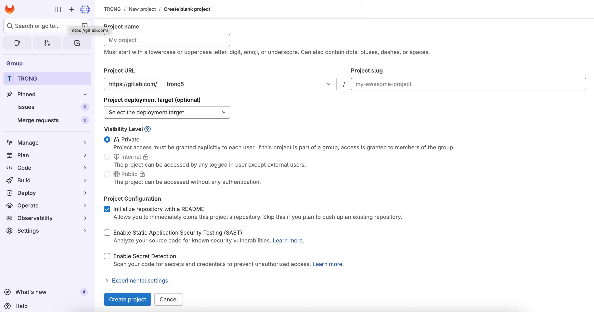

> **💡 Explanation:** Selecting Internal makes the project accessible to organization members. Unchecking README allows you to push code from an existing repository.

##### Create and config access token for Docker Hub
In this lab, you have to create a docker hub account and generate an access token. An access token allows GitLab to securely push Docker images to Docker Hub.

After create a Docker Hub account, log in to [hub.docker.com](https://hub.docker.com).
- Navigate to **Account Settings → Security → Personal access tokens**.
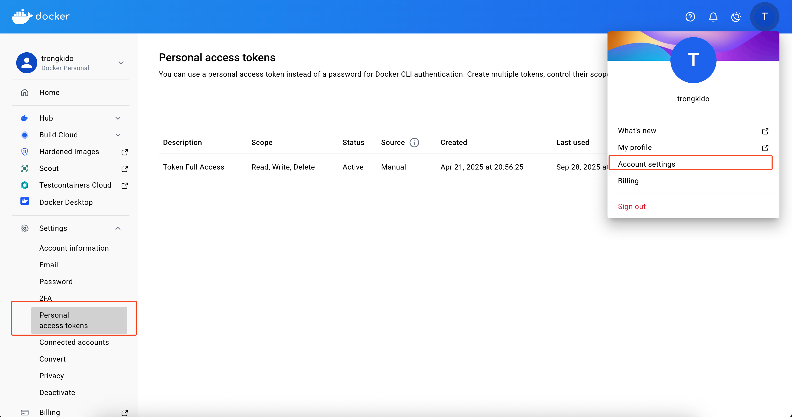
- Click **Generate new token**.
- Configure the token:
  - **Token description**: Name it (e.g., `gitlab-cicd`).
  - **Access permissions**: Select **Read & Write**.
  - **Expiration date**: Choose an expiration date.
- Click **Generate**.
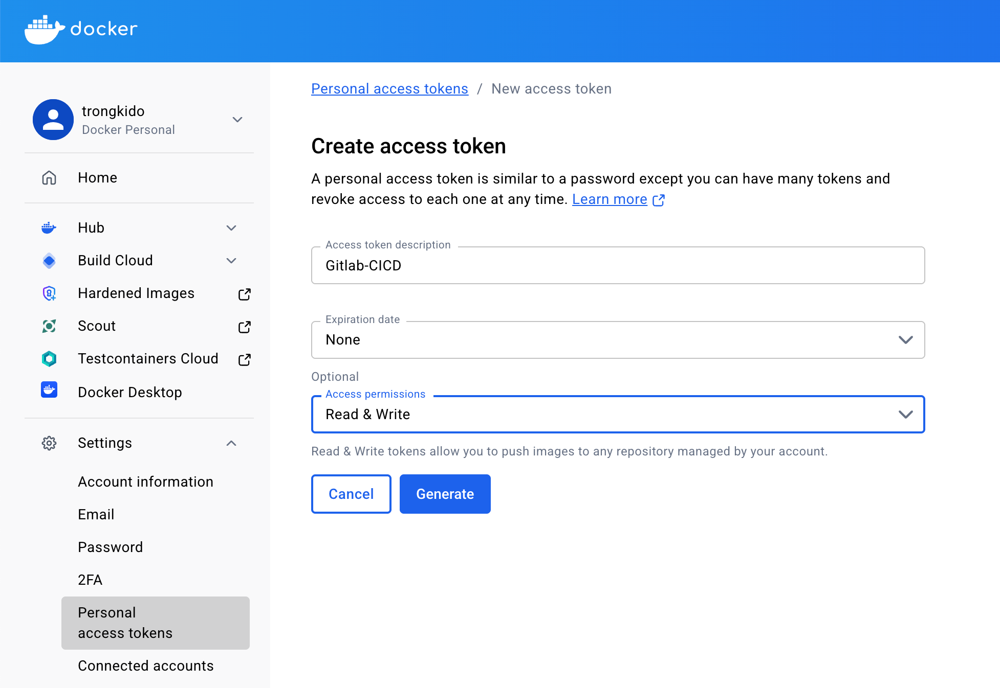

> [!NOTE]
> **Copy and save the token immediately** because it cannot be viewed again.

##### Create CI/CD Variables
Store Docker Hub credentials as environment variables for use in the pipeline.

- Navigate to your new created Group.
- Go to **Settings → CI/CD**.
- Expand the **Variables** section.
- Click **Add variable** and create the following two variables:

**Variable 1: DOCKER_USERNAME**
- **Key**: `DOCKER_USERNAME`
- **Value**: Your Docker Hub username (e.g., `username`)
- **Type**: Variable
- **Protected**: Optional
- **Masked**: Optional

**Variable 2: DOCKER_PASSWORD**
- **Key**: `DOCKER_PASSWORD`
- **Value**: The personal access token created from Docker Hub
- **Type**: Variable
- **Protected**: Optional
- **Masked**: Check (to hide the token in logs)

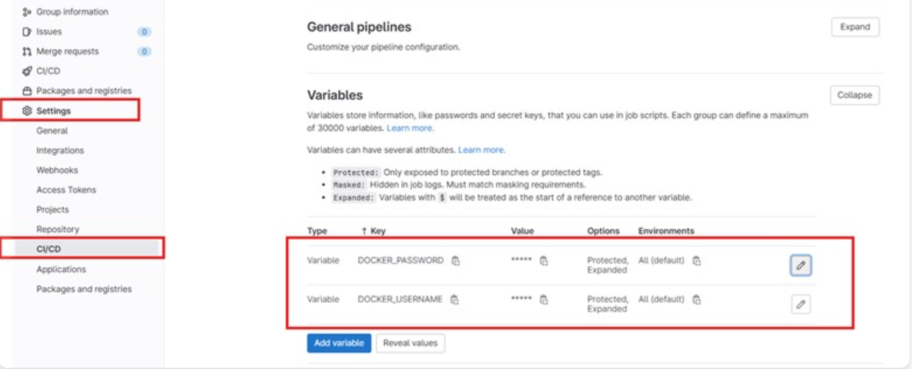

> **🔒 Security:** Always mark sensitive variables like passwords and tokens as "Masked" to prevent exposure in CI/CD logs.

## Configuring Runner on Linux Server
A **GitLab Runner** is an application that executes the jobs defined in your GitLab CI/CD pipelines.  
It’s the **worker** that picks up tasks from GitLab and runs them on a machine (VM, container, or bare metal).  

### 🔹 Key Points about GitLab Runner

#### 1. What it Does
- Listens to GitLab for jobs (from `.gitlab-ci.yml`).
- Runs the job’s script (build, test, deploy, etc.).
- Reports results (success/fail, artifacts, logs) back to GitLab.

#### 2. Where it Runs
- Can run **on your own server** (self-hosted).
- Can run **on GitLab’s shared infrastructure** (GitLab.com provides shared runners).
- Can run **inside Kubernetes**, Docker, or directly on Linux/Windows/Mac.

#### 3. Executors
A Runner can use different *executors* depending on how you want jobs executed:
- **Shell** → runs scripts directly on the host machine.
- **Docker** → runs each job in a fresh Docker container.
- **Docker-in-Docker (dind)** → for building Docker images.
- **Kubernetes** → runs each job as a Pod.
- **VirtualBox, SSH, custom** → less common.

#### 4. Shared vs. Specific Runners
- **Shared Runner** → available to all projects in GitLab.
- **Specific Runner** → assigned to a single project or group.

### Install Gitlab Runner
To install GitLab Runner on Linux system:
Add the official GitLab repository:
```bash
curl -L "https://packages.gitlab.com/install/repositories/runner/gitlab-runner/script.rpm.sh" | sudo bash
```
Install the lastest version of Gitlab Runner
```bash
sudo dnf install gitlab-runner
```
To install a specific version of GitLab Runner
```bash
sudo dnf list gitlab-runner --showduplicates | sort -r
sudo dnf install gitlab-runner-17.2.0-1
```
Check status of Gitlab Runner
```bash
sudo systemctl status gitlab-runner
```
If Gitlab Runner does not running, please start and enable it.
```bash
sudo systemctl start gitlab-runner
sudo systemctl enable gitlab-runner
```

### Registry Gitlab Runner with a Project
#### 🔹 Purpose
Registering a GitLab Runner to a project allows the project’s CI/CD pipelines to run on that runner.  
Without registering, GitLab has no worker available to execute jobs from `.gitlab-ci.yml`.

#### Why Register a Runner?
- **Execute CI/CD jobs**: Build, test, deploy your code automatically.
- **Project-specific isolation**: Limit a runner to only one project for better security.
- **Custom environments**: Use project-tailored runners (e.g., Docker with specific images, Kubernetes).
- **More control**: Choose resources and configurations dedicated to your project.

#### Create Project Registration Token Before Registering
- Navigate to your project in GitLab:
  - `Settings` → `CI/CD` → expand **Runners** → `Create Project Runner`
  - Configure runner
    - **Tags**: Tags to control which jobs can use this runner. (e.g., `docker`).
    - **Run untagged jobs**: Click to this if you need runner running untagged jobs.
  - Click **Create runner**.  
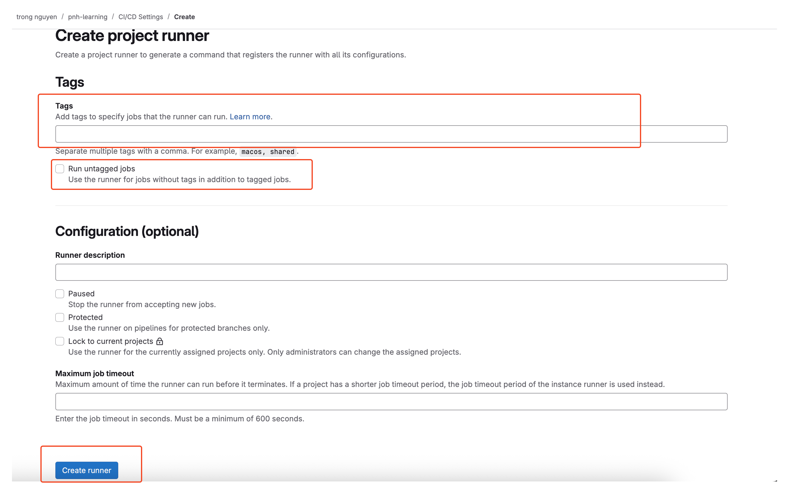
  - Copy the **registration token** for the project.
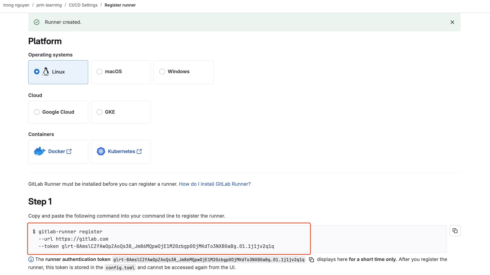
  - Run the following command on the server where the runner is installed:
```bash
gitlab-runner register \
  --url https://gitlab.example.com/ \
  --registration-token PROJECT_REGISTRATION_TOKEN \
  --executor docker \
  --docker-image docker:latest \
  --description "project-runner" \
  --tag-list "docker,ci,build" \
  --non-interactive
```
Explanation of Parameters
--url: GitLab instance URL.
--registration-token: Token from your project’s settings.
--executor: How jobs run (shell, docker, kubernetes, etc.).
--docker-image: Default image if Docker executor is used.
--description: Runner’s name/label.
--tag-list: Tags to control which jobs can use this runner.

> **✅ Check:** Return to GitLab Local, navigate to Settings → CI/CD → Runners, and confirm the Runner is connected successfully (indicated by a green dot).

In this lab, I'm using self-hosted Gitlab server, so I need to ensure that the docker image that gitlab runner use can connect to local Gitlab server. 
Open the GitLab Runner configuration file:

```bash
sudo vim /etc/gitlab-runner/config.toml
```
Find the `[runners.docker]` section and add the following line:
``toml
extra_hosts = ["gitlab.example.com:local_ip_address"]
```
> [! NOTE]
> Gitlab Runner can be installed any where you can control the CICD flow (e.g: linux-server, docker image)

## Create CICD WorkFlow with .gitlab-ci.yaml
After finish all the configuration, we can create a workflow with .gitlab-ci.yml file in your project in oder to gitlab runner can run the CICD pipeline.
In this lab, I will prepare a .gitlab-ci.yml file with the example work flow.
```yaml
stages:
  - build
  - deploy

variables:
  # Disable Docker TLS for dind
  DOCKER_TLS_CERTDIR: ""
  DOCKER_HOST: "tcp://docker:2375"    # <- ensure docker client talks to dind service
  DOCKER_BUILDKIT: "1"                # <- use BuildKit for buildx pushes

# Build CoreAPI image using buildx and push to Docker Hub (registry cache enabled)
build_coreapi:
  stage: build
  image: docker:24
  services:
    - name: docker:24-dind
      alias: docker
  variables:
    DOCKER_DRIVER: overlay2
  before_script:
    - echo "$DOCKER_PASSWORD" | docker login -u "$DOCKER_USERNAME" --password-stdin
    - docker buildx create --use || true
    - docker info | sed -n '1,5p'   # quick sanity check (no secrets printed)
  script:
    - |
      DATE=$(date +%Y%m%d)
      SHA=${CI_COMMIT_SHORT_SHA}
      IMAGE_TAG="$DATE-$SHA"
      REPO="$DOCKER_USERNAME/corejs-coreapi"
      docker buildx build --progress=plain --platform linux/amd64 --push \
        --tag "$REPO:latest" --tag "$REPO:$IMAGE_TAG" \
        --cache-from=type=registry,ref="$REPO:buildcache" \
        --cache-to=type=registry,ref="$REPO:buildcache",mode=max \
        -f CoreAPI/Dockerfile CoreAPI
  rules:
    - if: '$CI_COMMIT_BRANCH == "nodejs"'

# Build Frontend image using buildx and push to Docker Hub (registry cache enabled)
build_frontend:
  stage: build
  image: docker:24
  services:
    - name: docker:24-dind
      alias: docker
  variables:
    DOCKER_DRIVER: overlay2
  before_script:
    - echo "$DOCKER_PASSWORD" | docker login -u "$DOCKER_USERNAME" --password-stdin
    - docker buildx create --use || true
    - docker info | sed -n '1,5p'
  script:
    - |
      DATE=$(date +%Y%m%d)
      SHA=${CI_COMMIT_SHORT_SHA}
      IMAGE_TAG="$DATE-$SHA"
      REPO="$DOCKER_USERNAME/corejs-frontend"
      docker buildx build --progress=plain --platform linux/amd64 --push \
        --tag "$REPO:latest" --tag "$REPO:$IMAGE_TAG" \
        --cache-from=type=registry,ref="$REPO:buildcache" \
        --cache-to=type=registry,ref="$REPO:buildcache",mode=max \
        --build-arg NODE_ENV=production \
        -f frontend/Dockerfile frontend
  rules:
    - if: '$CI_COMMIT_BRANCH == "nodejs"'

# Deploy to remote server by SSH (uses SSH_PRIVATE_KEY variable)
deploy:
  stage: deploy
  image: alpine:3.18
  before_script:
    - apk add --no-cache openssh-client bash
    - mkdir -p ~/.ssh
    - echo "$SSH_PRIVATE_KEY" > ~/.ssh/id_rsa || true
    - chmod 600 ~/.ssh/id_rsa || true
    - |
      # add known host only for remote SSH deployments
      if [ -n "$SERVER" ] && [ "$SERVER" != "localhost" ] && [ "$SERVER" != "127.0.0.1" ]; then
        if [ -n "$PORT" ]; then
          ssh-keyscan -p $PORT $SERVER >> ~/.ssh/known_hosts
        else
          ssh-keyscan $SERVER >> ~/.ssh/known_hosts
        fi
      fi
  script:
    - DESTINATION_PATH="/home/$USERNAME/deployments/corejs"
    - DATE=$(date +%Y%m%d)
    - SHA=${CI_COMMIT_SHORT_SHA}
    - IMAGE_TAG="$DATE-$SHA"
    - |
      if [ -z "$SERVER" ] || [ "$SERVER" = "localhost" ] || [ "$SERVER" = "127.0.0.1" ]; then
        echo "Running local deploy (no SSH)..."
        mkdir -p "$DESTINATION_PATH"
        cp -r scripts "$DESTINATION_PATH/"
        chmod +x "$DESTINATION_PATH/scripts/deploy.sh"
        DOCKER_USERNAME='${DOCKER_USERNAME}' DOCKER_PASSWORD='${DOCKER_PASSWORD}' IMAGE_TAG='${IMAGE_TAG}' ALLOWED_HOSTS='${ALLOWED_HOSTS}' bash "$DESTINATION_PATH/scripts/deploy.sh"
      else
        echo "Running remote deploy via SSH..."
        ssh -p ${PORT} ${USERNAME}@${SERVER} "mkdir -p $DESTINATION_PATH"
        scp -P ${PORT} scripts/deploy.sh ${USERNAME}@${SERVER}:$DESTINATION_PATH/
        ssh -p ${PORT} ${USERNAME}@${SERVER} "cd $DESTINATION_PATH && \
          DOCKER_USERNAME='${DOCKER_USERNAME}' DOCKER_PASSWORD='${DOCKER_PASSWORD}' IMAGE_TAG='${IMAGE_TAG}' ALLOWED_HOSTS='${ALLOWED_HOSTS}' bash ./deploy.sh"
      fi
  dependencies:
    - build_coreapi
    - build_frontend
  rules:
    - if: '$CI_COMMIT_BRANCH == "nodejs"'
```
After pushing code with a `.gitlab-ci.yml` file to the repository, the pipeline will run automatically.

- Navigate to the project on GitLab.
- Go to **CI/CD → Pipelines**.
- View the details of the running pipeline.
- Check each job: `build-coreapi`, `build-frontend`.

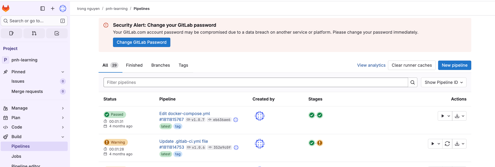

> **🎉 Success!** If all jobs pass (displayed in green), you have successfully set up the CI/CD pipeline. The Docker images have been built and pushed to Docker Hub.

## Summary
In this lab, you have successfully:
- ✅ Created a Group and Project on GitLab.
- ✅ Installed and registered a GitLab Runner with a Docker executor.
- ✅ Integrated Docker Hub to store Docker images.
- ✅ Configured DNS mapping for Docker containers.
- ✅ Built a CI/CD pipeline to automatically build and push images.

> **🚀 Next Steps:** You can expand the pipeline with stages like testing, security scanning, and deployment for a complete CI/CD workflow.

> **📚 References:**
> - [GitLab Runner Documentation](https://docs.gitlab.com/runner/)
> - [GitLab CI/CD Documentation](https://docs.gitlab.com/ee/ci/)
> - [Docker Hub Documentation](https://docs.docker.com/docker-hub/)

[Back to Articles & Labs](../../articles-labs.html)
