# Hands-on CICD Lab with Jenkins

## Table of Contents
- [Environment Setup](#environment-setup)
- [Create CICD WorkFlow with Jenkinsfile](#create-cicd-workflow-with-jenkinsfile)
- [Summary](#summary)

**📋 Lab Objective:** This guide walks you through setting up a complete CI/CD environment using Jenkins integrating with Docker to automatically build and deploy applications.

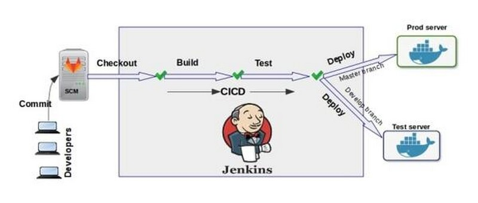

## Environment Setup
### 1. Install Java

Jenkins requires Java. Check version compatibility on the [Jenkins Java support page](https://www.jenkins.io/doc/administration/requirements/java/).

#### For Debian/Ubuntu:
```bash
sudo apt update
sudo apt install -y openjdk-17-jdk
java -version
```

#### For RHEL/Rocky/CentOS:
```bash
sudo dnf install -y java-17-openjdk
java -version
```

---

### 2. Install Jenkins

### Option A: Debian/Ubuntu

```bash
# Add Jenkins repository
curl -fsSL https://pkg.jenkins.io/debian/jenkins.io-2023.key | sudo tee   /usr/share/keyrings/jenkins-keyring.asc > /dev/null

echo deb [signed-by=/usr/share/keyrings/jenkins-keyring.asc]   https://pkg.jenkins.io/debian binary/ | sudo tee   /etc/apt/sources.list.d/jenkins.list > /dev/null

# Install Jenkins
sudo apt update
sudo apt install -y jenkins
```

Start and enable Jenkins:
```bash
sudo systemctl enable jenkins
sudo systemctl start jenkins
sudo systemctl status jenkins
```

---

#### Option B: RHEL/Rocky/CentOS

```bash
sudo dnf install -y wget
sudo wget -O /etc/yum.repos.d/jenkins.repo   https://pkg.jenkins.io/redhat-stable/jenkins.repo
sudo rpm --import https://pkg.jenkins.io/redhat-stable/jenkins.io-2023.key

sudo dnf install -y jenkins
sudo systemctl enable jenkins
sudo systemctl start jenkins
sudo systemctl status jenkins
```

---

### 3. Running Jenkins with Docker Compose

If you prefer containerized setup, you can customize your jenkins with Dockerfile and Docker compose, in this lab, I will use my custom Dockerfile and Docker compose file to setup a jenkins server.

> [!NOTE]
> Please install docker, docker-compose and have some basic knowledge about docker if you prefer this approach.

My custom Dockerfile and docker-compose.yml

```bash
vim Dockerfile
```
```text
# =============================
# Stage 1: Build & Package Tools
# =============================
FROM debian:bullseye-slim AS builder

ENV DEBIAN_FRONTEND=noninteractive

# Install required base packages for downloading and packaging
RUN apt-get update && apt-get install -y --no-install-recommends \
    curl \
    ca-certificates \
    gnupg \
    apt-transport-https \
    lsb-release && \
    rm -rf /var/lib/apt/lists/*

# Install Kubernetes CLI (kubectl)
RUN curl -fsSLo /usr/local/bin/kubectl https://dl.k8s.io/release/$(curl -L -s https://dl.k8s.io/release/stable.txt)/bin/linux/amd64/kubectl \
    && chmod +x /usr/local/bin/kubectl

# Install Helm CLI
RUN curl -fsSL https://get.helm.sh/helm-v3.16.1-linux-amd64.tar.gz | tar -xz && \
    mv linux-amd64/helm /usr/local/bin/helm && \
    chmod +x /usr/local/bin/helm && rm -rf linux-amd64

# =============================
# Stage 2: Final Jenkins Image
# =============================
FROM jenkins/jenkins:lts

USER root

# Install minimal runtime utilities and Docker CLI
RUN apt-get update && apt-get install -y --no-install-recommends \
    docker.io \
    net-tools \
    telnet \
    iputils-ping \
    curl \
    ca-certificates \
    && rm -rf /var/lib/apt/lists/*

# Copy tools from builder stage
COPY --from=builder /usr/local/bin/kubectl /usr/local/bin/kubectl
COPY --from=builder /usr/local/bin/helm /usr/local/bin/helm

# Verify installations
RUN kubectl version --client && helm version && docker --version

USER jenkins
```

```bash
vim docker-compose.yml
```
```text
## Docker compose
#version: '3.8'

services:
  jenkins:
    build:
      context: .
      dockerfile: Dockerfile
    container_name: jenkins
    restart: unless-stopped
    privileged: true  # Needed to access Docker socket and kubelet
    stdin_open: true
    tty: true
    user: root
    ports:
      - "8080:8080" # Jenkins UI
      - "50000:50000" # Agent communication
    networks:
      - jenkins
    extra_hosts:
      - "mygitlab.trongnv.xyz:192.168.88.140"
    volumes:
      - ./jenkins_home:/var/jenkins_home
      - ./jenkins_home/.kube:/root/.kube
      - /var/run/docker.sock:/var/run/docker.sock

networks:
  jenkins:
```
In this lab, I have my local gitlab server with ip address 192.168.88.140, in order to Jenkins can connect to my gitlab server with local network, the extra_hosts option resolve this for me. 

Now, let start jenkins server with command

```bash
docker compose up -d
```

Then, we need to check and ensure jenkins server is up

```bash
docker ps -a
```
Once jenkins server is up, access Jenkins at:
👉 [http://localhost:8080](http://localhost:8080)

To view admin password:
```bash
docker exec jenkins cat /var/jenkins_home/secrets/initialAdminPassword
```

Jenkins Login Page
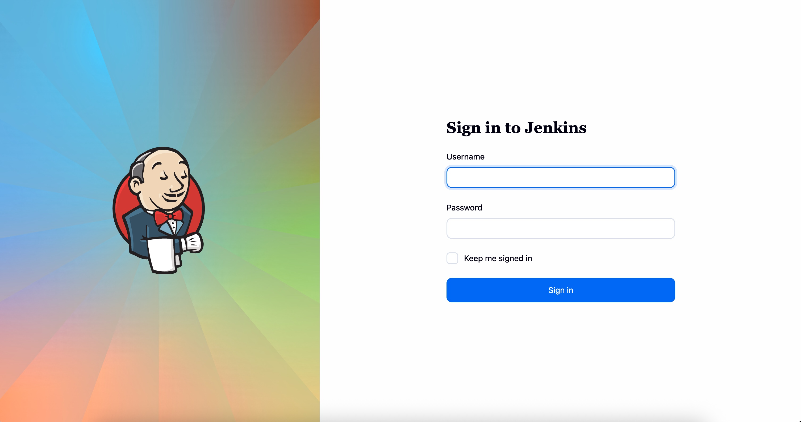

Jenkins Main Dashboard
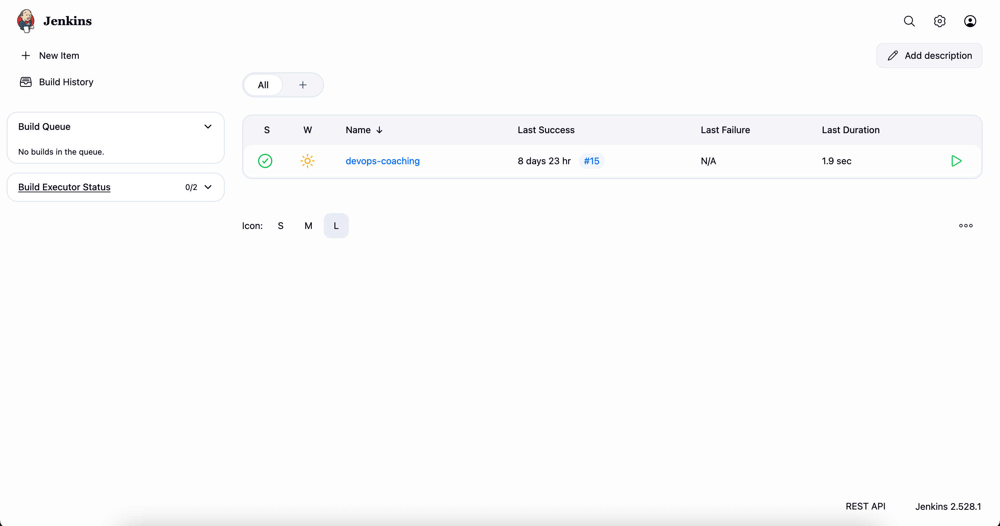

Manage Jenkins – System configuration, plugins, credentials, etc.
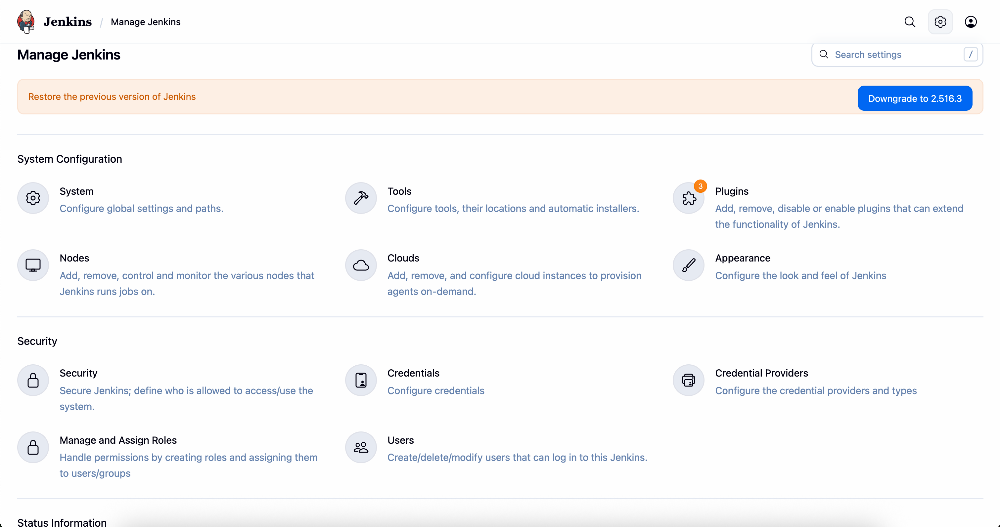

Plugin Installation
Go to **Manage Jenkins → Plugins → Available Plugins** and install:

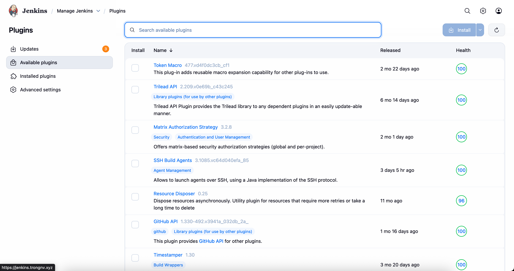

You can choose what plugins are best for you. For example:

* Blue Ocean
* Docker Pipeline
* Kubernetes CLI
* GitLab Plugin
* Role-based Authorization Strategy

For security, you can use RBAC (Role-based Authorization Strategy) with jenkins user to grant privilege for specific user

Enable Authorization
Go to **Manage Jenkins → Configure Global Security** and enable:

* ✅ “Enable security”
* ✅ “Jenkins’ own user database”
* ✅ “Role-based Strategy”

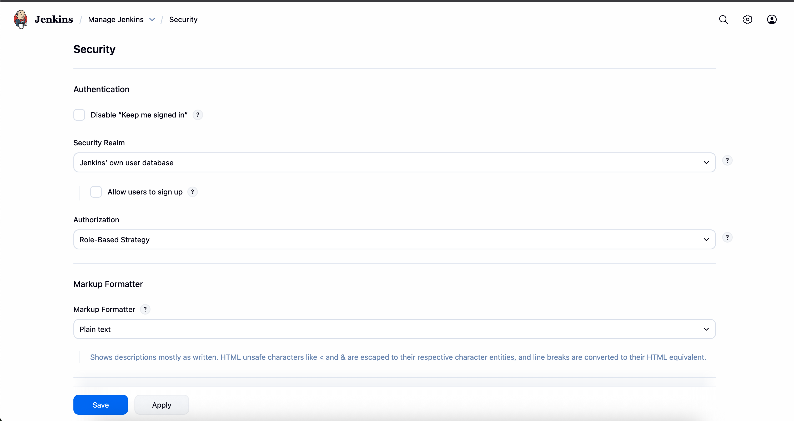

You can create user in jenkins

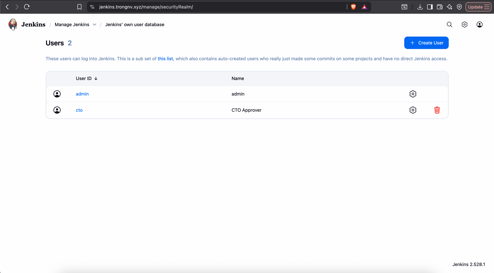

Then grant privilege

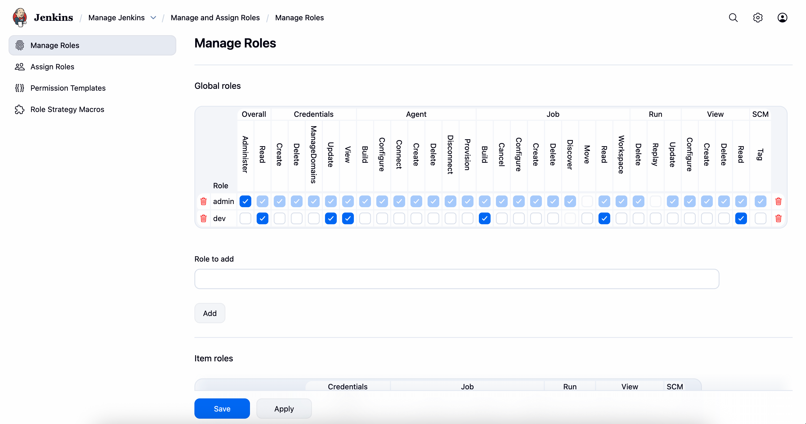

## Create CICD WorkFlow with Jenkinsfile

### Objective

* When code is committed to GitLab,  
* Jenkins automatically builds the project.

### GitLab Configuration

#### 1. Create a Personal Access Token (PAT) in GitLab

* Go to **GitLab → Preferences → Access Tokens → Add new token**
* Create a token with the permissions: `api` and `read_repository`
* Save the generated token.

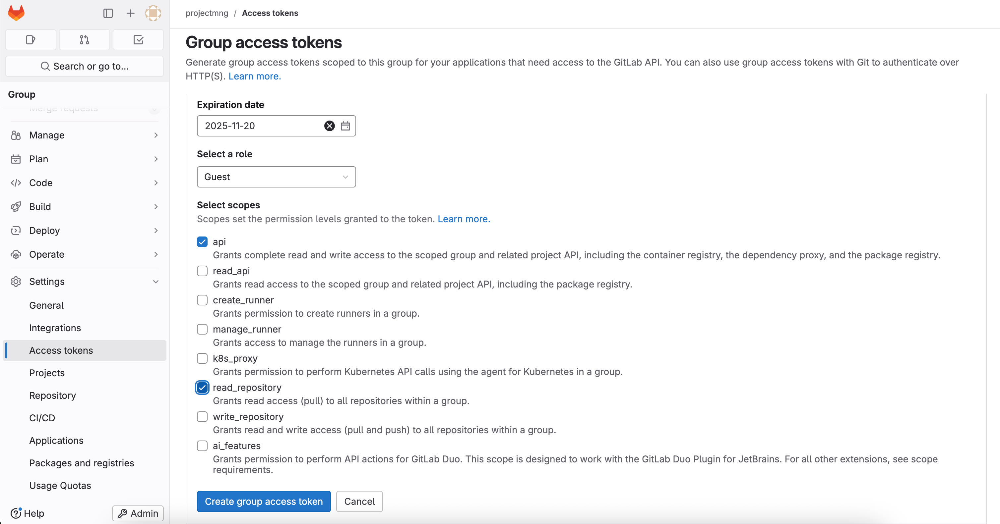

---

#### 2. Add a Webhook

* In your **GitLab Project → Settings → Webhooks → Add new webhook**
* **URL:** `https://jenkins.trongnv.xyz/project/devops-coaching`  
  (This URL comes from Jenkins trigger configuration)
* **Trigger:** Select `"Push events"`
* Click **Test** to verify the connection.

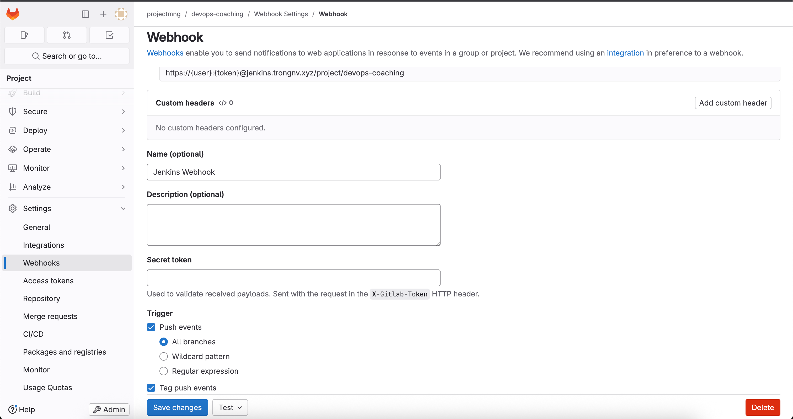

Please see https://plugins.jenkins.io/gitlab-plugin/#plugin-content-configuring-global-authentication for more information

---

### Jenkins Configuration

#### 1. Create Credentials

Go to **Manage Jenkins → Credentials → Global**
Create **Username + Password Credentials**
* **Kind:** `GitLab API token`
* **API Token:** `<PAT>`
* **ID:** `gitlab-cred`

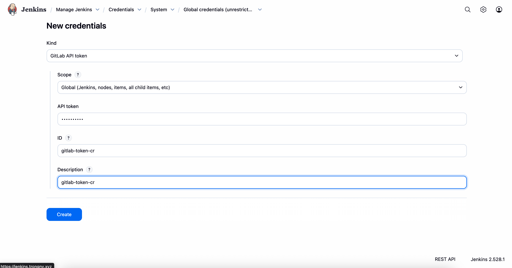

---

#### 2. Create a Pipeline

**New Item → Enter name → Select “Pipeline” → OK**

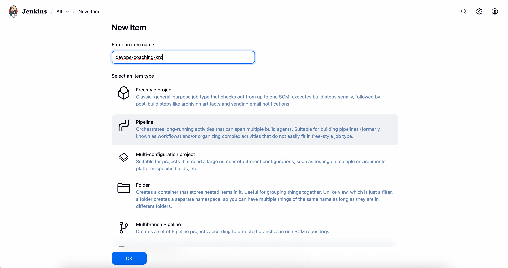

##### Configure Trigger

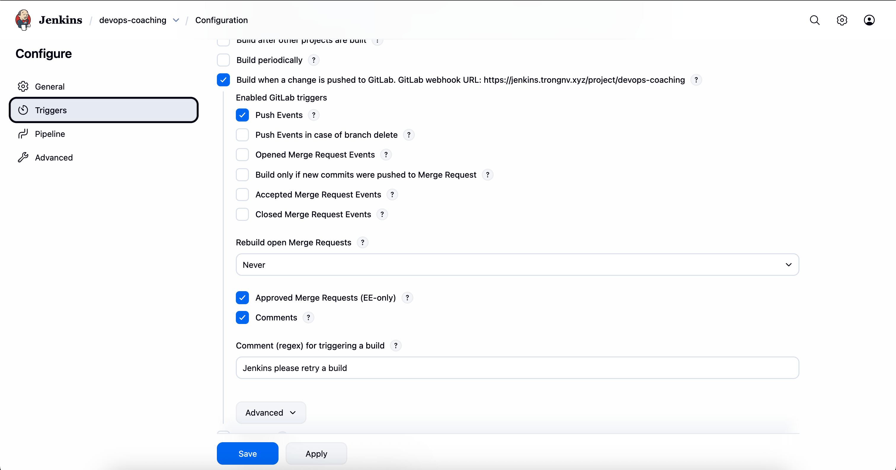

##### Configure Pipeline

You can either:
- Write your pipeline directly in the **Pipeline script** section in Jenkins, or  
- Select **Pipeline script from SCM** to load it from your Git repository  
  (In this example, we’ll use *Pipeline script from SCM*).

Choose:
* **SCM:** `Git`
* **Repository URL:** `https://mygitlab.trongnv.xyz/projectmng/devops-coaching.git`
* **Credentials:** Select the created GitLab token
* **Branches to build:** e.g., `nodejs` or `*` for all branches
* **Script Path:** Path to your `Jenkinsfile` (e.g., root directory)

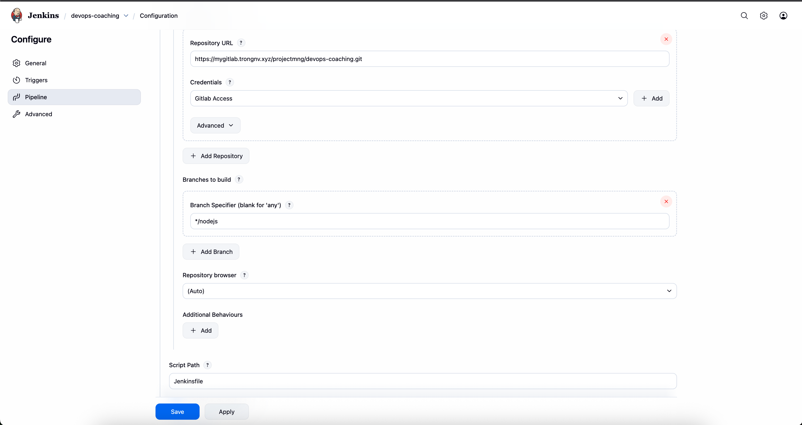

---

#### 3. Create Jenkinsfile and Push to GitLab
```bash
git clone https://mygitlab.trongnv.xyz/projectmng/devops-coaching.git
cd devops-coaching
vim Jenkinsfile
```
```groovy
pipeline {
  agent any
  options {
    buildDiscarder(logRotator(numToKeepStr: '5'))
  }
  environment { 
  // GitLab Container Registry host and project (namespace/project) 
    DOCKER_REGISTRY = "https://index.docker.io/v1/"
    GITLAB_PROJECT = "projectmng/devops-coaching" 
    GITLAB_CREDENTIALS = "gitlab-token"
    DOCKER_CREDENTIALS = "docker-login"
    FRONTEND_IMAGE = "${env.DOCKER_REGISTRY}/${env.GITLAB_PROJECT}/core2-frontend:latest" 
    BACKEND_IMAGE = "${env.DOCKER_REGISTRY}/${env.GITLAB_PROJECT}/core2-backend:latest" 
  } 
  post {
    always {
      sh 'docker --version'
    }
  }
}
```

Push to gitlab
```bash
git add .
git commit -m "Update Jenkinsfile"
git push origin main
```

Now, you can run pipeline whenever you push code to your repository or you can run manually by click to **Build Now** button in your pipeline

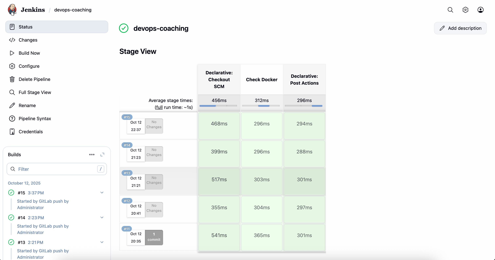

You can check your build result as below

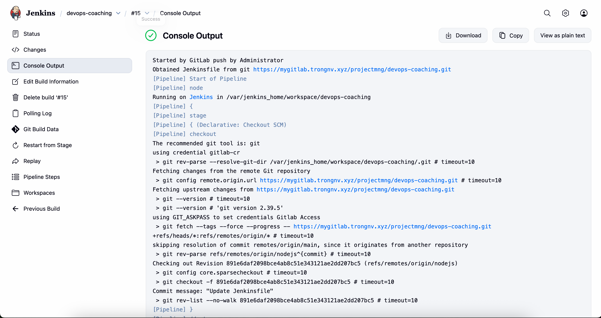

> **🎉 Success!** If all jobs pass (displayed in green), you have successfully set up the CI/CD pipeline.

## Summary
In this lab, you have successfully:
- ✅ Intergrate Jenkins with Gitlab.
- ✅ Built a CI/CD pipeline with Jenkinsfile

> **🚀 Next Steps:** You can expand the pipeline with stages like testing, security scanning, and deployment for a complete CI/CD workflow.
