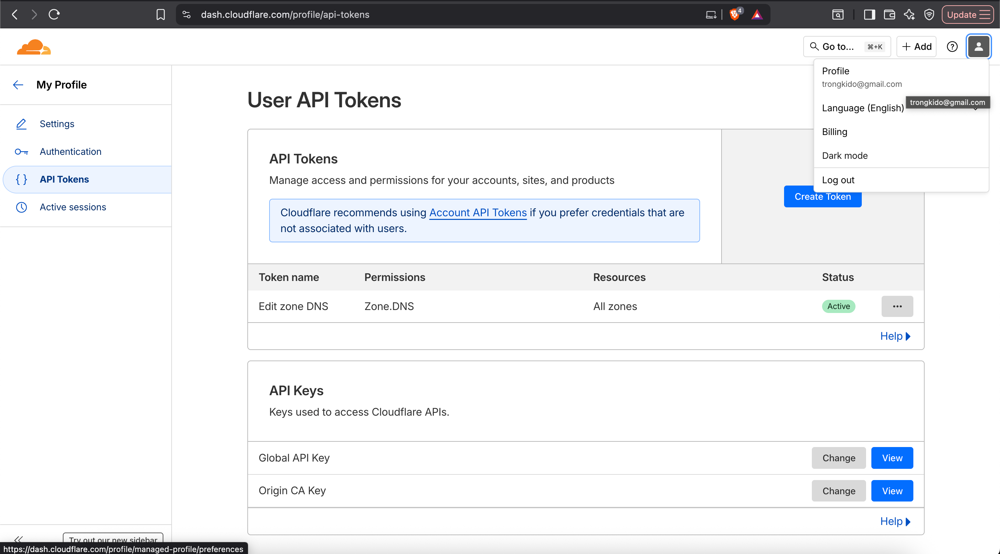
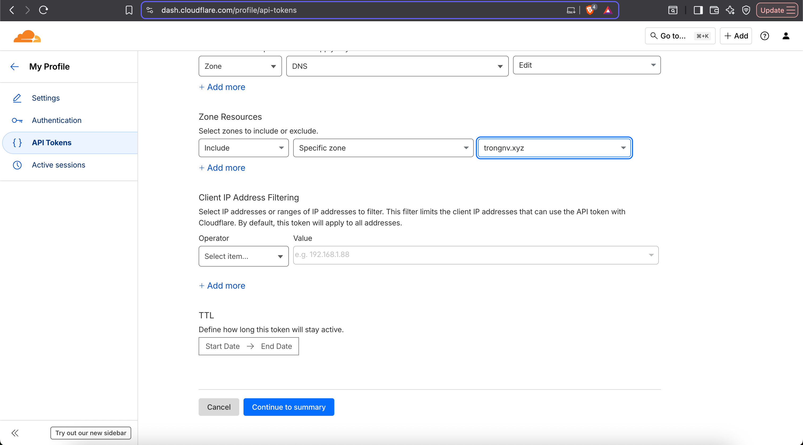
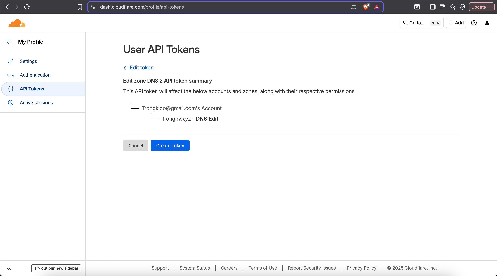
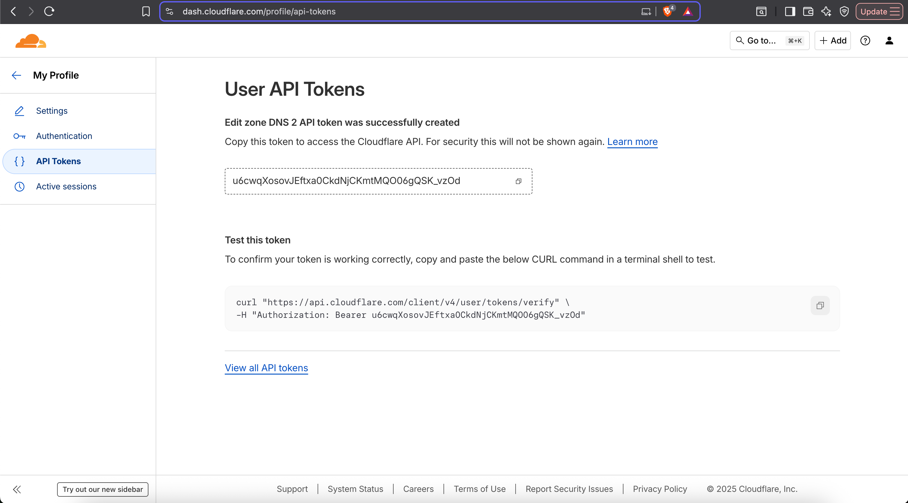
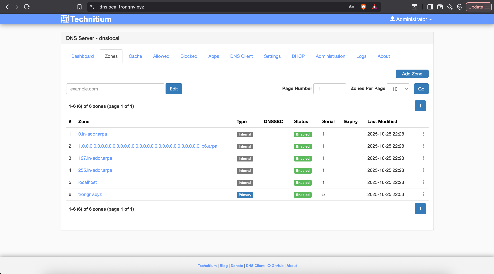
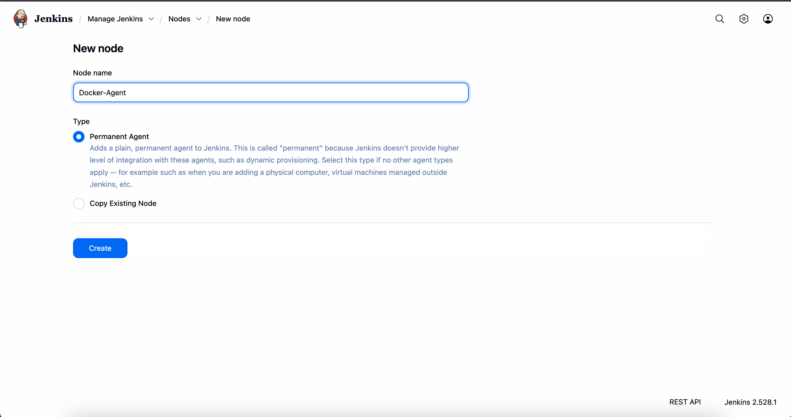
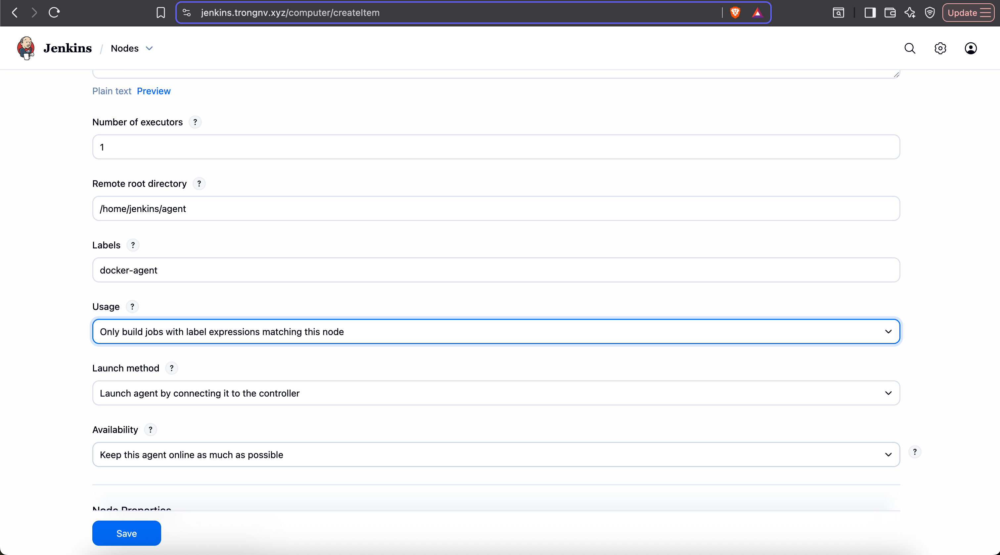
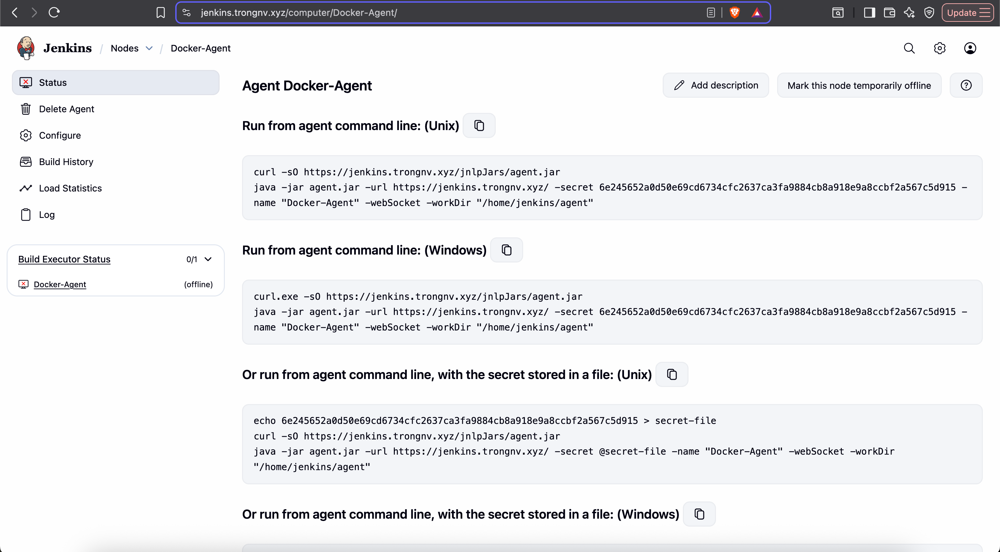
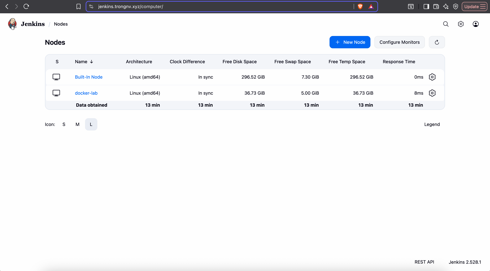

# Hands-on CICD Lab with Jenkins Agent

## Table of Contents
- [Environment Setup](#environment-setup)
- [Create CICD WorkFlow with Jenkinsfile](#create-cicd-workflow-with-jenkinsfile)
- [Summary](#summary)
- [References](#references)

**📋 Lab Objective:** The lab provides detailed instructions for building a complete CI/CD pipeline "All-in-One" to deploy applications (frontend + backend) to a Docker host. This lab includes persistent MACVLAN network configuration, centralized DNS, Reverse Proxy, and automated build/deploy processes with manual approval steps.

This "All-in-One" model is suitable for:

- **Learning & Experimentation**: Quickly set up and understand basic CI/CD workflows
- **Internal Development/Testing Environments**: Where security risks are controlled

⚠️ **Security Warning**: Please notice that mounts `/var/run/docker.sock` into Jenkins server allowing Jenkins to control the Docker host. **Never** use this in real Production environments. A safer approach (Using Agents - As in this lab) will isolate the build environment.

## Desired Workflow:
**Workflow Diagram**
```
👨‍💻 Developer pushes new code to GitLab (nodejs branch)
    ⬇️
📡 GitLab automatically sends Webhook to Jenkins
    ⬇️
👷‍♂️ Jenkins receives code, builds Docker images (frontend & backend)
    ⬇️
⏸️ Jenkins pauses, awaits "CTO" approval
    ⬇️
🧑‍💼 You (playing CTO role) log into Jenkins and click "Approve"
    ⬇️
🚀 Jenkins runs new Docker containers on Docker host
```

As in previous section, I have mentioned about setting up Gitlab server and Jenkins server, Please refer at these sites:

https://github.com/trongkido/devops-coaching/tree/main/git-cicd/hands-on-cicd-lab

https://github.com/trongkido/devops-coaching/tree/main/jenkins/hand-on-jenkins-cicd

## Environment Setup
### Deploy Requiremt Resources
#### Step 1: Create macvlan Network (Required)

This command creates a virtual network layer, allowing each container to have its own IP address on your LAN, just like a real machine. Run this command on the host machine:

```bash
# Create a MACVLAN network linked to the physical interface (e.g., eth0)
docker network create -d macvlan --subnet=192.168.88.0/24 --gateway=192.168.88.1 -o parent=ens37 MACVLAN1
```

**Note**: Replace `ens37` with your host's actual physical network card name, for example: `eth0`.

#### Step 2: Setup Host ↔ MACVLAN Communication (Permanent using NetworkManager)
This is the breakthrough and most important step to allow the host machine to "communicate" with containers. We use `nmcli` (NetworkManager) as this is the confirmed working method on your host environment.

**Ensure NetworkManager is running:**

We need to disable systemd-networkd (if running) and enable NetworkManager.

```bash
# Stop and disable systemd-networkd to avoid conflicts
sudo systemctl stop systemd-networkd || true
sudo systemctl disable systemd-networkd || true

# Enable and start NetworkManager
sudo systemctl enable NetworkManager
sudo systemctl start NetworkManager
sudo systemctl status NetworkManager # Output should show 'active (running)'
```

**Create Virtual MACVLAN Connection (macvlan-host):**
This command creates a virtual interface on the host (IP .254) to act as a "bridge" for communication.
```bash
## Create macvlan conection
nmcli con add type macvlan con-name macvlan-host ifname macvlan-host dev ens37 mode bridge tap no ip4 192.168.88.254/24 gw4 192.168.88.1 connection.autoconnect yes
## Bring it up
nmcli con up macvlan-host
##Verify
ip a show macvlan-host
→ 192.168.88.254/24
```
**(Replace `ens33` with your host's actual physical network card name).**

**Add Static Routes (Only for Container IPs):**
Tell the host the route to each container via the virtual interface .254.
```bash
## Add static routes, modifying the 'macvlan-host-con' profile
## Note: The '+' adds this route without overwriting existing ones.
## Format: +ipv4.routes "destination/mask gateway"

## Add route for NPM (.223) via the virtual IP
nmcli con mod macvlan-host +ipv4.routes "192.168.88.25/32 192.168.88.254"

## For multiple IP address, you can you this command
CONTAINERS="192.168.88.21 192.168.88.22 192.168.88.23 192.168.88.24 192.168.88.25"

for ip in $CONTAINERS; do
  nmcli con mod macvlan-host +ipv4.routes "$ip/32 192.168.88.254"
done
```

**Activate New Connection:**
```bash
## Reload all connection profiles from disk
nmcli connection reload

## Bring up (activate) the new macvlan connection
nmcli con up macvlan-host
```

**Verify Interface & Route (Important):**

```bash
ip a show macvlan-host
ip route show 192.168.88.25
```

You must see the `macvlan-host` interface with IP .254 and route to .223 going through `via 192.168.110.254`.

#### Step 3: Setup Let's Encrypt and create SSL certificate
> [!NOTE]
> In order to use certbot with let's encrypt, you need to buy a domain name, you can choose different providers, for example Godady, AWS, Cloudflare ... Please refere there documents for buying your domain name.

After buying a domain name (I'm buying a Godady domain name), in this lab, I choose Cloudflare for manage my domain name.
First, you need create a Cloudflare account, please refer Cloudflare document to create account and add your Godaddy domain name to Cloudflare.
You can refer to: https://www.melodylee.tech/website-development-blog/transfer-domain-godaddy-to-cloudflare for more information

Next, we need to create an Cloudflare API.
Go to Profile -> API Token -> Create Token 



After that, Choose Use Template (Edit Zone DNS) ->  Fill out all options that we need -> Continue to summary 



Then, Click Create



API Token will be displayed one, you need to save it to some where for certbot use.



To generate certificate with let's encrypt, we need to install certbot 
```bash
dnf install certbot
```

Start and enable service
```bash
systemctl start certbot-renew
systemctl enable certbot-renew
```

Generate certificate
```bash
## Create cloudflare secret file
dnf install python3-certbot-dns-cloudflare -y
mkdir -p .secrets/certbot
vim .secrets/certbot/cloudflare.ini
---
dns_cloudflare_api_token = u6cwqXosovJEftxa0CkdNjCKmtMQO06gQSK_vzOd ## This is token from cloudflare in the above steps
---
chmod 600 /root/.secrets/certbot/cloudflare.ini

## Generate certificate
certbot certonly --dns-cloudflare --dns-cloudflare-credentials /root/.secrets/certbot/cloudflare.ini -d trongnv.xyz -d '*.trongnv.xyz'
```

>[!NOTE]
> Please change the domain name with your domain name 

The certificate will be generated in "/etc/letsencrypt/live/", you can copy to your ssl folder for Reverse Proxy

#### Step 4: Setup a local repo using Nexus
##### Prerequisites
Nexus run with java, so we neet to install java before running nexus
```bash
curl https://www.oracle.com/webapps/redirect/signon?nexturl=https://download.oracle.com/otn/java/jdk/8u201-b09/42970487e3af4f5aa5bca3f542482c60/jdk-8u201-linux-x64.tar.gz -o jdk-8u201-linux-x64.tar.gz 
tar -xvzf jdk-8u201-linux-x64.tar.gz -C /opt/
```

##### Installation Steps
###### 1. Extract and Setup Nexus
```bash
curl https://download.sonatype.com/nexus/3/nexus-3.70.1-02-java8-unix.tar.gz -o nexus-3.70.1-02-java8-unix.tar.gz
tar -xzf nexus-3.70.1-02-java8-unix.tar.gz -C /opt/
```

###### 2. Create User and Group
```bash
groupadd nexus
useradd nexus -g nexus
chown -R nexus:nexus /opt/nexus-3.70.1-02
ln -s /opt/nexus-3.70.1-02 /opt/nexus
```

###### 3. Configure Run User
```bash
vim /opt/nexus/bin/nexus.rc
---
run_as_user="nexus"
---
```

###### 4. Setup Data Directory
```bash
mkdir -p /opt/nexus-data/sonatype-work
chown -R nexus:nexus /opt/nexus-data
```

###### 5. Configure JVM Options
```bash
cd /opt/nexus/bin
cp -rp nexus.vmoptions nexus.vmoptions.bk
vim nexus.vmoptions
---
-Xms512m
-Xmx1024m
-XX:MaxDirectMemorySize=256m
-XX:+UnlockDiagnosticVMOptions
-XX:+LogVMOutput
-XX:LogFile=/opt/nexus-data/sonatype-work/nexus3/log/jvm.log
-XX:-OmitStackTraceInFastThrow
-Djava.net.preferIPv4Stack=true
-Dkaraf.home=.
-Dkaraf.base=.
-Dkaraf.etc=etc/karaf
-Djava.util.logging.config.file=etc/karaf/java.util.logging.properties
-Dkaraf.data=/opt/nexus-data/sonatype-work/nexus3
-Dkaraf.log=/opt/nexus-data/sonatype-work/nexus3/log
-Djava.io.tmpdir=/opt/nexus-data/sonatype-work/nexus3/tmp
-Dkaraf.startLocalConsole=false
-Djdk.tls.ephemeralDHKeySize=2048
---
```

###### 6. Set Java Home
```bash
vim /opt/nexus/bin/nexus
---
INSTALL4J_JAVA_HOME_OVERRIDE=/opt/jdk1.8.0_121
---
```

###### 7. Start Nexus
```bash
/opt/nexus/bin/nexus start
```

###### 8. Access Nexus
Login to: `http://ip_address:8081/`
Get initial password:
```bash
cat /opt/nexus-data/sonatype-work/nexus3/admin.password
```

###### 9. Manage Nexus Service
```bash
# Check status
/opt/nexus/bin/nexus status

# Stop service
/opt/nexus/bin/nexus stop
```

---

##### Configure Nexus as Docker Repository

###### 1. Enable Docker Bearer Token Realm
1. Login to `http://ip_address:8081/`
2. Navigate to **Realms**
3. Move "Docker bearer token realm" from "Available" to "Active"
4. Click **Save**

###### 2. Create Docker Repository Role
1. Navigate to **Roles** → **Create role**
2. Configure:
   - **Type**: Nexus Role
   - **Role ID**: `docker-repo-full-access`
   - **Role name**: `docker-repo-full-access`
   - **Applied Privileges**: `nx-repository-admin-docker-docker-registry-*`
3. Click **Save**

###### 3. Create Docker Repository User
1. Navigate to **User** → **Create local user**
2. Configure:
   - **ID**: `docker-repo`
   - **First name**: `docker-repo`
   - **Last name**: `docker-repo`
   - **Email**: [your email]
   - **Password**: [set password]
   - **Confirm password**: [confirm password]
   - **Status**: Active
   - **Role**: `docker-repo-full-access`
3. Click **Create**

###### 4. Create Docker Registry Repository
1. Navigate to **Repositories** → **Create repository**
2. Select **docker (hosted)**
3. Configure:
   - **Name**: `docker-registry`
   - **HTTP**: port `5000`
   - **Enable docker v1 api**: ✓
4. Click **Create**


#### Step 5: Configure Reverse Proxy
In this lab, I use nginx of Gitlab as a Reverse Proxy, you can install another server or run a docker image of Reverse Proxy.
Update these configs file for your custom domain

```bash
## When setup Gitlab, the nginx config will be in /var/opt/gitlab/nginx/conf
cd /var/opt/gitlab/nginx/conf
vim jenkins.conf
---
server {
  listen *:443 ssl;

  server_name jenkins.trongnv.xyz;
  server_tokens off; ## Don't show the nginx version number, a security best practice
  client_max_body_size 0;
  add_header Strict-Transport-Security "max-age=31536000";
  proxy_hide_header Referrer-Policy;
  add_header Referrer-Policy strict-origin-when-cross-origin;

  ssl_certificate /etc/gitlab/ssl/mygitlab.trongnv.xyz.crt;
  ssl_certificate_key /etc/gitlab/ssl/mygitlab.trongnv.xyz.key;

  access_log  /var/log/gitlab/nginx/jenkins_access.log gitlab_access;
  error_log   /var/log/gitlab/nginx/jenkins_error.log error;

  gzip on;
  gzip_static on;
  gzip_comp_level 2;
  gzip_http_version 1.1;
  gzip_vary on;
  gzip_disable "msie6";
  gzip_min_length 250;
  gzip_proxied no-cache no-store private expired auth;
  gzip_types text/plain text/css application/x-javascript text/xml application/xml application/xml+rss text/javascript application/json;


  location /  {
	proxy_pass http://127.0.0.1:9000;
	proxy_set_header Host $host:$server_port;
	proxy_set_header X-Real-IP $remote_addr;
        proxy_set_header X-Forwarded-For $proxy_add_x_forwarded_for;
  }

}

server {
        listen          80;
        server_name     jenkins.trongnv.xyz;
        return 301 https://$server_name$request_uri;
}
---

vim nexus.conf
---
server {
  listen *:443 ssl;

  server_name nexus.trongnv.xyz;
  server_tokens off; ## Don't show the nginx version number, a security best practice
  client_max_body_size 0;
  add_header Strict-Transport-Security "max-age=31536000";
  proxy_hide_header Referrer-Policy;
  add_header Referrer-Policy strict-origin-when-cross-origin;

  ssl_certificate /etc/gitlab/ssl/mygitlab.trongnv.xyz.crt;
  ssl_certificate_key /etc/gitlab/ssl/mygitlab.trongnv.xyz.key;

  access_log  /var/log/gitlab/nginx/nexus_access.log gitlab_access;
  error_log   /var/log/gitlab/nginx/nexus_error.log error;

  gzip on;
  gzip_static on;
  gzip_comp_level 2;
  gzip_http_version 1.1;
  gzip_vary on;
  gzip_disable "msie6";
  gzip_min_length 250;
  gzip_proxied no-cache no-store private expired auth;
  gzip_types text/plain text/css application/x-javascript text/xml application/xml application/xml+rss text/javascript application/json;


  location /  {
	proxy_pass http://127.0.0.1:8081;
	proxy_set_header Host $host:$server_port;
	proxy_set_header X-Real-IP $remote_addr;
        proxy_set_header X-Forwarded-For $proxy_add_x_forwarded_for;
  }

}

server {
        listen          80;
        server_name     nexus.trongnv.xyz;
        return 301 https://$server_name;
}
---

vim registry.conf
---
server {
  listen *:443 ssl;

  server_name registry-nexus.trongnv.xyz;
  server_tokens off; ## Don't show the nginx version number, a security best practice
  client_max_body_size 0;
  add_header Strict-Transport-Security "max-age=31536000";
  proxy_hide_header Referrer-Policy;
  add_header Referrer-Policy strict-origin-when-cross-origin;

  ssl_certificate /etc/gitlab/ssl/mygitlab.trongnv.xyz.crt;
  ssl_certificate_key /etc/gitlab/ssl/mygitlab.trongnv.xyz.key;

  access_log  /var/log/gitlab/nginx/nexus_access.log gitlab_access;
  error_log   /var/log/gitlab/nginx/nexus_error.log error;

  gzip on;
  gzip_static on;
  gzip_comp_level 2;
  gzip_http_version 1.1;
  gzip_vary on;
  gzip_disable "msie6";
  gzip_min_length 250;
  gzip_proxied no-cache no-store private expired auth;
  gzip_types text/plain text/css application/x-javascript text/xml application/xml application/xml+rss text/javascript application/json;


  location /  {
	proxy_pass  http://127.0.0.1:5000;
	proxy_set_header Host $host:$server_port;
	proxy_set_header X-Real-IP $remote_addr;
        proxy_set_header X-Forwarded-For $proxy_add_x_forwarded_for;
  }
}

server {
        listen          80;
        server_name     registry-nexus.trongnv.xyz;
        return 301 https://$server_name;
}
---

vim echnitium-dns.conf
---
server {
  listen *:443 ssl;

  server_name dnslocal.trongnv.xyz;
  server_tokens off; ## Don't show the nginx version number, a security best practice
  client_max_body_size 0;
  add_header Strict-Transport-Security "max-age=31536000";
  proxy_hide_header Referrer-Policy;
  add_header Referrer-Policy strict-origin-when-cross-origin;

  ssl_certificate /etc/gitlab/ssl/mygitlab.trongnv.xyz.crt;
  ssl_certificate_key /etc/gitlab/ssl/mygitlab.trongnv.xyz.key;

  access_log  /var/log/gitlab/nginx/dnslocal_access.log gitlab_access;
  error_log   /var/log/gitlab/nginx/dnslocal_error.log error;

  gzip on;
  gzip_static on;
  gzip_comp_level 2;
  gzip_http_version 1.1;
  gzip_vary on;
  gzip_disable "msie6";
  gzip_min_length 250;
  gzip_proxied no-cache no-store private expired auth;
  gzip_types text/plain text/css application/x-javascript text/xml application/xml application/xml+rss text/javascript application/json;


  location /  {
	proxy_pass http://192.168.88.25:5380;
	proxy_set_header Host $host:$server_port;
	proxy_set_header X-Real-IP $remote_addr;
        proxy_set_header X-Forwarded-For $proxy_add_x_forwarded_for;
  }

}

server {
        listen          80;
        server_name     dnslocal.trongnv.xyz;
        return 301 https://$server_name;
}
---

vim nginx.conf
---
...
  include /var/opt/gitlab/nginx/conf/registry.conf;
  include /var/opt/gitlab/nginx/conf/nexus.conf;
  include /var/opt/gitlab/nginx/conf/jenkins.conf;
  include /var/opt/gitlab/nginx/conf/technitium-dns.conf;
---

```

After that, we need to restart nginx with gitlab-ctl command
```bash
gitlab-ctl restart nginx
```

#### Step 6: Configure DNS Server

In this lab, I will use technitium dns server with docker compose for rapid setup. Create the file at `/opt/docker-compose/technitium-dns/docker-compose.yml`.

```yaml
version: '3.8'

services:
  # --- DNS SERVER (192.168.88.25) ---
  dns-server:
    image: technitium/dns-server:latest
    container_name: dns-server
    hostname: dnslocal.trongnv.xyz
    restart: always
    ports:
      - "5380:5380/tcp"
      - "53:53/udp"
      - "53:53/tcp"
    volumes:
      - ./config:/etc/dns
    environment:
      - TZ=Asia/Ho_Chi_Minh
    networks:
      MACVLAN1:
        ipv4_address: 192.168.88.25   # Correct: mapping, not list

networks:
  MACVLAN1:
    external: true
    name: MACVLAN1
```

Create config file for saving technitium permanently.
```bash
mkdir /opt/docker-compose/technitium-dns/config
```

> [!NOTE]
> Why Choose /opt/docker-compose/?
> - **Common Convention**: The `/opt` (optional) directory in Linux is typically used for "third-party" or packaged applications. Placing the entire Docker Compose project here helps isolate it from the main operating system
> - **Centralized & Manageable**: Keeping all configuration files (IaC – Infrastructure as Code) and data directories (volumes) in one place makes it easy to find, backup, or move when needed
> - **Other Standard FHS Alternatives** (Advanced): `/srv/docker-compose/` or separate (config in `/etc`, data in `/var/lib`)
> - ⚠️ **Avoid**: Don't create arbitrary directories at root level like `/projects/` as it doesn't follow FHS standards and clutters the OS root directory structure

> **Conclusion**: Using `/opt/docker-compose/` is a good choice, balancing simplicity, common conventions, and manageability for this lab.

Start DNS service
```bash
cd /opt/docker-compose/technitium-dns/
docker compose up -d
```
Set up the domain name resolution system (DNS) and Reverse Proxy so services can be accessed via beautiful and secure (HTTPS) domain names.

Login to https://dnslocal.trongnv.xyz/

> [!NOTE]
> You need to config Reverse Proxy and restart nginx from the above step, then config hosts file before access to the dns web UI or you can login to http://technitium_ip_address:5380 to access to the dns web UI.

- Create Zone `trongnv.xyz` (if not already created)
- Create 4 A records:
  - `mygitlab.trongnv.xyz` ➡️ `192.168.88.140` # (Points to Reverse Proxy IP)
  - `register.trongnv.xyz` ➡️ `192.168.88.140` # (Points to Reverse Proxy IP)
  - `jenkins.trongnv.xyz` ➡️ `192.168.88.140`  # (Points to Reverse Proxy IP)
  - `nexus.trongnv.xyz` ➡️ `192.168.88.140`    # (Points to Reverse Proxy IP)

**✅ Verify**
- Accessing `https://gitlab.trongnv.xyz` must show GitLab
- Accessing `https://jenkins.trongnv.xyz` must show Jenkins
- Accessing `https://nexus.trongnv.xyz` must show Nexus
- Accessing `https://dnslocal.trongnv.xyz` must show Technitium DNS
- Running `docker login register.trongnv.xyz` must succeed (using username and password create in Nexus repo)



#### Step 7: Setup Jenkins Agent
After login to Jenkins, Go to Config -> Nodes -> New Node -> Fill Node Name -> Choose Permanent Agent -> Create



Fill all needed information for creating new agent -> Save


Go to New Agent -> Status to get information about new agent and how to run agent in remote host


On remote host, we need config dns to dns local server, edit file "/etc/resolv.conf"
```text
# Generated by NetworkManager
nameserver 192.168.88.25
nameserver 8.8.8.8
```

Setup Jenkins Agent on remote host
```bash
## Setup java
curl https://download.oracle.com/java/17/archive/jdk-17.0.9_linux-x64_bin.tar.gz -o jdk-17.0.9_linux-x64_bin.tar.gz
tar -xvzf jdk-17.0.9_linux-x64_bin.tar.gz -C /opt/
ln -s /opt/jdk-17.0.9 /opt/jdk17
## Create Jenkins home folder and download Agent
mkdir /home/jenkins/agent -p
cd /home/jenkins/agent
curl -sO https://jenkins.trongnv.xyz/jnlpJars/agent.jar
## Get secret from the above step
echo "6e245652a0d50e69cd6734cfc2637ca3fa9884cb8a918e9a8ccbf2a567c5d915" > secret.txt
## Run Jenkins Agent
/opt/jdk17/bin/java -jar /home/jenkins/agent/agent.jar -url https://jenkins.trongnv.xyz/ -secret @/home/jenkins/agent/secret.txt -name docker-lab -workDir /home/jenkins/agent
```

Verify status on Jenkins server




> [!NOTE]
**Configure Docker Daemon (Trust Registry)**
To allow Jenkins (and host) to `docker login/pull/push` to `register.trongnv.xyz` (via Reverse Proxy without SSL), configure the Docker daemon on the remote host machine.

**Edit file `/etc/docker/daemon.json`:**

```bash
sudo nano /etc/docker/daemon.json
```

**Add the following content:**

```json
{
  "insecure-registries": ["register.trongnv.xyz"],
  "dns": ["192.168.88.140", "8.8.8.8"] 
}
```

**Restart Docker daemon:**

```bash
sudo systemctl restart docker
```

**(Optional)** Repeat the above steps for Kubernetes Nodes if you use K8s later.


## Create CICD WorkFlow with Jenkinsfile
### Phase 1: GitLab (Code Repository) 📝

Create project and pipeline Jenkinsfile.

#### Create Project:
- Access `https://mygitlab.trongnv.xyz`
- Create new project `corejs`
- Clone this code from https://gitlab.com/nhanfu/core2 and push code to project `corejs`

#### Create Jenkinsfile:
**Create new file named `Jenkinsfile`.**
```groovy
// Jenkinsfile - Simple Deploy to Docker Host (Method 1: All-in-One)
// Builds production images and runs them on the host Docker daemon.
pipeline {
  agent {
    label 'docker-lab'
  }

  options {
    buildDiscarder(logRotator(numToKeepStr: '5'))
  }

  environment {
  // GitLab Container Registry host and project (namespace/project)
    DOCKER_REGISTRY = "https://registry-nexus.trongnv.xyz"
    REGISTRY_HOST = DOCKER_REGISTRY.replace("https://", "").replace("http://", "")
    GITLAB_PROJECT = "projectmng/devops-coaching"
    GITLAB_CREDENTIALS = credentials('gitlab-cr')
    DOCKER_CREDENTIALS = credentials('docker-login')

  // --- Application & Image Naming ---
    APP_NAME = 'corejs' // Base name for images and containers
    FRONTEND_IMAGE = "${env.REGISTRY_HOST}/${env.GITLAB_PROJECT}/${env.APP_NAME}-frontend:latest"
    BACKEND_IMAGE = "${env.REGISTRY_HOST}/${env.GITLAB_PROJECT}/${env.APP_NAME}-backend:latest"
    FRONTEND_CONTAINER  = "${env.APP_NAME}-frontend-app" // Fixed container name for frontend
    BACKEND_CONTAINER   = "${env.APP_NAME}-backend-app"  // Fixed container name for backend

  // --- Host Port Configuration ---
  // Define ports on the Docker HOST machine where the containers will be accessible.
  // Make sure these ports (e.g., 8081, 5001) are free on your host.
     FRONTEND_HOST_PORT = 8081 // Access Frontend via http://:8081
     BACKEND_HOST_PORT = 5001 // Access Backend via http://:5001

  // --- Docker Network ---
  // Specify the Docker network the containers should connect to (must exist)
     DOCKER_NETWORK = 'app-internal'
  }

  stages {
    // --- Stage 1: Get latest code ---
    stage('1. Checkout Code') {
      steps {
        checkout scm
        echo "SUCCESS: Code checked out from GitLab."
      }
    }

    // --- Stage 2: Build Docker Images ---
    stage('2. Build Docker Images') {
      parallel {
        stage('Build Frontend') {
          steps {
            dir('frontend') { // Assumes Dockerfile is here
              echo "INFO: Building Frontend production image: ${env.FRONTEND_IMAGE}"
              sh "docker build -t ${env.FRONTEND_IMAGE} ."
            }
            echo "SUCCESS: Frontend image built."
          }
        }

        stage('Build Backend') {
          steps {
            dir('CoreAPI') { // Assumes Dockerfile is here
              echo "INFO: Building Backend image: ${env.BACKEND_IMAGE}"
              sh "docker build -t ${env.BACKEND_IMAGE} ."
            }
            echo "SUCCESS: Backend image built."
          }
        }
      } // End parallel build
    } // End Stage 2

    // --- Stage 3: Push image to registry ---
    stage('3. Push Images') {
      steps {
        script {
          sh '''
		echo $DOCKER_CREDENTIALS_PSW | docker login ${DOCKER_REGISTRY} -u $DOCKER_CREDENTIALS_USR --password-stdin
                docker push ${FRONTEND_IMAGE}
                docker push ${BACKEND_IMAGE}
                docker logout ${DOCKER_REGISTRY}
             '''
          }
        }
      } // End of step
    } // End of stage 3

    // --- Stage 4: Manual Approval Gate ---
    stage('4. CTO Approval') {
      steps {
        timeout(time: 1, unit: 'HOURS') {
          input message: 'ACTION REQUIRED: Approve deployment to Production (Docker Host)?',
                          ok: 'Proceed to Deploy',
                          submitter: 'cto' // Only user 'cto' can approve
        }
      }
    } // End Stage 4

    // --- Stage 5: Deploy Containers to Docker Host ---
    stage('4. Deploy to Production (Docker Host)') {
      steps {
        echo "INFO: Approval received. Deploying containers to Docker Host..."
        echo "INFO: Stopping and removing old containers (if they exist)..."
        sh "docker stop ${env.FRONTEND_CONTAINER} || true"
        sh "docker rm ${env.FRONTEND_CONTAINER} || true"
        sh "docker stop ${env.BACKEND_CONTAINER} || true"
        sh "docker rm ${env.BACKEND_CONTAINER} || true"

        echo "INFO: Starting new Backend container..."
        // Assumes backend listens on port 80 internally
        sh "docker run -d --name ${env.BACKEND_CONTAINER} -p ${env.BACKEND_HOST_PORT}:80 --network ${env.DOCKER_NETWORK} --hostname ${env.BACKEND_CONTAINER} --restart always ${env.BACKEND_IMAGE}"
        echo "SUCCESS: Backend container started."

        echo "INFO: Starting new Frontend container..."
        // Assumes frontend (Nginx) listens on port 80 internally
        sh "docker run -d --name ${env.FRONTEND_CONTAINER} -p ${env.FRONTEND_HOST_PORT}:80 --network ${env.DOCKER_NETWORK} --hostname ${env.FRONTEND_CONTAINER} --restart always ${env.FRONTEND_IMAGE}"
        echo "SUCCESS: Frontend container started."

        echo "----------------------------------------------------"
        echo "DEPLOYMENT COMPLETE!"
        echo "Access Frontend at: http://:${env.FRONTEND_HOST_PORT}"
        echo "Access Backend API at: http://:${env.BACKEND_HOST_PORT}"
        echo "----------------------------------------------------"
        echo "(Replace  with your host's actual IP, e.g., 192.168.110.161)"
      }
    } // End Stage 5

  } // End of stages

  // --- Post Actions ---
  post {
    always {
      sh 'docker logout'
      echo 'INFO: Pipeline finished execution.'
    }

    success {
      echo 'SUCCESS: Pipeline completed successfully!'
    }

    failure {
      echo 'FAILED: Pipeline failed!'
    }
  } // End of post
} // End of pipeline
```

**Push Jenkinsfile to GitLab:**

```bash
# Stage the new Jenkinsfile
git add .

# Commit the change
git commit -m "Add Jenkinsfile for Docker host deployment"

# Push to the appropriate branch (e.g., nodejs or main)
git push -u origin <branch-name>
```

### Phase 2: Jenkins (Build Server)
Set up Jenkins Servers, Project and Gitlab Webhook with the following instruction
https://github.com/trongkido/devops-coaching/blob/main/jenkins/hand-on-jenkins-cicd/README.md

### Phase 3: Test Run & Verification 🚀

Now, test the entire CI/CD workflow and verify the deployed application.

#### Developer Pushes Code:

1. Edit any file in the `corejs` project
2. Run git commands:

```bash
git add .
git commit -m "Test full pipeline with Docker deploy"
git push origin <branch-name>
```

#### Observe Jenkins:

1. Open `https://jenkins.trongnv.xyz`
2. Job `corejs` will automatically run
3. Click on the running job. It will run through Stage 1, 2 and PAUSE at Stage 3 "CTO Approval"

#### CTO Approval:

1. Log into Jenkins using the `cto` user
2. Open the paused job
3. Hover over the "CTO Approval" stage, click the **Proceed** button

#### Complete Deploy & Verify Application:

1. Pipeline will continue to run Stage 4 (Deploy) and report SUCCESS
2. Check "Console Output" to view logs, especially the last lines showing access URLs
3. SSH into the Linux host machine (`tony@gitlab`), run `docker ps` to see 2 containers `corejs-frontend-app` and `corejs-backend-app` running and mapped to correct ports (e.g., `8081->80/tcp`, `5001->80/tcp`)
4. **Access Application**: Open browser on Windows machine, access:
   - **Frontend**: `http://192.168.88.16:8081` (Replace host IP and port if you set differently in Jenkinsfile)
   - **Backend**: `http://192.168.88.16:5001`


### Phase 5 (Advanced): Deploy to Kubernetes 🚢

After mastering "All-in-one Deployment", you can upgrade the pipeline to deploy the application to a Kubernetes cluster instead of Docker host. This is a preliminary guide; you'll need to adjust details as appropriate.

**Note**: Deploying to K8s typically goes with Jenkins Agent on K8s to ensure better security and scalability. However, you can still deploy from Jenkins Controller for learning purposes.

>[!NOTE]
> Before go to this section, you need to have basic understanding about kubernetes and can setup a minimal kubernetes cluster.

#### Step 1: Prepare Kubernetes Manifest Files

You need to create YAML files defining how the application runs on K8s (Deployment, Service). Create a `k8s` directory in the `corejs` project.

**File: k8s/namespace.yaml (Optional)**

```yaml
apiVersion: v1
kind: Namespace
metadata:
  name: corejs-prod # Namespace name for application
```

**File: k8s/registry-secret.yaml (Required if Registry is not public)**

K8s needs to know how to login to GitLab Registry to pull images.

Create Secret on your machine (replace username/PAT):

```bash
kubectl create secret docker-registry gitlab-registry-creds \
  --docker-server=register.trongnv.xyz \
  --docker-username=YOUR_GITLAB_USERNAME \
  --docker-password=YOUR_GITLAB_PAT \
  --namespace=corejs-prod \
  --dry-run=client -o yaml > k8s/registry-secret.yaml
```

The `registry-secret.yaml` file will be created.

**File: k8s/backend-deployment.yaml**

```yaml
apiVersion: apps/v1
kind: Deployment
metadata:
  name: corejs-backend
  namespace: corejs-prod
spec:
  replicas: 1 # Number of pods to run
  selector:
    matchLabels:
      app: corejs-backend
  template:
    metadata:
      labels:
        app: corejs-backend
    spec:
      # K8s will use this secret to pull images
      imagePullSecrets:
      - name: gitlab-registry-creds
      containers:
      - name: backend
        # Image built by Jenkins
        image: tonytechlab/corejs-backend:latest 
        ports:
        - containerPort: 80 # Port backend listens on internally
```

**File: k8s/backend-service.yaml**

```yaml
apiVersion: v1
kind: Service
metadata:
  name: corejs-backend-svc # Internal service name
  namespace: corejs-prod
spec:
  selector:
    app: corejs-backend
  ports:
    - protocol: TCP
      port: 80 # Port other services in K8s call
      targetPort: 80 # Points to containerPort of Deployment
  # Type: ClusterIP is default, only accessible within K8s
```

**File: k8s/frontend-deployment.yaml**

```yaml
apiVersion: apps/v1
kind: Deployment
metadata:
  name: corejs-frontend
  namespace: corejs-prod
spec:
  replicas: 1
  selector:
    matchLabels:
      app: corejs-frontend
  template:
    metadata:
      labels:
        app: corejs-frontend
    spec:
      imagePullSecrets:
      - name: gitlab-registry-creds
      containers:
      - name: frontend
        image: tonytechlab/corejs-frontend:latest # Built Nginx image
        ports:
        - containerPort: 80 # Port Nginx listens on internally
```

**File: k8s/frontend-service.yaml (Using NodePort)**

```yaml
apiVersion: v1
kind: Service
metadata:
  name: corejs-frontend-svc
  namespace: corejs-prod
spec:
  selector:
    app: corejs-frontend
  # --- USE NODEPORT TO ACCESS FROM OUTSIDE ---
  type: NodePort 
  ports:
    - protocol: TCP
      port: 80       # Port inside cluster
      targetPort: 80   # Container port
      # nodePort: 30080 # Optional: Specify specific port (30000-32767)
      # If left empty, K8s will auto-select a NodePort
```

Push the `k8s` directory containing these files to GitLab.

#### Step 2: Install kubectl in Jenkins (Already Done in Dockerfile)

The `jenkins/Dockerfile` already includes the step to install kubectl.

#### Step 3: Create K8s Credentials in Jenkins

Jenkins needs permissions to connect and deploy to the K8s cluster.

**Method 1 (Username/Password – Simple but less secure):**

1. Go to Jenkins → Credentials → (global) → Add Credentials
2. **Kind**: Username with password
3. **Username**: `devops`
4. **Password**: `devops@2025`
5. **ID**: `k8s-user-creds`

**Method 2 (Kubeconfig – Recommended):**

1. SSH into `k8s-master-1`
2. Copy contents of file `~/.kube/config`
3. Go to Jenkins → Credentials → (global) → Add Credentials
4. **Kind**: Kubernetes configuration (kubeconfig)
5. **ID**: `k8s-cluster-config`
6. **Kubeconfig**: Select **Enter directly** and paste the config file contents
7. **Note**: Using Kubeconfig is safer and more flexible. Jenkins Controller needs to mount volume `/project/kube/.kube:/root/.kube` (as in docker-compose.yml) for kubectl to work.

#### Step 4: Update Jenkinsfile (Add K8s Deploy Stage)

Edit the Jenkinsfile in the `corejs` project.

**Add environment variables for K8s:**

```groovy
environment {
    // ... (existing variables) ...
    K8S_NAMESPACE     = 'corejs-prod'
    K8S_CREDENTIAL_ID = 'k8s-cluster-config' // Kubeconfig credential ID
}
```

**Replace old Stage 4 with this new Stage:**

```groovy
        // --- Stage 4: Deploy to Kubernetes ---
        stage('4. Deploy to Production (Kubernetes)') {
            steps {
                echo "INFO: Approval received. Deploying application to Kubernetes cluster..."
                script {
                    // Use the created Kubeconfig credential
                    withKubeconfig(credentialsId: env.K8S_CREDENTIAL_ID) {
                        
                        echo "INFO: Applying K8s manifests..."
                        // Run kubectl apply for YAML files (in k8s directory of repo)
                        sh """
                        kubectl apply -f k8s/namespace.yaml || true 
                        kubectl apply -f k8s/registry-secret.yaml -n ${env.K8S_NAMESPACE} || true
                        kubectl apply -f k8s/backend-deployment.yaml -n ${env.K8S_NAMESPACE}
                        kubectl apply -f k8s/backend-service.yaml -n ${env.K8S_NAMESPACE}
                        kubectl apply -f k8s/frontend-deployment.yaml -n ${env.K8S_NAMESPACE}
                        kubectl apply -f k8s/frontend-service.yaml -n ${env.K8S_NAMESPACE}
                        """

                        echo "INFO: Waiting for deployments to roll out..."
                        // Wait for deployment to complete
                        sh "kubectl rollout status deployment/corejs-frontend -n ${env.K8S_NAMESPACE}"
                        sh "kubectl rollout status deployment/corejs-backend -n ${env.K8S_NAMESPACE}"

                        // Get NodePort of frontend service
                        def nodePort = sh(
                            script: "kubectl get service corejs-frontend-svc -n ${env.K8S_NAMESPACE} -o=jsonpath='{.spec.ports[0].nodePort}'",
                            returnStdout: true
                        ).trim()
                        
                        echo "----------------------------------------------------"
                        echo "✅ KUBERNETES DEPLOYMENT COMPLETE!"
                        echo "   Access Frontend at: http://<node-ip>:${nodePort}"
                        echo "----------------------------------------------------"
                        echo "(Replace <node-ip> with the IP of any K8s node, e.g., 192.168.110.151)"
                    } // end withKubeconfig
                } // end script
            }
        } // End Stage 4 K8s
```

Push the new Jenkinsfile and `k8s` directory to GitLab.

#### Step 5: Run Pipeline and Access Application

1. Trigger pipeline (push code or `Build Now`)
2. Approve at Stage 3
3. Stage 4 will run `kubectl apply`
4. After success, check Console Output to get NodePort
5. Access application via browser at: `http://<node-ip>:<nodePort>` (Example: `http://192.168.110.151:30080`)

---

## Summary
🎉 Congratulations!

You have completed the detailed guide for "All-in-one Deployment" and gained your first look at how to deploy to Docker host and Kubernetes.

## Key Takeaways

### What You've Learned:

1. **MACVLAN Networking**: Virtual network layer for containers with dedicated IPs
2. **DNS Management**: Centralized domain resolution with Technitium
3. **Reverse Proxy**: SSL termination and routing with Nginx Proxy Manager
4. **CI/CD Pipeline**: Automated build and deployment with manual approval gates
5. **GitLab Integration**: Repository management with Docker Registry
6. **Jenkins Automation**: Pipeline orchestration and webhook triggers
7. **Docker Deployment**: Direct container deployment to host
8. **Kubernetes Basics**: Introduction to K8s manifests and deployments

### Security Considerations:

⚠️ **Production Warning**: This "All-in-One" method is for learning only:

- **Do NOT use** in production environments
- Mounting `/var/run/docker.sock` is a security risk
- Running Jenkins as `root` is insecure
- Consider "Method 2" (Jenkins Agent) for production use

### Next Steps:

1. **Practice**: Run the pipeline multiple times to understand the workflow
2. **Experiment**: Modify the Jenkinsfile to add new stages
3. **Secure**: Learn about "Method 2" with dedicated build agents
4. **Scale**: Explore Kubernetes deployments for production workloads
5. **Monitor**: Add logging and monitoring solutions

### Troubleshooting Tips:

**If containers can't communicate:**
- Verify MACVLAN network exists: `docker network ls`
- Check routes: `ip route show`
- Test DNS: `nslookup gitlab.tonytechlab.com`

**If webhook fails:**
- Verify SSL verification is disabled in GitLab webhook settings
- Check Jenkins is accessible: `curl https://jenkins.tonytechlab.com`
- Review Jenkins webhook logs

**If deployment fails:**
- Check Docker daemon logs: `journalctl -u docker`
- Verify network connectivity from Jenkins container
- Review pipeline console output for errors

---

## References

- **GitLab Documentation**: [https://docs.gitlab.com](https://docs.gitlab.com)
- **Jenkins Documentation**: [https://www.jenkins.io/doc/](https://www.jenkins.io/doc/)
- **Docker Documentation**: [https://docs.docker.com](https://docs.docker.com)
- **Kubernetes Documentation**: [https://kubernetes.io/docs/](https://kubernetes.io/docs/)

