# Install Proxmox VE

Proxmox VE is an [open-source](https://phoenixnap.com/glossary/what-is-open-source) server platform for enterprise virtualization. As a Debian-based Linux distribution, Proxmox uses a modified [Ubuntu kernel](https://phoenixnap.com/kb/how-to-update-kernel-ubuntu) to run multiple [virtual machines and containers](https://phoenixnap.com/kb/containers-vs-vms) on a single server.

You can deploy and manage virtualized environments through a web console or a command line, ensuring simple and fast accessibility.

**This tutorial shows how to install and configure Proxmox.**

Prerequisites

*   A physical or [dedicated server](https://phoenixnap.com/servers/dedicated).
*   64bit [CPU](https://phoenixnap.com/kb/check-cpu-usage-load-linux).
*   At least 1GB of RAM (and additional RAM needed for guest VMs).
*   A USB stick with at least 1GB storage.

## Install Proxmox Virtual Environment via GUI
-------------------------------------------

Follow the steps below to install Proxmox VE on a physical or dedicated server.

**Note:** For the best performance, use Proxmox on bare-metal hardware, especially for production environments. Boot up a phoenixNAP [Bare Metal Cloud](https://phoenixnap.com/bare-metal-cloud) server with Proxmox installed and configured out of the box.

Bare Metal Cloud offers automated deployment with Proxmox servers typically deployed in 8 minutes (no additional costs). See how easy it is to [deploy a Bare Metal Cloud server](https://phoenixnap.com/kb/how-to-deploy-bare-metal-cloud-server).

### Step 1: Download Proxmox ISO Image

The first step is to download the Proxmox VE ISO image. Follow the steps below:

1\. Navigate to the official [Proxmox ISO Downloads page](https://www.proxmox.com/en/downloads/proxmox-virtual-environment/iso) and find the latest Proxmox Installer available.

### Step 2: Prepare Installation Medium

Copy the Proxmox ISO image on a CD/DVD or a USB flash drive. Although both options are possible, it is assumed that most systems don't have an optical drive.

Plug in the USB drive and copy the ISO image to the USB stick using the command line or a USB formatting utility (such as [Etcher](https://phoenixnap.com/kb/etcher-ubuntu) or Rufus).

**Note:** Back up and remove any data on the device as the process will erase any previously stored data.

If you are working on [Linux](https://phoenixnap.com/kb/what-is-linux), the fastest way to create a bootable USB is to use the following syntax:

```bash
dd bs=1M conv=fdatasync if=./proxmox-ve_*.iso of=/device/name
```

Modify the file name and path in **if=./proxmox-ve_*.iso** and make sure to provide the correct USB device name in **of=/device/name**.

To find the name of your USB stick, run the following command before and after plugging in the device:

```bash
lsblk
```

Compare the output. The additional entry in the second output is the name of the device.

### Step 3: Launch the Proxmox Installer

1\. Move to the server (machine) where you want to install Proxmox and plug in the USB device.

2\. While the server is booting up, access the boot menu by pressing the required keyboard key(s). Most commonly, they are either **Esc**, **F2**, **F10**, **F11**, or **F12**.

3\. Select the installation medium with the Proxmox ISO image and boot from it.

4\. The Proxmox VE menu appears. Select **Install Proxmox VE** to start the standard installation.

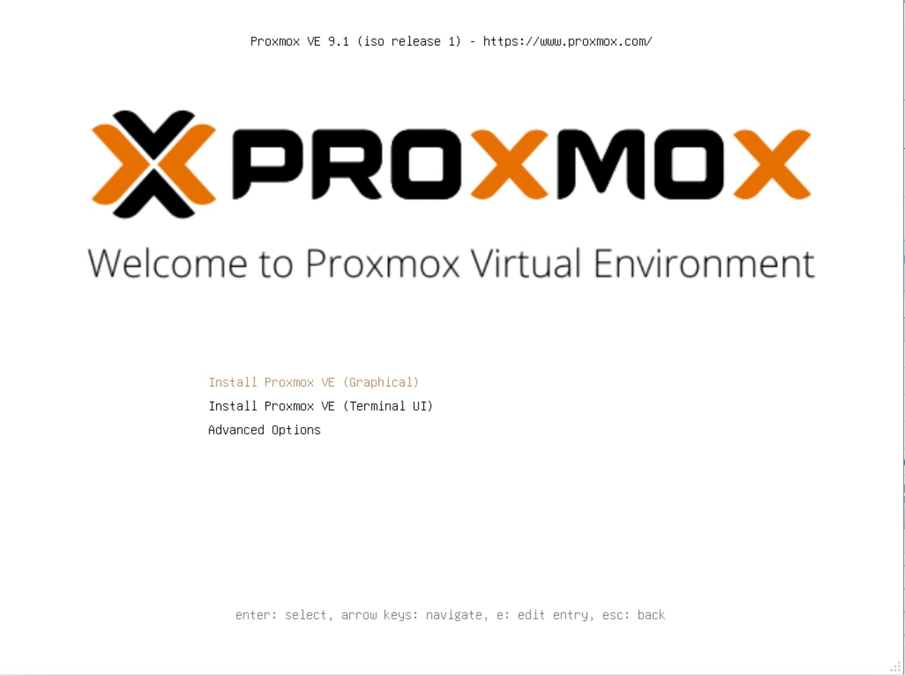

5\. Read and accept the EULA to continue.

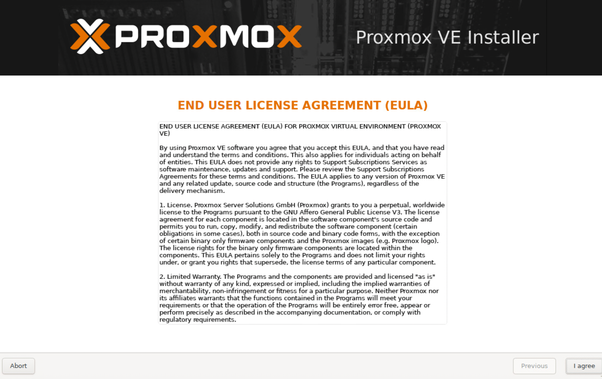

6\. Choose the target hard disk where you want to install Proxmox. Click **Options** to specify additional parameters, such as the filesystem. By default, it is set to [ext4](https://phoenixnap.com/glossary/ext4).

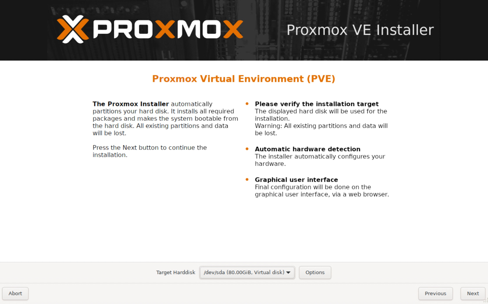

7\. Next, set the location, time zone, and keyboard layout. The installer autodetects most of these configurations.

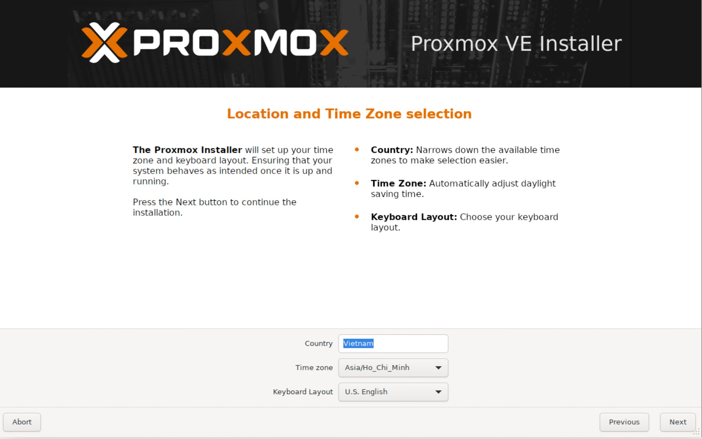

8\. Create a [strong password](https://phoenixnap.com/blog/strong-great-password-ideas) for your admin credentials, retype the password to confirm, and type in an email address for system administrator notifications.

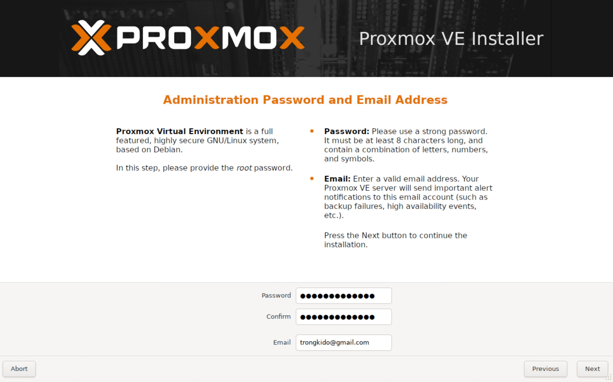

9\. The final step in installing Proxmox is setting up the network configuration. Select the management interface, a [hostname](https://phoenixnap.com/kb/linux-hostname-command) for the server, an available IP address, the default [gateway](https://phoenixnap.com/glossary/what-is-gateway), and a [DNS server](https://phoenixnap.com/kb/what-is-domain-name-system). During the installation process, use either an [IPv4 or IPv6](https://phoenixnap.com/blog/ipv4-vs-ipv6) address. To use both, modify the configuration after installing.

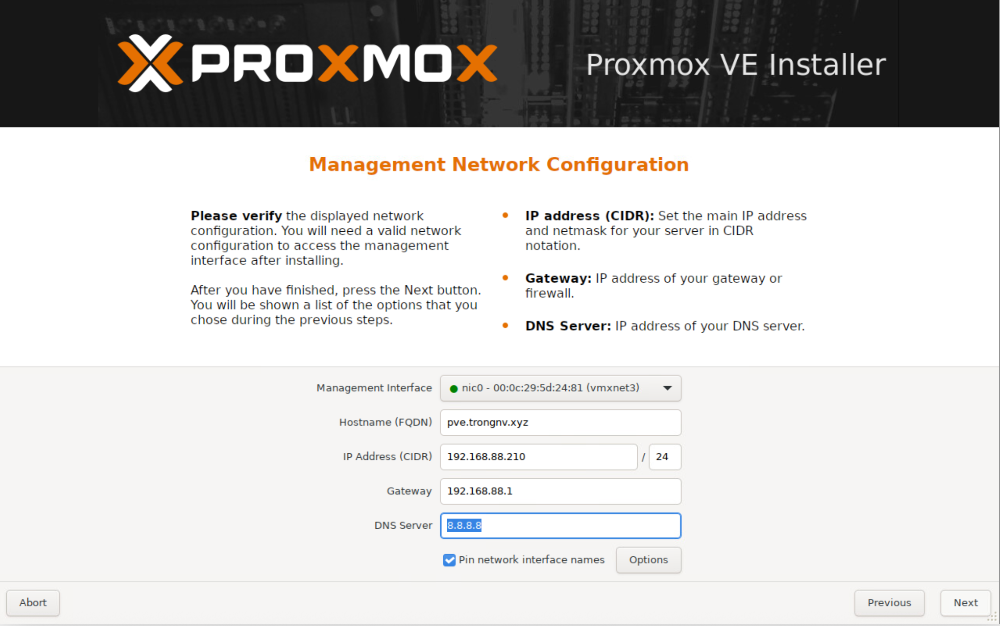

10\. The installer summarizes the selected options. After confirming everything is in order, press **Install**.

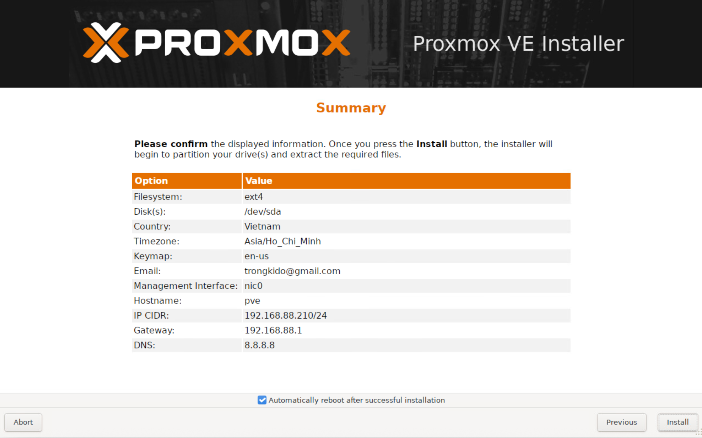

11\. Remove the USB drive and reboot the system after installation.

### Step 4: Run Proxmox

1\. Once the system reboots, the Proxmox GRUB menu loads. Select **Proxmox Virtual Environment GNU/Linux** and press **Enter**.

2\. Next, the Proxmox VE welcome message appears. It includes an IP address that loads Proxmox. Navigate to that IP address in a web browser of your choice.

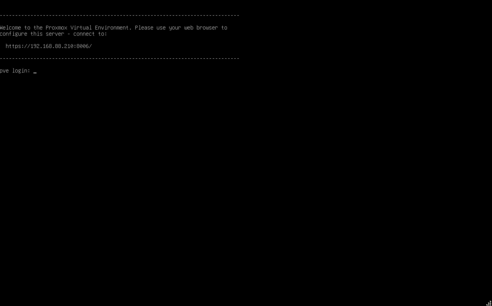

3\. After navigating to the required IP address, you may see a warning message that the page is unsafe because Proxmox VE uses self-signed [SSL certificates](https://phoenixnap.com/kb/types-of-ssl-certificates). Click the IP link to proceed to the Proxmox web management interface.


4\. To access the interface, [log in as root](https://phoenixnap.com/glossary/what-is-root-access) and provide the password you set when installing Proxmox.

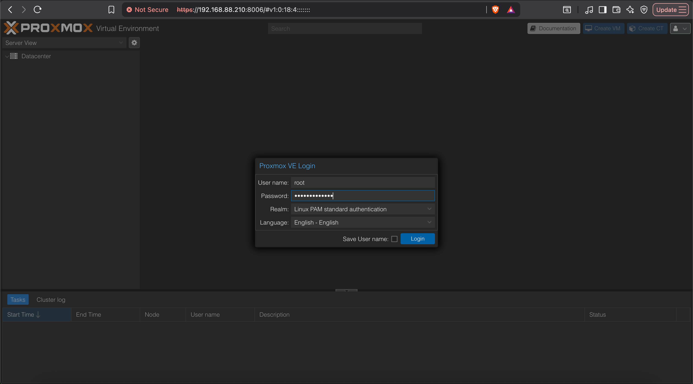

5\. A dialogue box pops up saying there is no valid subscription for the server. Proxmox offers an optional add-on service to which you can subscribe. To ignore the message, click **O**K.


### Step 5: Create a VM

Now that you logged in to the Proxmox web console, follow these steps to create a virtual machine.

1\. Make sure you have ISO images for installation mediums. Move to the resource tree on the left side of your [GUI](https://phoenixnap.com/glossary/what-is-gui).

Select the server you are running and click on **local (pve1)**. Select **ISO Images** from the menu and choose between uploading an image or downloading it from a URL.


2\. Once you have added an ISO image, spin up a virtual machine. Click the **Create VM** button.


3\. Provide general information about the [VM](https://phoenixnap.com/glossary/what-is-a-virtual-machine):

*   Start by selecting the **Node**. If you are starting and have no nodes yet, Proxmox automatically selects node 1 (**pve1**).
*   Provide a **VM ID**. Each resource has to have a unique ID.
*   Finally, specify a **name** for the VM.


3\. Next, switch to the **OS** tab and select the **ISO image** you want for your VM. Define the **OS Type** and [kernel Version](https://phoenixnap.com/kb/check-linux-kernel-version). Click **Next** to continue.


4\. Modify system options (such as the **Graphic card** and **SCSI controller**) or leave the default settings.


5\. Configure any **Hard Disk** options you want the VM to have. You can leave all the default settings. However, if the physical server uses an [SSD](https://phoenixnap.com/glossary/what-is-ssd), enable the **Discard** option.


6\. The number of **Cores** the physical server has determines how many cores you can provide to the VM. The number of cores allocated also depends on the predicted workload.


7\. Next, choose how much **RAM Memory (MiB)** you want to assign to the VM.


8\. Move on to the **Network** tab. It is recommended to separate the management interface from the VM network. For now, leave the default setting and click **Next**.


9\. Proxmox loads the _Confirm_ tab that summarizes the selected VM options. To start the VM immediately, check the box under the listed information or start the VM manually later. Click **Finish** to create the VM.


10\. The newly created VM appears in the resource tree on the left side of the screen. Click the VM to see its specifications and options.


**Note:** Learn how to [delete a VM in Proxmox](https://phoenixnap.com/kb/proxmox-delete-vm). The guide includes both the command line and GUI methods for deleting VM, VM disks, and VM snapshots.

## Converting a Promox VE VM into a template in Proxmox VE web console
Now that your VM is prepped, let’s convert it into a template using the Proxmox VE web console. Here’s a step-by-step guide:
Locate Your VM: In the left-hand pane, navigate to the “Datacenter” where your VM resides. Expand the datacenter and locate the VM you want to convert.

Right-Click and Convert: Right-click on the chosen VM. From the context menu, select the option “Convert to template.” Here we are converting the VM (104 Win7). The below screenshot shows this step.
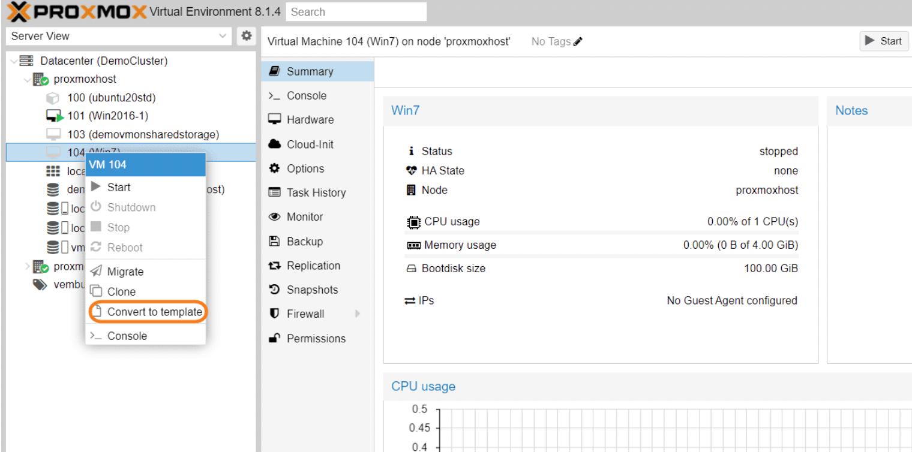

Confirmation : In all your Proxmox VE version, you might encounter a confirmation dialog. Click “Yes” to proceed. The below screenshot shows this step.
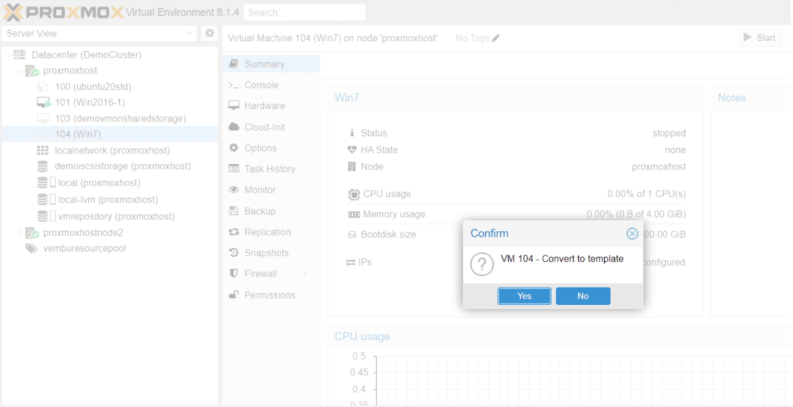

Conversion Process: Proxmox VE will initiate the conversion process. The VM will remain shutdown during this time. The progress might be indicated visually or through console logs (accessible by clicking the VM and then “Console”) or by clicking the description “Convert to template” under description in Tasks bar available at the bottom.
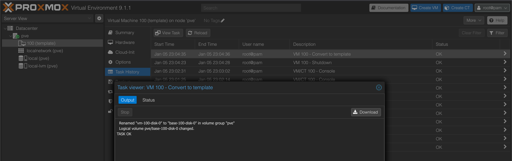

## Create an **API Token** and assign permissions
To create an user and assign api token for a user, please following these steps
- Create a group
Datacenter > Permission > Group > Create


- Next, create user and add user to group
Datacenter > Permission > User > Add
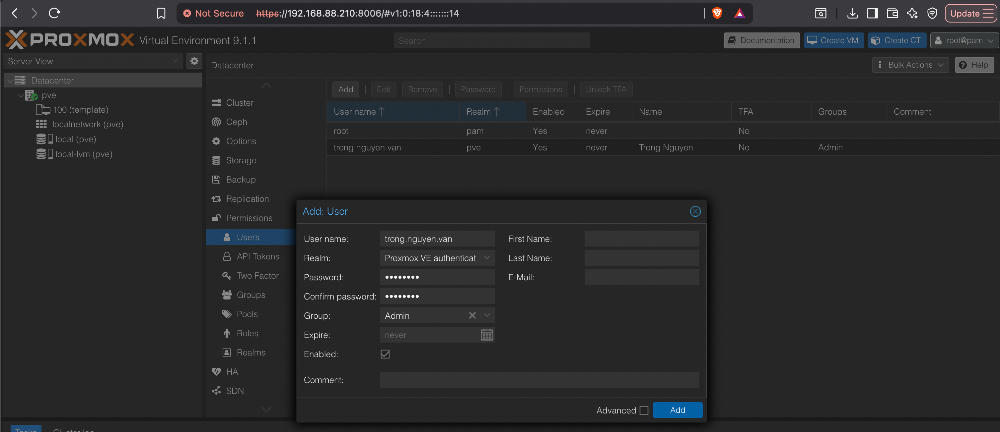

- Then, Create API Token for user
Datacenter > Permissions > API Tokens > Add
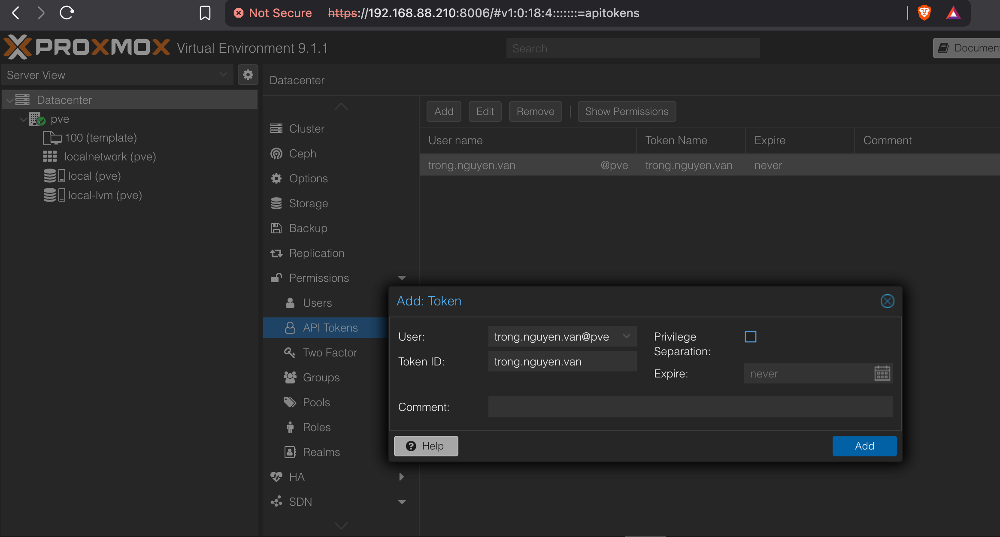
>[!NOTE]
>Please save this api token because it only shows once

- After that, Grant permission for group
Datacenter > Permissions > Add > Group Permissions
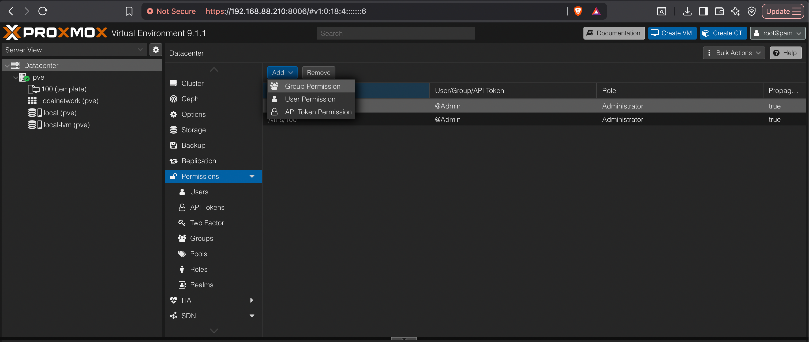

- Add permissons to Groups


- Add permission to API Token
Datacenter > Permissions > Add > API Token Permissions
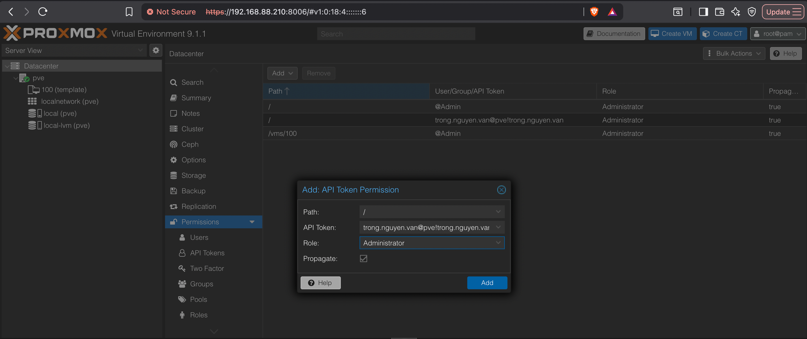

## Install Proxmox Virtual Environment via Command Line
----------------------------------------------------

If your server is headless, use the [CLI](https://phoenixnap.com/glossary/command-line-interface-cli) installation. The GUI and CLI use the same code base for the installation process, so the end result is the same.

Since Proxmox is based on Debian, it should not be installed on top of any other Linux distributions. Although installing it on Ubuntu might work, you are likely to encounter issues during the installation and while using the software.

If you have a machine with a system other than Debian and want to keep that system and run Proxmox, use [KVM](https://phoenixnap.com/kb/ubuntu-install-kvm) to create the Proxmox VM and run other VMs under it.

Follow the steps below to install Proxmox VE using the CLI.

### Step 1: Update Repository Information

Update your system's package repository information by running the command below:

```bash
sudo apt update
```

### Step 2: Configure IP Address

Configuring the server's [IP address](https://phoenixnap.com/glossary/what-is-an-ip-address) is essential, especially if you want to access Proxmox remotely or when setting up a network environment. You can configure an IP address to be static or dynamic:

*   [Static IP](https://phoenixnap.com/glossary/static-ip-address) address. It's generally recommended to assign a static IP address to your server, especially for services like Proxmox VE. This ensures that the server always has the same IP address, making it easier to manage and access.
*   [Dynamic IP](https://phoenixnap.com/glossary/dynamic-ip-address) Address (DHCP). If you are using [DHCP](https://phoenixnap.com/glossary/dhcp-dynamic-host-configuration-protocol) to assign IP addresses in your network, Debian can automatically obtain an IP address from your DHCP server during installation.

Follow the steps below to configure a static IP address on Debian:

1\. Open the network configuration file with a [text editor](https://phoenixnap.com/kb/best-linux-text-editors-for-coding):

```bash
sudo nano /etc/network/interfaces
```

2\. Find the network interface you want to configure (**`eth0`** for Ethernet connections or **`wlan0`** for wireless connections) and modify the file to include your desired network configuration.

For example, to set a static IP address, netmask, gateway, and DNS servers, add lines like the ones below and replace the values with the appropriate values for your network:

```
auto eth0
iface eth0 inet static
address 192.168.1.100
netmask 255.255.255.0
gateway 192.168.1.1
dns-nameservers 8.8.8.8 8.8.4.4
```

Ensure that the IP address you set is accessible from your network and reachable from the machine you intend to use for managing Proxmox VE.

3\. Save the file and exit the text editor.

4\. Restart the networking service to apply the changes:

```bash
sudo systemctl restart networking
```

### Step 3: Add the Proxmox Repository

1\. [Elevate your access](https://phoenixnap.com/kb/create-a-sudo-user-on-debian):

```bash
su -
```

2\. Run the following command to install the prerequisite packages for the Proxmox installation:

```bash
apt install curl software-properties-common apt-transport-https ca-certificates gnupg2 -y
```

3\. When the installation finishes, add the Proxmox repository to the _sources.list.d_ directory. Run the following command:

```bash
echo "deb [arch=amd64] http://download.proxmox.com/debian/pve bookworm pve-no-subscription" > /etc/apt/sources.list.d/pve-install-repo.list
```

4\. After adding the repository, use the [wget command](https://phoenixnap.com/kb/wget-command-with-examples) to download and add the Proxmox VE repository key:

```bash
wget https://enterprise.proxmox.com/debian/proxmox-release-bookworm.gpg -O /etc/apt/trusted.gpg.d/proxmox-release-bookworm.gpg
```


5\. Lastly, update the local APT cache and upgrade packages to their latest version:

```bash
apt update && sudo apt full-upgrade
```

### Step 4: Install the Proxmox Kernel

After the upgrade, install the Proxmox kernel to ensure you have an optimized, secure, and fully compatible environment for running Proxmox VE. Replacing the Linux kernel with Proxmox provides better performance and stability for your virtualized infrastructure.

Run the following command:

```bash
apt install proxmox-default-kernel -y
```

When the installation completes, a confirmation is displayed that the Proxmox kernel was successfully installed:


### Step 5: Install the Proxmox Packages

The next step is to install Proxmox VE and additional packages, such as **postfix** and **chrony**. [Postfix](https://phoenixnap.com/kb/postfix-smtp) is a mail transfer agent (MTA) that Proxmox uses to send system notifications, alerts, and other administrative emails.

Chrony is an implementation of the Network Time Protocol ([NTP](https://phoenixnap.com/glossary/network-time-protocol)) that synchronizes the system clock with NTP servers. Although they are not mandatory, their functionalities are crucial for managing virtualized environments.

Follow the steps below:

1\. Install the packages with the following command:

```bash
apt install proxmox-ve postfix open-iscsi chrony
```

Wait until the process completes.

2\. The system prompts you to configure Postfix. Press **Ok** to start the configuration, select **Local only** in the mail configuration type, and press **Enter** to confirm.


3\. Provide your preferred mail name and press **Enter**.


Wait for the installation to complete.

4\. Confirm that Proxmox was installed by running the command below:

```bash
ss -tunelp | grep 8006
```


Proxmox VE is installed and listening on [TCP](https://phoenixnap.com/glossary/transmission-control-protocol-tcp) port 8006, as we can see from the output.

### Step 6: Remove the Linux Kernel

Keeping the default Debian kernel can cause issues, so removing it from the system is recommended. Run the following command:

```bash
apt remove linux-image-amd64 'linux-image-6.1*'
```

A prompt appears asking you to confirm the kernel removal. Use the arrow keys to select **Ok** and press **Enter** to confirm.


### Step 7: Update GRUB

Complete the process by updating the GRUB configuration file:

```bash
update-grub
```


Additionally, it is recommended to remove the **os-prober** package to prevent it from listing any virtual machines you create with Proxmox in the boot menu. Run the following command:

```bash
apt remove os-prober
```

Reboot the system to complete the process:

```bash
reboot
```

**Step 7: Access Proxmox Web Interface**

On boot, the GRUB loader shows the **Proxmox VE** entry. Select it and press **Enter** to proceed.


When the system boots, open a web browser and navigate to the admin web interface. Use the following URL:

```bash
https://[your_IP_address]:8006/
```

Replace **`[your_IP_address]`** with your machine's IP address. Log in with your root credentials to create and manage your VMs, containers, etc.

## Configure Proxmox Virtual Environment
-------------------------------------

After creating a virtual machine, move on to configuring the environment.

### Start VM at Boot

If the **Start at boot** option is set to **No**, the VM does not automatically start after rebooting the server. This means you need to log in to the Proxmox interface and start the VM manually.

To change the default setting, highlight the option and click the **Edit** button.


Check the box and click **OK**.


### Increase/Decrease Virtual Disk Size

The simplest way to increase or decrease a VM's virtual disk size is through the command-line interface, which can be done online or offline. When increasing disk space, modify the partition table and file system inside the VM to update to the new size.

When decreasing a VM's disk space, back up any data you want to save and reduce the [file system](https://phoenixnap.com/kb/linux-file-system) and partition inside the VM first.

The general syntax for increasing/decreasing virtual disk size is:

```
qm resize [virtual_machine_ID] [disk] [size]
```


For instance, to add 10G to a **virtio0** disk on a VM with the ID 100, run:

```
qm resize 100 virtio0 +10G
```

### Enable NAT Networking Mode

As mentioned above, it is a good idea to change the default bridge networking mode to prevent the Proxmox host and VMs from being on the same network. To create a separate network, enable NAT networking mode. Follow the steps below:

1\. Edit the _Interfaces_ file. Open the command line and run:

```
sudo nano /etc/network/interfaces
```

The file shows that **`vmbr0`** is the default bridge public network for Proxmox, as in the example below:

```
auto lo
iface lo inet loopback
iface eno1 inet manual
auto vmbr0
iface vmbr0 inet static
        address 131.10.22.115
        netmask 255.255.255.0
        gateway 131.10.22.1
        bridge_ports eno1
        bridge_stp off
        bridge_fd 0
post-up echo 1 > /proc/sys/net/ipv4/ip_forward
        post-up   iptables -t nat -A POSTROUTING -s '10.10.10.0/24' -o vmbr0 -j MASQUERADE
        post-down iptables -t nat -D POSTROUTING -s '10.10.10.0/24' -o vmbr0 -j MASQUERADE
```


2\. Save and exit the file.

3\. Restart your network service for changes to take effect:

```
sudo systemctl restart networking
```

The NAT networking mode is now enabled.

## Installing Proxmox: FAQ
-----------------------

This section covers the commonly asked questions about installing and using Proxmox.

### What Are the Minimum System Requirements for Installing Proxmox?

The following minimum requirements are intended solely for evaluation purposes and are not suitable for production environments:

*   **CPU**: 64-bit processor (Intel EMT64 or AMD64). The motherboard and CPU must support Intel VT/AMD-V for full KVM virtualization.
*   **RAM**: 1 GB, plus additional memory as needed for virtual machines.
*   **Storage**: Hard drive/SSD.
*   **Network**: One network interface card (NIC).

### What Are the Recommended System Requirements for Installing Proxmox?

The recommended system requirements for installing and using Proxmox are:

*   **CPU**: 64-bit processor (Intel EMT64 or AMD64) with Intel VT/AMD-V support.
*   **RAM**: At least 2 GB for the OS and Proxmox VE services, with additional memory allocated for virtual machines. Storage solutions like Ceph and ZFS require roughly 1 GB of RAM per TB of used storage.
*   **Storage**: Fast and redundant storage is preferred, with SSDs providing optimal performance. SSDs with Power-Loss-Protection (PLP) are recommended for better performance.
*   **Network**: Redundant multi-gigabit NICs are recommended, with additional NICs as needed based on the storage technology and cluster setup.
*   **PCI(e) Passthrough**: The CPU must support VT-d/AMD-d.

### What System Should Proxmox Be Installed On?

Proxmox VE (Virtual Environment) is a complete, stand-alone virtualization management solution that includes its own [operating system](https://phoenixnap.com/glossary/operating-system). Therefore, Proxmox VE is installed directly onto the hardware as an operating system, and it does not require another underlying OS. It comes with its own ISO installer, which includes a Debian-based Linux operating system along with the Proxmox management interface and tools.

While not typically recommended for production environments, it is possible to install Proxmox VE on top of an existing Debian system, as described in the CLI installation section above. This can be useful for testing or in specific use cases.

### Which Operating Systems Can Run on Proxmox?

Proxmox can run a variety of operating systems within its virtual machines, including:

*   **Linux Distributions.** Ubuntu, Debian, Rocky Linux, Fedora, Red Hat Enterprise Linux ([RHEL](https://phoenixnap.com/kb/how-to-check-redhat-version)), and many others.
*   **Windows:** Windows Server (all versions), Windows 10, Windows 11.
*   **BSD Variants:** FreeBSD, OpenBSD, NetBSD.
*   **Other Unix-like Systems:** Solaris, OpenIndiana.

The OSes are supported through KVM-based virtualization and LXC containers.

# References
https://phoenixnap.com/kb/install-proxmox
